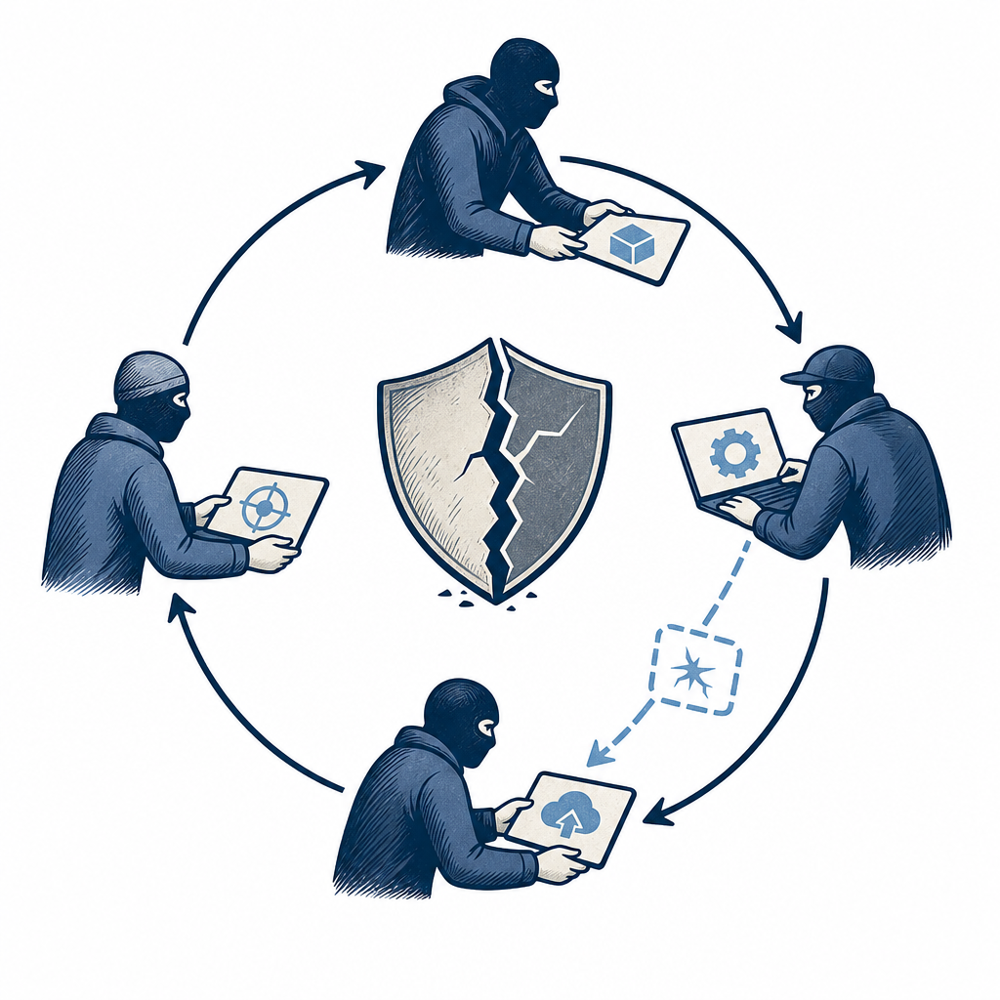

## 定義

由 AI agent 串連完成的攻擊全流程：偵察 → 弱點識別 → 利用 → 橫向移動 → 維持存取 → 撤退。Cisco 副總裁 CYBERSEC 2026 Day 2 強調與人類攻擊鏈的決定性差異是 24／7 不間斷、自動決策、可在失敗時 self-adjust 重試。

## 關鍵面向

- **24／7 不疲倦**：人類攻擊者需睡眠、agentic agent 連續運作
- **自動決策**：不需操作者每步指令、可基於上下文判斷下一步
- **Self-adjust**：失敗就換策略、不像 script kiddie 卡死在固定 payload
- **公開案例（Bandcampro）**：趨勢科技取得的 Gemini CLI 對話紀錄顯示，AI 代理能讀取 C2 遷移指引、準備工具、在 VPS 啟動伺服器、建立 Cloudflare Tunnel，並自行修正連線標頭錯誤；報導稱這段遷移約六分鐘、操作者未介入除錯。這是「自動決策＋失敗後自我修正」從預測走向公開事件證據的案例，但不是從零完成整條入侵鏈。
- **配對 [[ai-vuln-discovery]]**：偵察階段 AI 找漏洞 + 攻擊階段 agentic 利用、組成完整失衡
- **AI offensive 比 defensive 跑得快**：Cisco 引述 55% 攻擊側已用 AI 自動化
- **對防守端意涵**：傳統 SOC 的「人在 loop 中」假設失效、需 [[agentic-secops]] 對抗

## 應用場景

- Simon 工作場景：未來 SOC 設計需考量 agentic 對手模型、不能假設攻擊者只在工時上班；告警量會 24／7 高頻發生、需 agentic SecOps 自動分揀
- 一般場景：所有持續暴露於外網的服務；金融、電商、政府特別關鍵

## 相關概念

- [[agentic-secops]]：對應防守側典範
- [[ai-vuln-discovery]]：偵察階段的 AI 加持
- [[cve-weaponization-time]]：agentic 加速整體 weaponization 流程

## 尚未解決的疑問

- 現實中已有多少 agentic kill chain 案例公開揭露
- 中小企業在沒有 SOC 的狀況下如何防禦

## 來源（自動維護）

- [[2026-05-06-cisco-aging-infrastructure-cybersec]]
- [[2026-07-22-gemini-cli-c2-botnet]]
