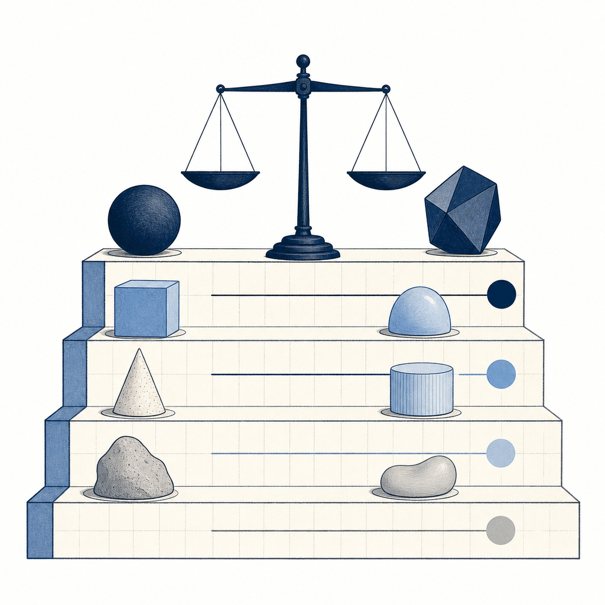

## 定義

把人類腦中模糊的「做得好」標準，拆解成 AI 評審可以逐項打分的結構化量表。不是 prompt engineering（怎麼問）、不是 context engineering（餵什麼），而是 evaluation engineering（怎麼判斷好壞）。有了 rubric，AI 的執行者和評審才能形成持續迭代的閉環。

## 關鍵面向

- **執行者 + 評審架構**：goal 機制背後通常有兩個角色——執行者負責產出、評審在每輪結束後依 rubric 打分。評審說「沒達標」，執行者就繼續。人類只需要定義好 rubric，不用每三分鐘回來催
- **Anthropic 網頁設計研究案例**：把「漂亮的網站」拆成四個維度——設計品質（整體設計語言一致性）、原創性（有沒有刻意設計選擇、還是全用預設模板）、技術執行（字體階層、間距、配色是否一致）、可用性（使用者能不能直覺完成目標）。還會加重模型弱項的權重做校正
- **六步驟建 rubric 的 SOP**：① 先讓 AI 跑一輪看 baseline → ② 親自看產出、記錄皺眉的具體原因 → ③ 把皺眉原因分類成維度 → ④ 每個維度用具體案例當 reference（「不要用破折號」比「避免 AI 味」有效 100 倍）→ ⑤ 用多樣化案例取代單一範例（避免 overfitting）→ ⑥ 餵給評審跑看產出、人工校正幾輪
- **反案例的力量**：Anthropic 在 front-end design skill 的原創性維度裡寫的是「絕對不要用 Inter / Roboto / Arial / system fonts」、「絕對不要用紫漸層蓋在白色卡片上」——負面指令比正面指令更容易讓評審抓到違規
- **非線性躍遷**：Anthropic 研究發現，迭代到第 10 輪時 Claude 把美術館網站重新想像成 3D 空間體驗，這種創意躍遷不是每輪線性改善、而是持續迭代中偶發的突破
- **自動化測試當 rubric（程式碼領域）**：AI Coding Daily 比較 coding 模型時，rubric 不是人工打分、而是直接拿自動化測試當判準——後端用 PHP 測試驗邏輯、前端用 Playwright 測試驗畫面，全過才得一分、每個專案重跑五次取平均。這是程式碼領域 rubric 的天然優勢：對錯有客觀答案、評審可完全自動。但作者也點出限制——一旦任務簡單到所有模型都全過，rubric 就失去區分力，得設計更難的測試。長任務（「寫一個完整 app」）難自動評估正是因為缺少這種確定性 rubric，只能退回「我喜不喜歡這段 code」的 vibes 評分

## 應用場景

- Simon 工作場景：KW γ reading 品質評估（摘要是否白話、概念是否有具體例子、對 Simon 的應用是否可落地）、Substack 文章品質把關（降 AI 語感的修辭上限表就是一份 rubric）、資安週報的品質一致性
- 一般場景：AI 輔助寫作、AI 生成設計、AI 程式碼品質、任何需要「好不好」判斷的 AI 工作流

## 相關概念

- [[claude-code-goal-command]]：goal 提供迭代框架，rubric 提供判斷標準，兩者搭配使用
- [[context-anxiety]]：沒有 rubric 的 goal 很容易被 context-anxiety 繞過——模型自己說「做完了」評審就放行
- [[claude-md-12-rules]]：12 條規則本質上就是一份程式碼品質的 rubric
- [[loud-failure]]：rubric 裡應該有「不確定時要說不確定」這種 loud failure 條款

## 尚未解決的疑問

- 非程式碼領域（寫作、設計）的 rubric 需要多少輪校正才能穩定
- rubric 本身的 token 成本——放太多具體案例會不會擠壓 context

## 來源（自動維護）

- [[2026-05-26-yt-goal-evaluation-rubric-long-tasks]]
- [[2026-05-29-opus-4-8-coding-benchmark]]
