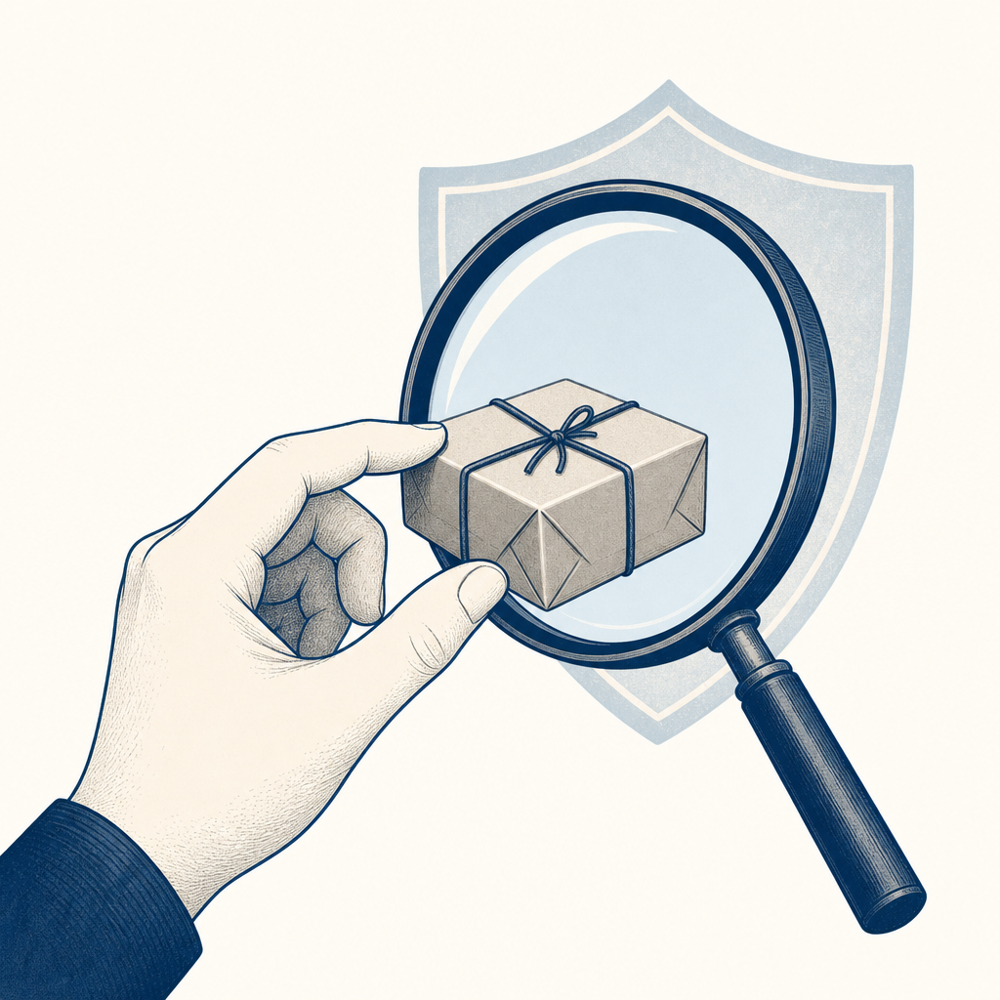

## 定義

安裝或執行第三方 AI Skill（[[skill]]，技能包）帶來的資安風險，以及在裝之前用肉眼審核 skill 是否可疑的方法。核心認知：裝一個 skill 不是裝一個瀏覽器外掛，而是把整台電腦的鑰匙交給一份你可能根本沒看過的文件——因為 skill 會以你的使用者身份執行、預設沒有沙箱隔離。

## 關鍵面向

- **為什麼 skill 這麼危險（三個原因）**：（1）AI 不會懷疑 SKILL.md 寫的東西，叫它做什麼就做什麼，信任度等同你親手改電腦設定；（2）skill 一啟動就是用你的身份在動，你能碰的檔案它都能讀，包含存密碼、金鑰、雲端帳號的設定檔（例如 `~/.secrets/`）；（3）預設沒有殺傷保護，能讀、能改、能刪檔案，還能對外連網下載任何東西、或把你電腦裡的檔案傳出去。
- **三種攻擊型態（皆為已揭露真實案例）**：（1）**改官方 skill**——研究員拿 Anthropic 官方 skill 偷塞幾行字，執行後自動下載勒索軟體（影片宣稱的 gif-creator + MedusaLocker 案）；（2）**偽裝成 skill 的注入文件**——PromptArmor 2026-01 用偽裝成 skill 的 Word 檔、靠隱形 [[prompt-injection]] 讓 Claude Cowork 把含個資的檔案 curl 外傳（48 小時內被證實）；（3）**市集供應鏈**——Koi Security 2026-02 在 OpenClaw 的 skill 市集 ClawHub 掃出大量惡意 skill（ClawHavoc 行動，TheHackerNews 證實 341 個），屬 [[supply-chain-risk]] 在 AI 時代的具體化。
- **四招肉眼審核（GitHub 點 RAW 直接看 SKILL.md、零下載）**：（1）有沒有要環境變數／API 金鑰——一個寫作工具沒理由要你的金鑰；（2）Repo 裡有沒有夾帶用不到的可執行檔（`.sh` 等）——像請人掃地卻帶了電鑽；（3）全文搜 `curl`／`bash`／`base64`／`eval`、或密碼保護的 zip——這是規避掃描的經典招；（4）有沒有陌生的對外網址（telemetry／analytics 開頭）。
- **肉眼審核是必要非充分**：四招擋得掉大部分明目張膽的，但擋不掉藏在零寬度字元裡的隱形指令（影片自承、研究員在 OpenAI 官方 skill 試過加料）。所以審核要搭配結構性防禦（最小權限、沙箱、限制對外連線），不能只靠肉眼。

## 應用場景

- **Simon 工作場景**：Simon 同時跑 Claude Code（WSL）+ Codex（Windows）、裝了 superpowers 等大量第三方 skill、也自寫不少 skill，且 `~/.secrets/` 存金鑰——正是這支影片講的高風險使用者。裝任何非自寫 skill 前可跑一次四招審核。雙平台的權限不對稱設計（WSL 可丟可重建、Windows 走最小權限）剛好呼應「skill 用你身份跑」這個風險。
- **公司 IT 場景**：把「AI agent / skill 供應鏈風險」納入資安意識宣導與 ISO 27001 第三方供應商風險（A.5.19~A.5.23）考量，員工若自行裝 AI agent skill 也是新攻擊面。
- **一般場景**：任何要安裝第三方 AI agent skill／plugin／MCP server 的人，裝之前都該先看原始碼、確認權限範圍。

## 相關概念

- [[skill]]：被審核的對象本身，本概念是它的資安風險面。
- [[prompt-injection]]：攻擊型態（2）的技術機制——偽裝成 skill 的文件靠隱形注入劫持 AI。
- [[supply-chain-risk]]：攻擊型態（3）ClawHub 市集案是供應鏈風險在 AI skill 市集的新形態。
- [[principle-of-least-privilege]]：skill 預設拿到帳號全部權限、違反最小權限；結構性防禦的核心就是把 skill 的權限收到剛好夠用。

## 尚未解決的疑問

- 各家 skill 市集／平台是否會建立官方審核、簽章、權限沙箱機制——已開始出現：Hermes Agent（Nous Research）在使用者安裝第三方 skill 前會自動做來源與安全性檢查、發現惡意或高風險內容就擋下並提醒（2026-06-15 PAPAYA 教學）。但這只是單一平台的內建檢查、深度與覆蓋率不明，也還不是跨市集的簽章或沙箱標準。在通用機制成形前，責任仍落在使用者身上（Anthropic 官方立場：使用者有責任只執行可信任的 skill）。

## 來源（自動維護）
- [[2026-06-13-pansci-claude-skill-security]]
- [[2026-06-15-papaya-hermes-agent-tutorial]]
