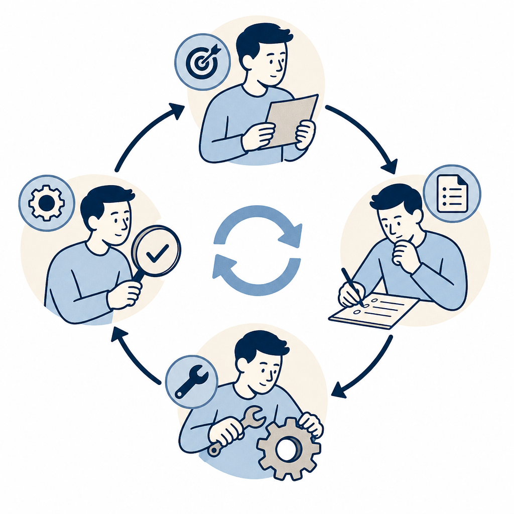

## 定義

AI 從「回答問題的搜尋引擎」進化為「能完成任務、執行細節的個人助理」的範式轉移。標誌性改變：AI 不再只輸出文字建議，而是直接操作工具、呼叫 API、修改檔案、跑排程——使用者描述目標，AI 自主拆解並執行步驟。2025–2026 年以 Claude Cowork / Operator 功能為代表進入主流意識。

## 關鍵面向

- **舊範式（問答型）**：使用者輸入問題 → AI 輸出文字 → 使用者自行執行；AI 只是「更聰明的 Google」
- **新範式（執行型）**：使用者描述目標 → AI 規劃步驟 → AI 直接操作工具完成 → 人類審核結果；AI 是「能做事的助理」
- **執行型的核心能力**：tool use（工具呼叫）、multi-step reasoning（多步驟推理）、長時間 autonomous run（自主執行）
- **邊界條件**：高風險動作（刪除資料、財務操作）仍需人類確認；irreversible action 應加 confirmation gate
- **市場意義**：從 LLM 到 agentic AI 的商業落地轉折點；以前 AI 幫你「想」，現在 AI 幫你「做」
- **Google I/O 2026 落地**（2026-05-19）：Google 一次推 [[gemini-spark]]（Workspace 跨 app 代理人）+ [[docs-live]]（Docs 語音編輯）+ [[information-agent]]（搜尋層 24/7 監看）+ [[gemini-omni]]（多模態生成）+ [[compute-based-pricing]]（算力計費）；同步把「執行型 AI」推進主流；底層靠 [[gemini-flash]] 速度 4 倍撐起代理人即時感

## 應用場景

- Simon 工作場景：KW γ 收錄流程（Claude 自動抓文章→抽概念→寫 vault→更新 Notion）是典型執行型 AI 落地；Claude Code hooks 也屬此範式
- 一般場景：行銷自動化、雲端硬碟整理、資料報告產出、IT 例行維運腳本

## 相關概念

- [[claude-three-modes]]：Cowork 模式是 AI 執行型範式的主要 Claude 介面
- [[agentic-secops]]：資安領域的 AI 執行型落地
- [[agent-error-amplification]]：執行型 AI 的風險面向，多步驟誤差放大
- [[loud-failure]]：執行型 AI 的失敗應對設計原則

## 尚未解決的疑問

- 執行型 AI 的責任歸屬：AI 執行錯誤，誰負責？
- 現階段 Claude Cowork 在台灣的實際可用功能與授權範圍

## 來源（自動維護）

- [[2026-05-20-accuhit-claude-ai-complete-guide]]
- [[2026-05-20-bnext-google-io-2026-gemini-spark]]
