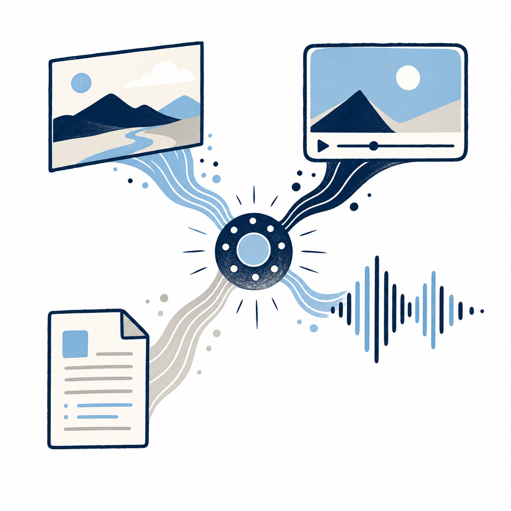

## 定義

Google I/O 2026 發布的多模態生成模型；首發版本 Omni Flash；接續 Nano Banana 影像能力延伸到影片；輸入支援圖、文、影片、音訊組合；輸出影片內容並支援自然語言對話式編輯；含角色／物理／場景三類一致性；附 Avatars 用自己聲音生影片功能、附 SynthID 數位浮水印。

## 關鍵面向

- **首發版本**：Omni Flash；接續 Nano Banana 影像能力、延伸至影片
- **輸入**：圖／文／影片／音訊任意組合
- **輸出**：影片內容、支援自然語言對話式編輯
- **三類一致性**：角色一致性／物理一致性／場景連貫性（影片生成痛點）
- **Avatars**：用使用者自己聲音生成影片；附 SynthID 浮水印做來源驗證
- **上線**：即日開放 Google AI Plus／Pro／Ultra 訂閱者；YouTube Shorts 與 YouTube Create App 本週免費；開發者 API 數週內推出
- **競爭對標**：OpenAI Sora、Runway Gen-3、Stability AI；Google 在 YouTube 通路有渠道優勢
- **跟 Spark 的差別**：[[gemini-spark]] 在 Workspace 內代理任務、Omni 在 YouTube／Pics 內生成內容、不重疊
- **跟 [[gemini-flash]] 的差別**：同名 Flash 但不同模型；Flash 主代理任務、Omni Flash 主多模態生成

## 應用場景

- Simon 工作場景：作 Substack 文章視覺資產（cover、配圖）的替代方案；Avatars 可考慮做芙莉蓮第一人稱影片內容（如目前已有的 Substack 自介系列）；公司資安宣導影片快速產出
- 一般場景：YouTube Shorts 創作者、社群行銷內容、線上教學影片片段、Notes／文章配圖
- 反場景：深度敘事影片、需精確劇本控制的廣告片仍要傳統製作流程

## 相關概念

- [[gemini-spark]]：同 I/O 2026 發布；Spark 代理任務、Omni 生成內容、分工正交
- [[gemini-flash]]：同 Google 模型家族、但定位不同（代理任務 vs 多模態生成）
- [[docs-live]]：同 I/O 2026 發布；Docs Live 文件編輯、Omni 影片生成、模態不同
- [[ai-task-execution]]：Omni 也是「AI 從問答到執行」的多模態場景落地

## 尚未解決的疑問

- 影片長度上限、解析度規格
- API 計費結構（按秒？按 token？）
- SynthID 浮水印是否容易被洗掉
- 跟 Veo（Google DeepMind 影片模型）的關係、是否整合進 Omni
- 中文／繁中 prompt 支援度

## 來源（自動維護）

- [[2026-05-20-bnext-google-io-2026-gemini-spark]]
