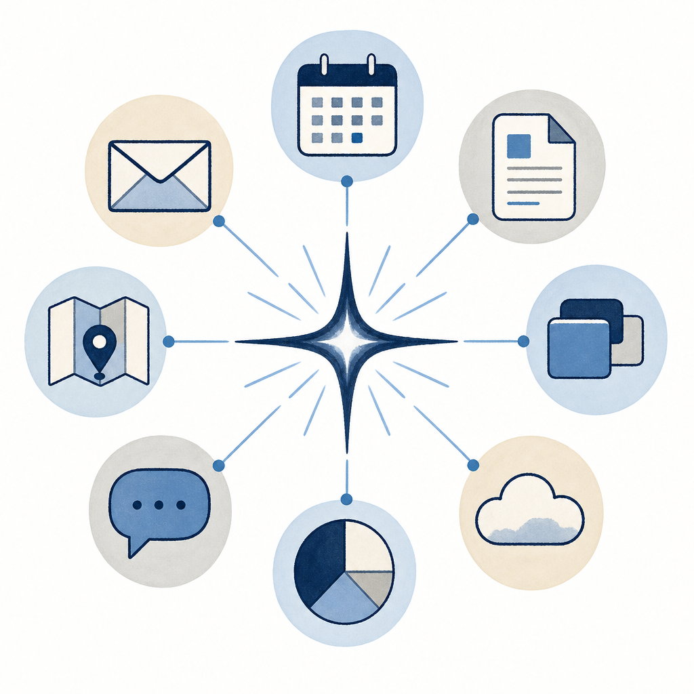

## 定義

Google I/O 2026 推出的跨服務代理人產品；不是新模型、是組織 [[gemini-flash]] 跟 Antigravity harness 在 Google Workspace（Gmail、Calendar、Drive、Docs、Sheets、Slides、YouTube、Maps）內執行任務的介面；三大模組（Tasks 單次／Skills 客製化反覆／Schedules 時間條件觸發）；高風險動作（寄信、花錢）前需使用者確認。

## 關鍵面向

- **底層**：跑在 [[gemini-flash]] + Antigravity harness、不是新模型；定位是「組織已有 AI 能力的代理介面」
- **三模組**：Tasks（單次任務）／Skills（客製化反覆動作）／Schedules（時間或條件自動觸發）
- **原生整合**：8 個 Google 服務預設關閉、需手動啟用；第三方支援 Canva、OpenTable、Instacart 等
- **典型情境**：每週一 9 點掃信箱整理優先待辦／讀 50 封過往郵件學個人寫信風格作 ghostwriter／檢查信用卡隱藏費用／整理會議筆記成報告
- **安全護欄**：寄信、花錢等高風險動作前需確認；不直接放權
- **可用性**：先給 trusted testers、下週擴美國 AI Ultra 用戶 Beta 測試、台灣暫不可用
- **跟 Docs Live 的關係**：Spark 是跨 app 入口、[[docs-live]] 是 Docs 內語音層、兩個正交產品
- **競爭脈絡**：對標 OpenAI Agents、Anthropic Claude Code agent 場景；Google 優勢在 Workspace 生態深度

## 應用場景

- Simon 工作場景：撈當週 Gmail 待辦＋會議節點 → 整理成 Notion Action（取代手動 /morning）；公司 IT 工單郵件批次標籤、回信草稿；自動每週掃 Veeam 備份日誌摘要
- 一般場景：個人事務集中處理（信用卡帳單、訂位、行程）；內容創作者建 ghostwriter 學自己風格
- 反場景：台灣未上線、暫無法用；隱私敏感資料（健保、財務）不建議授權

## 相關概念

- [[gemini-flash]]：Spark 的底層模型；對代理人任務速度直接影響使用者信任
- [[docs-live]]：同 I/O 2026 發布、Docs 內語音層、跟 Spark 正交
- [[information-agent]]：搜尋層的代理人姊妹產品、同 I/O 發布、24/7 監看主題
- [[gemini-omni]]：多模態生成姊妹產品、不在 Spark 模組內
- [[ai-task-execution]]：Spark 是 AI 從問答到執行範式在 Google 生態的代表落地
- [[agent-os-competition]]：Anthropic／OpenAI／xAI／Google 代理人作業系統競賽中 Google 端的核心產品
- [[subscription-vs-api-cost]]：Spark 走訂閱方案、非 API 計費；Pro/Ultra 額度耦合

## Compute-based pricing（運算量計費）

Google I/O 2026 隨 Spark 公佈的新訂閱計費邏輯：從「每日提示次數上限」轉為「依運算量計費」。
- **舊模型**：每日 prompt 次數上限（如 ChatGPT Plus 80 messages / 3 hours）
- **新模型**：依實際運算量計費；複雜推理／長對話／多模態調用各自吃不同算力
- **降級備援**：到上限自動切較小模型（如 Pro 降 Lite）、不直接斷服務
- **加買機制**：Pro／Ultra 訂戶可購 pay-as-you-go 點數續用
- **重新整理週期**：每 5 小時刷新一次、直到週上限
- **意涵**：訂戶為「值得多少算力」付錢、不再被「次數」綁

## 尚未解決的疑問

- 台灣上線時程
- B2B Workspace 是否預設啟用、企業資料隱私邊界
- Skills 跟 Claude Code skill 的關係（同樣概念不同實作？）
- 跟 Gemini Daily Brief（每日早晨摘要代理）是否同一機制不同包裝
- 「運算量」是否量化展示給用戶（如 Anthropic 的 5h / weekly meter）
- 跟 token-based 計費的精確換算公式
- Pro／Ultra 額外點數價格

## 來源（自動維護）

- [[2026-05-20-bnext-google-io-2026-gemini-spark]]
