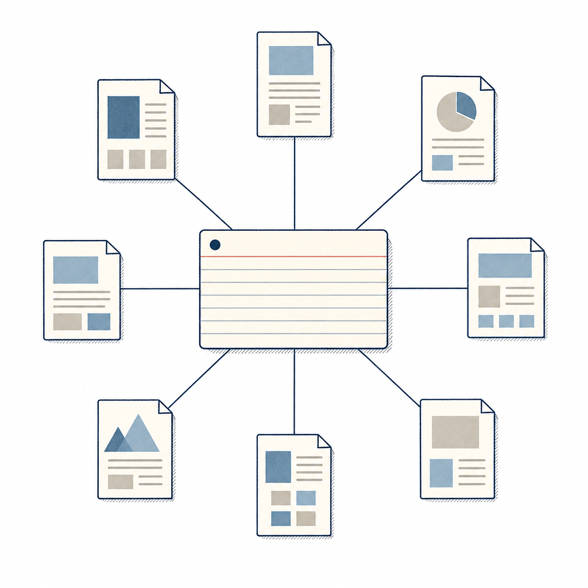

## 定義

用一份 Index markdown 檔當全庫目錄，AI 查詢時先讀索引再決定打開哪些頁面，不依賴向量相似度搜尋的個人知識庫架構，是 RAG 的另一條輕量替代路徑。

## 關鍵面向

- 索引由 LLM 自行維護（讀全庫後產生），不需要 embedding pipeline
- 規模上限約數百篇文章，超過後索引太長 token 成本爆炸
- 跟 graph database 不同：索引是平面的目錄頁，不強調關聯網結構
- **具體門檻參考**：Karpathy 說知識庫累積到約 100 篇文章、40 萬字左右時，複雜問答幾乎不必再依賴 RAG，因為 LLM 已把索引與摘要維護得夠完整、能直接從編譯後的結構找答案。這給「索引式何時夠用、何時該升 RAG」一個粗略的量級錨點。

## 應用場景

- Simon 工作場景：Notion KW 三 DB（資訊收集箱／概念庫／閱讀頁）本質就是索引式（DB relation 取代向量），可考慮加一份「主索引閱讀頁」當統一導引
- 一般場景：個人知識庫、團隊內部 wiki、不想自架 RAG 的早期實驗

## 相關概念

- [[raw-wiki-split]]：原料分流是索引式知識庫常見的子結構
- [[graph-emergence]]：索引建立後跨文章共用節點會自動浮現

## 尚未解決的疑問

- 索引超過幾千條後該不該升級到 RAG

## 來源（自動維護）

- [[2026-04-29-karpathy-obsidian-claude-wiki]]
- [[2026-05-31-codex-obsidian-self-growing-kb]]
- [[2026-07-09-inside-llm-wiki]]
