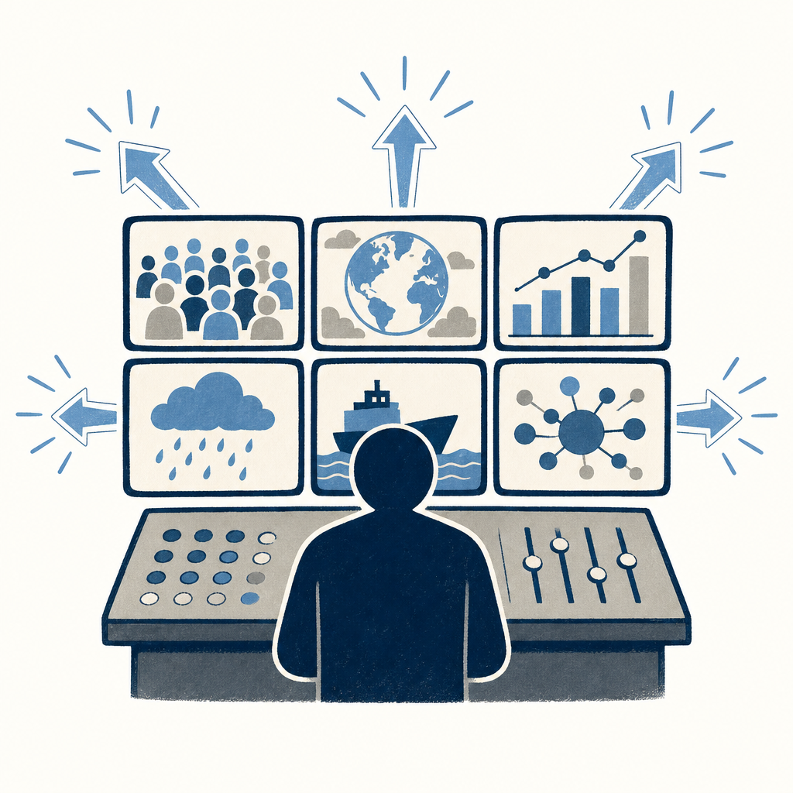

## 定義

Google I/O 2026 推出的搜尋層代理人功能；24／7 監看特定主題、條件達成時主動通知附連結與摘要；使用者可建立、客製、管理多個代理人；搭配生成式介面（Generative UI）讓搜尋結果即時生成自訂互動元件、視覺化或 mini app；標誌 Google 搜尋從「人輸關鍵字 → Google 回連結」轉向「AI 主動分解問題 → 監控資料源 → 生成答案與介面」。

## 關鍵面向

- **核心轉變**：從被動查詢（pull）到主動監看（push）；搜尋第一次有持續性記憶
- **三大新能力**：建多個資訊代理人客製化主題／24/7 監看自動通知／生成式介面即時組互動 mini app
- **AI Overviews 升級**：支援更長提問、多模態輸入（文字 / 圖片 / 檔案 / 影片 / Chrome 分頁）、可接續進 AI Mode 追問
- **跟 Google Alerts 的差別**：Alerts 是關鍵字 RSS 監控、Information Agent 是 AI 理解語意主題、可生成互動結果
- **生成式介面（Generative UI）**：搜尋結果依問題即時組視覺化／互動元件／mini app；不固定模板
- **官方語**：「搜尋不再只是把答案摘要放在搜尋結果上方、而是走向可追問、可監控主題、甚至可生成互動介面的代理人搜尋」
- **底層**：跑在 [[gemini-flash]]、跟 [[gemini-spark]] 同模型家族但定位不同（Spark 在 Workspace、Information Agent 在搜尋）

## 應用場景

- Simon 工作場景：監看「CVE 武器化時間趨勢」、「ISO 27001 修訂版本」、「PQC 標準進度」、「台灣資安事件」等資安情資主題；取代手動掃 IT 新聞時間；個人興趣可監看「芙莉蓮動漫第二季消息」、「Cybersecurity 認證更新」
- 一般場景：投資人監看特定股票／產業新聞、求職者監看特定公司 hiring、創作者監看 trend topic
- 反場景：高度時效性／秒級交易訊號（仍要 RSS + 即時警報）、需嚴格 source 驗證的情資（仍要人工 cross-check）

## 相關概念

- [[gemini-spark]]：同 I/O 2026 發布；Spark 在 Workspace、Information Agent 在搜尋、分層正交
- [[gemini-flash]]：底層模型
- [[ai-task-execution]]：搜尋層 AI 從回答升級到「持續執行監看任務」
- [[agent-os-competition]]：代理人作業系統競賽中 Google 把搜尋升級為代理人入口
- [[disposable-ui-html]]：Generative UI 跟 Anthropic Thariq 的 disposable HTML UI 概念高度重疊、Google 把它做進搜尋

## 尚未解決的疑問

- 上線時程、台灣可用性
- 每個帳號可建多少 Information Agent
- 跟 NotebookLM Audio Overview / Discover 的關係
- Generative UI 是否會吃掉 Google 既有 Knowledge Graph 卡片
- 對 SEO 跟內容創作者的影響（用戶停留在搜尋結果頁、不再點站外連結）

## 來源（自動維護）

- [[2026-05-20-bnext-google-io-2026-gemini-spark]]
