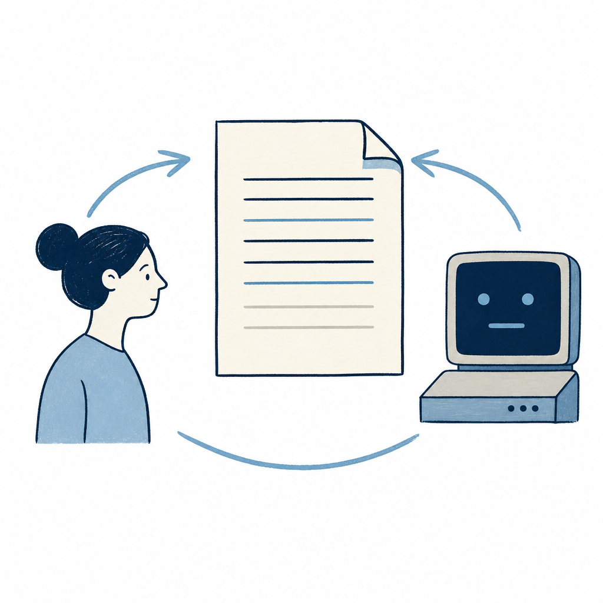

## 定義

把專案規格、命名規則、AI 應做事項寫在 claude.md，每次開 Claude Code 自動讀，省掉每次重新解釋的成本，是 AI 與專案之間的常駐合約。

## 關鍵面向

- 每次 session 自動載入，不必重述
- 各家 AI 工具有自己的命名（Claude Code 用 CLAUDE.md、Cursor 用 .cursorrules、Gemini 用 GEMINI.md、開源 agent 多用 AGENTS.md）
- **AGENTS.md 是開放標準**：Codex、Cursor、Gemini CLI、Windsurf、GitHub Copilot 都讀同一份 AGENTS.md；寫一次整條 toolchain 共用，是目前唯一不被廠商鎖定的 AI 指令檔格式。讀取順序：`~/.codex/AGENTS.md`（跨專案）+ `<project>/AGENTS.md`（專案內），`AGENTS.override.md` 在每層優先；合計上限 32 KiB、建議 500 字內
- **Claude Code 也開始讀 AGENTS.md（2026-09-18 起）**：2.1.277 版起，專案沒有 CLAUDE.md 時會改讀 AGENTS.md；/config 的「Project instructions」可改成只讀 CLAUDE.md、兩份一起讀，或只保留企業統一派發的說明檔。預設模式下，從專案根目錄到工作目錄之間任何一層有 `CLAUDE.md`、`.claude/CLAUDE.md` 或 `CLAUDE.local.md`，AGENTS.md 就完全不讀（使用者層 `~/.claude/CLAUDE.md`、組織統一檔、`.claude/rules`、`--add-dir` 目錄裡的 CLAUDE.md 不算）；載入範圍是路徑上每一份 AGENTS.md 與 `.claude/AGENTS.md`，載入後仍有差異（`/memory` 與 `#` 捷徑不認得 AGENTS.md、巢狀檔只在文字 Read 時附上），所以兩種檔案並存的專案行為不變、要兩份都吃得自己切模式；選項在 `~/.claude/settings.json` 的 `pluginConfigs.agents-md@builtin.options.instructionFiles`（或 /config「Project instructions」），專案內的 `.claude/settings.json` 不會被讀來取這個選項。Anthropic 先前只讀 CLAUDE.md 的理由是不同模型家族不能互換、系統提示詞影響表現。（動區報導，細節以原廠 agents-md 說明文件核對）
- 通常不版控敏感資料；分層設計（全域 / 專案）能控制可見範圍
- **跟 [[skill]] 的分工（雷蒙範式）**：CLAUDE.md = 「入職手冊」放通用偏好（語言、風格、禁區、資料夾結構）、Skill = 「SOP」放特定任務完整流程（步驟、格式、範例、例外處理）
- **更新頻率**：CLAUDE.md 偶爾改、Skill 每次做錯就改；長流程強塞 CLAUDE.md 會讓它又長又亂
- **載入機制差異**：CLAUDE.md 每次對話都自動載入（佔常駐 token）、Skill 相關時才載入（progressive disclosure）
- **常駐內容要定期盤點**：指令檔裡的故事、日期、過長例子與只在特定路徑才用的規則，應搬到 changelog、reference 或 path-scoped rules；指令檔只留會跨任務反覆影響行為的契約。

## 應用場景

- Simon 工作場景：已用兩層 CLAUDE.md（全域 ~/.claude/CLAUDE.md + 專案 ~/projects/Simon-Agent/CLAUDE.md）；可比對 Karpathy 的單層做法看自己分層是否過度
- 一般場景：任何 AI 反覆讀寫的專案、團隊內部 AI 規範

## 相關概念

- [[claude-md-dual-nav]]：指令檔的延伸，用兩層導航把全域 + 局部規則分開
- [[claude-code]]：指令檔的主要消費者

## 尚未解決的疑問

- 多 AI 工具並用時要不要建多份指令檔（CLAUDE.md / AGENTS.md / GEMINI.md）——AGENTS.md 的 open standard 地位讓這個問題有了部分答案：至少 AGENTS.md 可共用
- Claude Code 讀進沒有針對 Claude 調整過的 AGENTS.md 後，表現會不會打折？動區那篇沒有數據，Anthropic 舊理由（模型家族不能互換）也沒被回應（2026-09-19 記）

## 來源（自動維護）

- [[2026-04-29-karpathy-obsidian-claude-wiki]]
- [[2026-05-12-raymond-claude-code-skill]]
- [[2026-05-26-heymaibao-claude-code-to-codex-30-days]]
- [[2026-06-05-dustin-claude-code-harness-cleanup]]
- [[2026-09-19-blocktempo-claude-code-agents-md-native]]
