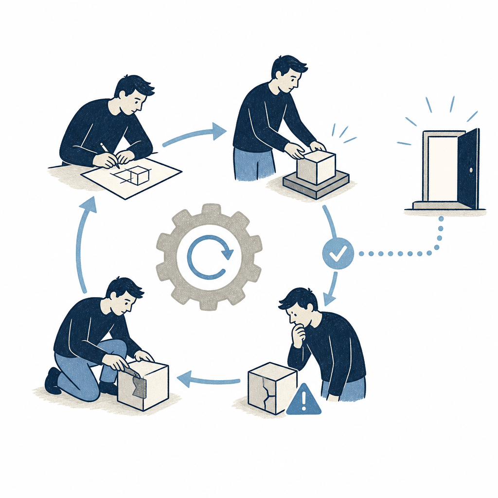

## 定義

把「由你親自一輪一輪提示 AI」的角色，換成一套會自己找工作、派給代理、檢查結果、記錄進度、再決定下一步的系統；你只設計這套系統一次，之後由它持續去提示 AI。槓桿點從「打字下提示」上移到「設計那套會下提示的系統」。

## 關鍵面向

- **跟提示工程是兩種技能**：提示工程拚語言精準、換一次更好的單次輸出，人本身就是回饋迴圈；迴圈工程拚軟體工程、換「可靠且已驗證」的結果，系統本身就是回饋迴圈。一句話差別：提示工程師說「幫我寫一個函式」，迴圈工程師說「寫出來、測試、修到全部通過為止」。
- **五個階段**：探索 → 規劃 → 執行 → 驗證 → 迭代。通過驗證就交付、沒通過就再跑一輪。
- **六塊組件**：①自動化（迴圈的心跳，照排程重跑、跑到條件成真，對應 [[claude-code-goal-command]] 的 /goal 與 /loop）②worktree（讓多代理平行不打架，對應 [[parallel-claude-sessions]]）③技能（把專案知識寫一次每次都讀，對應 [[skill]]）④連接器（建在 MCP 上、讓迴圈碰得到真正在用的工具）⑤子代理（換一個獨立代理做驗證、抓「自己說服自己」，即評估者／優化者模式，對應 [[adversarial-verification]]）⑥記憶（代理會忘、倉庫不會忘）。
- **比代理束縛高一層**：束縛（agent harness）是固定的執行環境（見 [[agent-harness-hygiene]]）；迴圈則是「會自己定時跑、會生小幫手、會自我供給」的束縛。
- **該不該建有四條件門檻（缺一個就維持手動提示）**：這件事會重複、驗證能自動化、token 預算扛得住浪費、代理有資深工程師等級的工具。衡量指標只看「每個被採納的修改花多少成本」，不是燒多少 token；採納率低於五成代表迴圈在幫倒忙。
- **三個迴圈不會幫你扛的陷阱**：Ralph Wiggum 迴圈（無聲失敗、半成品上退出還繼續燒錢，解法是一道客觀關卡而非「有意見的驗證者」，呼應 [[loud-failure]]）、理解債（迴圈越快交付你沒讀過的程式，落差越大，解法是讀 diff）、認知投降（放棄自己的判斷、全盤接受 AI 丟回來的東西）。
- **在採用階段模型中的位置**：[[ai-adoption-stage-model]] 的第 4 階「AI 原生」把迴圈擴到組織層：代理依意圖自行啟動、驗證與迭代，人只監看例外。但第 2、3 階仍要先建立可信的自我檢查、規則與停止條件；直接增加代理數，只會放大沒有關卡的壞迴圈。

## 應用場景

- Simon 工作場景：雷蒙雙棲地圖盤點後，把每週重複的任務（cert-quiz 出整卷、weekly-review、資安週報）按「先讓一次手動執行穩定 → 包成 skill → 再包成迴圈 → 最後才排程」順序試一條最小迴圈；六組件當成「我已有／還缺」對照表。
- Simon 工作場景：芙莉蓮雙棲本身（SSOT ＋ 本地記憶 ＋ 可遷移 skill）已備齊大半組件，缺的是「自動化心跳 ＋ 客觀關卡」這層；補強重點是 gate 設計，不是換工具。
- 一般場景：任何用 Claude Code／Codex 重度產出的人，判斷某個具體任務值不值得從「每次手動提示」升級成「設計一個迴圈」。

## 相關概念

- [[agent-harness-hygiene]]：迴圈工程在束縛工程的上一層；束縛先乾淨，迴圈才不會把雜訊放大。
- [[claude-code-goal-command]]：/goal 是「自動化」組件在 Claude Code 的具體指令，跑到完成條件成真。
- [[claude-code-iteration-loop]]：Boris Cherny 的「給 AI 驗證方式」自我修正循環，是五階段裡「驗證→迭代」的雛形。
- [[subagents]]：子代理組件的實作機制。
- [[adversarial-verification]]：子代理驗證要「推翻」而非「確認」，才抓得到自說自話。
- [[loud-failure]]：對應「客觀關卡」與 Ralph Wiggum 迴圈解法——失敗要大聲、不可靜默成功。
- [[parallel-claude-sessions]]：worktree ＋ 多視窗是「平行不打架」組件的來源。
- [[cross-platform-agent]]：「設計一個坐在哪一邊都能跑的迴圈」與雙棲可攜同源。
- [[dynamic-workflows]]：Claude Code 的 workflow 編排是「一次派多代理」的迴圈式實作。
- [[ai-evaluation-rubric]]：驗證階段要把「做得好」變成可打分的量表，迴圈才能自評。

## 尚未解決的疑問

- Simon 的任務多為知識／學習／個人系統類（重複性夠但驗證自動化程度參差），哪幾個真的跨得過四條件門檻？
- 在 Max 5x 固定額度下，迴圈「跑到達標」的 token 消耗與省下的人工審查時間，怎麼抓平衡點？

## 來源（自動維護）

- [[2026-06-15-bnext-loop-engineering]]
- [[2026-07-21-ai-adoption-five-stage-map]]
