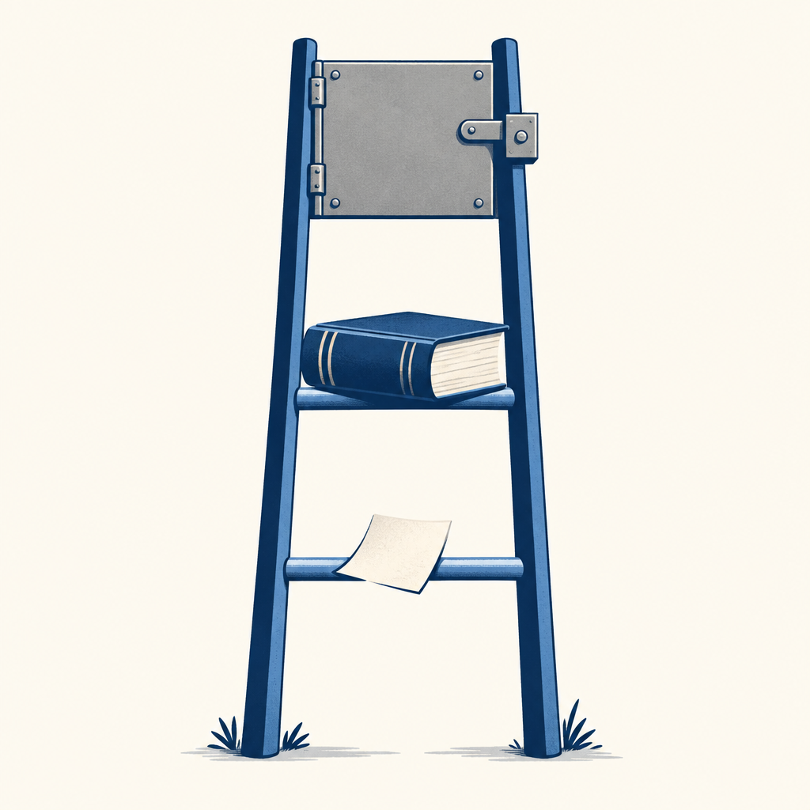

## 定義

養 AI 助理時，規則不一開始就寫死，而是照同類錯誤重複的次數逐級升格：第一次踩雷寫成記憶檔（軟提醒），同類第二次出現升成硬規則（明文禁止），硬規則仍擋不住就做成 hook（程式在動作前攔下、根本按不下去）。出自雷蒙 pro-kit 的「two-strike 錯誤升格」原則與蛋糕五個月的實作。

## 關鍵面向

- **三級對應三種成本**：記憶檔便宜、只在讀到時生效；硬規則每次對話都載入、佔脈絡；hook 是程式碼、要寫要測但最可靠。越往上越貴也越硬，所以用「重複次數」當升格門檻，避免單一事件就把最貴的一級用掉。
- **two-strike 是關鍵門檻**：一次事件不升格，因為可能是偶發；同類第二次才證明是模式。這條把「寫規則」從情緒反應變成有證據的動作。
- **最後一級把「會不會犯」變成「做不做得到」**：記憶檔與硬規則都靠模型讀了照做，hook 不靠模型自律，錯誤動作在機械層被攔下。對應「不要把守門交給意志力」的思路。
- **軟約束失效有實例**：Spotify 工程師先在 CLAUDE.md 寫「簡單任務請委派給便宜模型」，實測 Claude 在複雜任務中照樣自己整檔讀大檔，規則還得逐專案複製；改成 PreToolUse hook（工具呼叫前先跑的檢查）讀超過 350 行就攔下、叫它改走代讀代理，才真正落實。這是「直接跳到最後一級」的例子：違反成本高（燒 token）、又能用參數機械判斷，就值得做成 hook。（T客邦轉述 Spotify Mazmanov）
- **攔截要留放行條件**：hook 只擋浪費的動作、不擋合理的變體。Spotify 的例子放行「指定行數區間」與「用管線 grep 過濾」的讀檔，只擋整檔讀大檔；攔得太粗會把正常工作也卡死。（T客邦轉述 Spotify Mazmanov）
- **成長的量尺**：作者的體感是 AI 分身的成長不在會做更多事，在知道自己什麼時候做錯了；三層的檔數（記憶 353／規則 118／hook 11）是這種成長的可數痕跡。

## 應用場景

- Simon 工作場景：芙莉蓮現行路徑「feedback 記憶檔→CORE_RULES 條文→hook」同構，可補明「同類第二次才升 CORE_RULES、規則仍擋不住才做 hook」的門檻，防 CORE_RULES 因單一事件撐胖。
- 一般場景：任何用純文字規則管 AI 助理的人，遇到「這條要不要寫進常駐規則」時，先問這是第幾次同類錯誤。

## 相關概念

- [[hooks]]：階梯最上層的載體。
- [[agent-harness-hygiene]]：升格門檻是防規則層膨脹的來源端控制，健康管理是事後瘦身，兩者一前一後。
- [[claude-md-reflexive-law]]：「行為偏差先改規則」講的是要寫規則；本概念講的是寫到哪一級。
- [[loud-failure]]：hook 攔下時要大聲報，不然階梯最後一級也會變成靜默失敗。

## 尚未解決的疑問

- 「同類」怎麼判：作者沒說分類粒度；粒度太粗會讓不相干的事湊成第二次、太細永遠升不了格。

## 來源（自動維護）

- [[2026-09-17-cake-ai-clone-five-months]]
- [[2026-10-03-spotify-claude-gemini-token-savings]]
