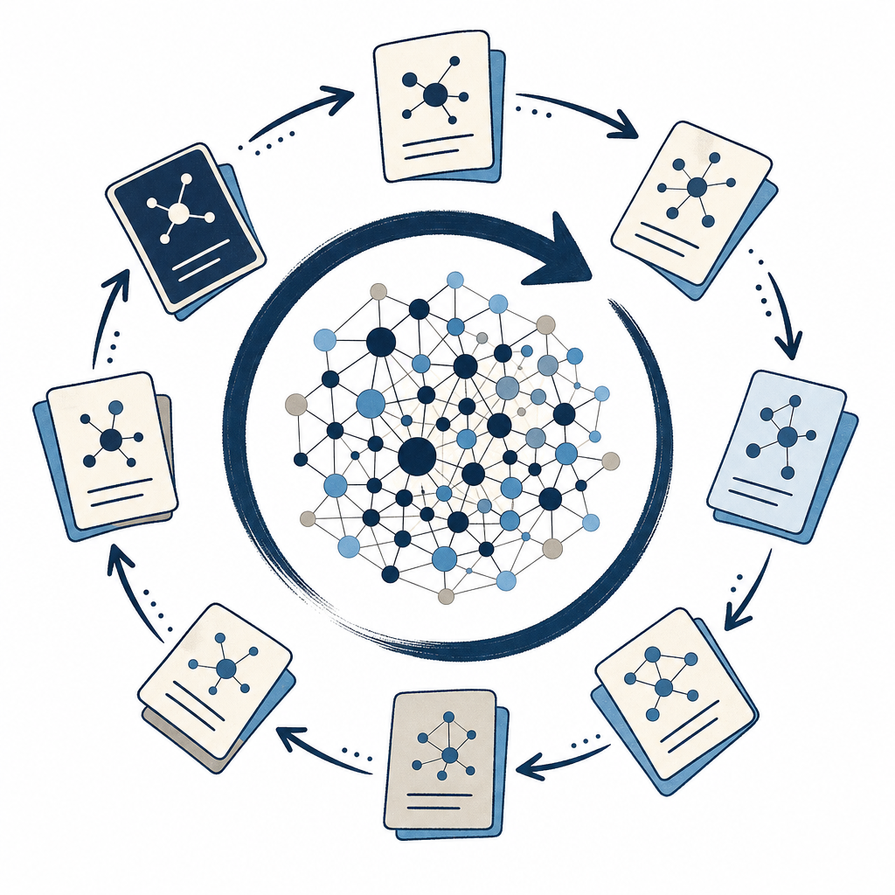

## 定義

把知識庫當成「一個由 AI 持續維護、會自己長大的系統」，而不是把資料收進去就不管的收藏夾。靈感來自 Andrej Karpathy：資訊收進來後讓 AI 定期消化、提煉、沉澱、迴流，知識庫會隨使用越長越密、越用越聰明。

## 關鍵面向

- **四層迴圈 A→B→C→D**：原始資料先統一進「未處理」資料夾 A（網頁、論文、影片、會議記錄）；AI 定期消化、把有價值的內容提煉成概念放進「已處理」資料夾 B；再依任務沉澱成可重複使用的方法論或 Skill 放進方法庫 C；每次產出的成果放進輸出資料夾 D。
- **輸出會迴流**：D 的成果不是終點，下一輪 AI 消化時又被重新讀回知識庫、變成新養分。這個迴流動作是「飛輪」越轉越快的關鍵——產出越多、庫越厚、下次產出越省力。
- **跟收藏夾的根本差別**：收藏夾是「收了就放著、要用再翻」，自生長知識庫是「收了之後 AI 主動幫你檢查哪些重複、哪些過時、哪些值得提煉成模板」。差別在有沒有一個「定期蒸餾（distillation）」的動作持續注入養分。
- **不依賴向量資料庫**：用資料夾分層 + 索引 + wikilink 就能跑，不必架 RAG 向量庫。靠的是 AI 直接讀本地 Markdown 檔。
- **Karpathy 稱它「LLM Wiki」，主動編輯而非被動索引**：跟傳統 RAG（查詢時才撈原文、答完就結束）相反，LLM Wiki 在「收進來當下」就讓 LLM 讀全文、抽概念、更新既有主題頁、甚至標注新舊資料的矛盾——把 LLM 從被動檢索工具變成主動的知識編輯。Karpathy 說累積到約 100 篇、40 萬字時，複雜問答幾乎不必再靠 RAG，因為索引與摘要已維護得夠完整。
- **三層流水線（擷取／編譯／審核）＋模型分級**：開源工具 obsidian-llm-wiki（v0.8.5）把流程拆三段——擷取用輕量模型（3B–8B 參數）抽概念摘要、編譯用較大模型（7B–14B）生成帶內部連結的 wiki 文章、審核由人逐篇確認（拒絕的帶回饋重生成）。預設走 Ollama 本機執行、資料不出網路，也支援 Groq／Together AI／Azure OpenAI。作者已把重心移到後繼專案 Synto，架構仍在快速演化。

## 應用場景

- **Simon 工作場景**：Simon 的 KW γ + vault 1b 結構就是這套理念的完整落地——`2-knowledge/readings` 對應 A／B（收進來的原始來源 + AI 提煉的概念）、`~/.claude/skills` 跟 `rules` 對應 C（方法庫）、Substack 文章跟 Reading Garden 網頁對應 D（輸出）；KW γ 的「健檢」就是定期蒸餾動作。影片用 Codex，Simon 用 Claude Code，理念同一套。
- **一般場景**：任何「資訊來源分散、會持續更新、需要反覆呼叫」的人（做內容、寫報告、搞研究、個人規劃），都可以用「先收集 → AI 消化迭代 → 輸出」三階段把零散資訊長成可複用的個人知識資產。

## 相關概念

- [[index-based-knowledge-base]]：自生長知識庫的「查詢端」實作——用索引取代向量檢索找到該讀哪幾頁。
- [[raw-wiki-split]]：A（原始）跟 B（已處理）分流的具體資料夾設計。
- [[graph-emergence]]：B 層概念越積越多後，跨篇共用概念自動連成圖譜，是「越長越密」的機制。
- [[progressive-vault-growth]]：自生長不要求一開始就建好完整結構，先建小庫再隨用長出。
- [[obsidian-claude-code-workflow]]：Obsidian 當資料層、Claude Code（或 Codex）當讀寫層的工具組合。
- [[second-brain]]：自生長知識庫是第二大腦範式加上「AI 主動維護」這層。
- [[skill]]：C 層方法庫的封裝形式。

## 尚未解決的疑問

- 「定期蒸餾」要多頻繁才不會變成負擔？Simon 的健檢目前是手動觸發，cron 化是否值得仍待評估。

## 來源（自動維護）
- [[2026-05-31-codex-obsidian-self-growing-kb]]
- [[2026-04-29-karpathy-obsidian-claude-wiki]]
- [[2026-07-09-inside-llm-wiki]]
