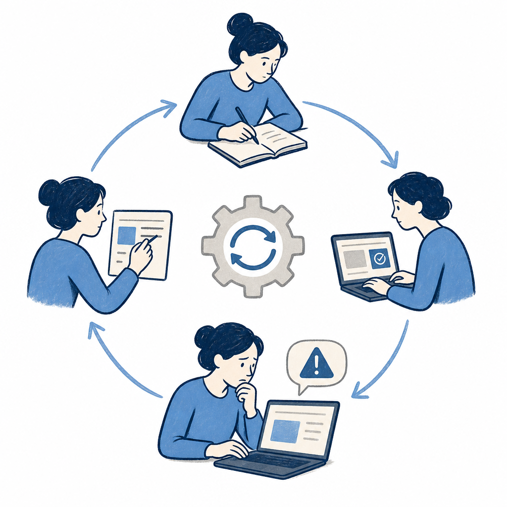

## 定義

Claude 的技能打包機制，把重複用到的 prompt、範例、流程固化為可重用的指令包，核心精神是「試一次、存起來、用很多次」。

> 打個比方：skill 就像給一位什麼都會、但都不夠精的廚師一本《台南小吃完全手冊》——擔仔麵湯頭怎麼熬、肉燥用哪個部位、醬油膏比例都寫在裡面，看完就能做出道地府城味。它把「什麼都略懂的通才 AI」變成「某個領域的專家」。（高見龍〈Claude Code Skills〉）

## 關鍵面向

- **組成**：description（觸發條件說明）、主體 prompt（含指示與範例）、附屬腳本或資源檔
- **觸發**：使用者意圖匹配 description 時自動載入到對話中
- **來源**：Anthropic 官方（superpowers、example-skills）+ 社群外掛 + 自製
- **與 Plugin 的關係**：Plugin 是一組 Skills 的打包，安裝 Plugin 會帶入多個 Skills
- **Skill Creator**：用自然語言讓 Claude 自動產出新 Skill
- **prompt-to-skill 封裝模式（Josie）**：對話得到滿意結果後直接請 Claude「把這段流程寫成 skill」、不是寫成 prompt；下次同類任務觸發 skill 自動跑同流程；自滾動 pipeline 的閉環
- **AskUser 內建工具**：skill description 只要說「請與我確認」、Claude 自動觸發 AskUser、不需要在 skill 裡明寫 ask tool；參見 [[interview-driven-prompting]]
- **跟 [[instructions-file]] 的分工（雷蒙範式）**：CLAUDE.md 是「入職手冊」放通用偏好、Skill 是「SOP」放特定任務完整流程；CLAUDE.md 每次對話自動載入、Skill 按需載入；不該把整本 SOP 塞進簡介
- **「連續三次重複交代 = 寫 Skill」判準**：在不同對話三次跟 AI 講同一件事就應該寫成 Skill
- **進化路徑**：每次都要講 → SKILL.md → 加 references/ 子資料夾 → 加 scripts/ → 加版本號與 changelog → 打包成 Plugin；大部分人到第三步就夠
- **模板 + Reference 雙要素（李佳達師父班）**：光有 prompt 模板不夠、要附範例和參考文獻才精準產出；技能包安裝後可持續優化、每次改版建議輸出安裝檔留底備份、方便回退版本
- **GPTs/Gems 範式翻轉**：GPTs 時代要「先想找誰、再開哪個對話框」；Skill 時代靠 description 自動匹配、AI 主動抓對應流程進來、「工具來找人」取代「人去找工具」
- **安全紅旗**：Skill 可內含 scripts/、能在本機跑程式、以你的使用者身份存取所有檔案與對外連網；裝陌生 Skill 前先把網址丟給 AI 評估、別無腦安裝。完整的風險模型（為何 skill 等同把電腦鑰匙交出去）、三種已揭露攻擊型態與四招肉眼審核法見 [[ai-skill-security]]
- **Skill 也需要瘦身**：description 太長、觸發條件相近或多個 skill 做同一件事，會讓模型匹配成本變高、觸發更不穩。定期檢查 description 是否精準互斥，是 [[agent-harness-hygiene]] 的一部分。
- **跟 Custom Commands／MCP／Subagents 的四機制分工**：客製化 Claude 行為有四種機制，差別在「誰觸發、給的是什麼」。Skills 由模型依 description 自動判斷觸發、給的是知識；Custom Commands 由使用者打 `/xxx` 手動觸發、是固定的 prompt 巨集（例如 `/review-pr`）；[[mcp]] 連外部服務、給的是工具；[[subagents]] 開獨立 context 平行處理複雜任務。四者互補、可同時運作——一個 `/review-pr` 觸發 Code Review 流程，Skill 給審查標準、MCP 拉 PR 內容、檔案多時再派 Subagent 平行審不同檔。判準一句話：要手動觸發固定流程用 Command、要 AI 自己判斷何時用什麼專業知識用 Skill。（高見龍〈Claude Code Skills〉）
- **Progressive Disclosure 的三層載入**：skill 內容按 [[progressive-disclosure]] 分三層——metadata（名稱＋描述、約 100 tokens、啟動全預載供比對）／instructions（`SKILL.md` 主體、建議 5000 tokens 內、相關才載）／resources（scripts/references/assets、用到才讀）。這也是「進化路徑」為什麼把細節往 references/ 拆的底層原因：主 `SKILL.md` 控在 500 行內、細節丟 references/，讓 context「用多少拿多少」。（高見龍〈Claude Code Skills〉）

## 應用場景

- Simon 工作場景：已安裝 superpowers 系列（TDD、plan、debug 等）、example-skills（pptx、pdf、xlsx、brand-guidelines 等）
- 一般場景：重複性工作流（會議紀錄、報表、簡報生成）、品牌或風格規範固化、專業領域知識注入

## 相關概念

- [[claude-code]]：Skill 運行的宿主環境
- [[subagents]]：Subagent 是持久化分身，Skill 是可召喚的流程；兩者在「重用」這個問題上互補
- [[interview-driven-prompting]]：skill 可內嵌訪談式互動防腦補
- [[template-reference-pattern]]：skill 可結合既有 template reference 提高產出品質

## 尚未解決的疑問

- Skill 版本管理與團隊共用機制
- Skill 與 Subagent 的邊界：什麼時候該寫 Skill、什麼時候該做 Subagent

## 來源（自動維護）

- [[2026-04-21-madebypan-claude-guide]]
- [[2026-05-02-haiuncle-claude-code-intro]]
- [[2026-05-11-josie-claude-code-obsidian-project-planner]]
- [[2026-05-12-raymond-claude-code-skill]]
- [[2026-05-18-li-jiada-skill-pack-install-demo]]
- [[2026-05-31-codex-obsidian-self-growing-kb]]
- [[2026-06-05-aj-chatgpt-presentation-flow]]
- [[2026-06-05-dustin-claude-code-harness-cleanup]]
- [[2026-06-13-pansci-claude-skill-security]]
- [[2026-07-01-kaochenlong-claude-code-skills]]
