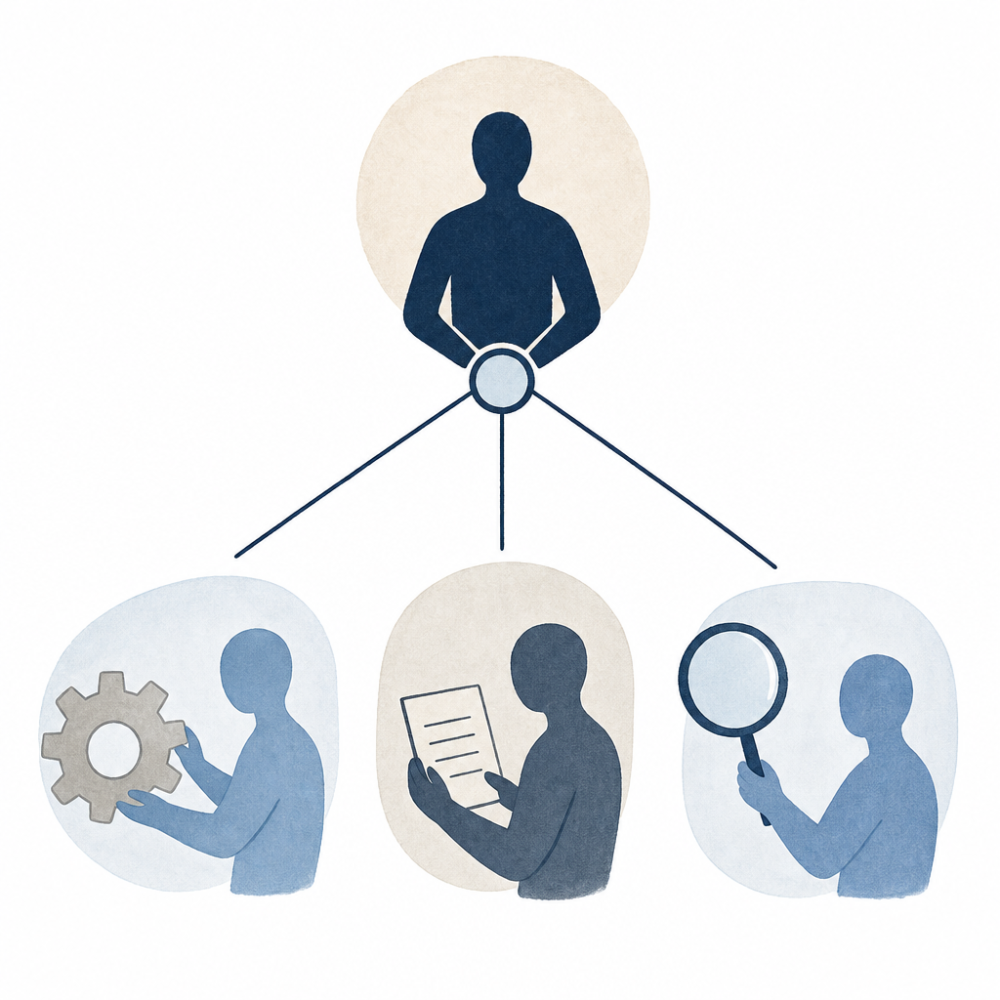

## 定義

Claude 的多代理協作機制。Subagent 是為特定任務訂製的持久化分身（自帶 prompt、工具集、記憶）；Agent Teams 則把多個分身並行派工並自動彙整結果。

## 關鍵面向

- **Subagent**：單一職能分身（如 code-reviewer、Explore、Plan、statusline-setup 等），自帶 system prompt 與允許工具集
- **Agent Teams**：多分身並行派工，適用於獨立任務（例如：三個方向同時研究）
- **Context 隔離**：每個 subagent 有獨立對話脈絡，不污染主 context，也看不到主對話歷史
- **Claude Code 內建**：透過 Agent tool + subagent_type 欄位呼叫；有官方與使用者自訂兩類
- **傳遞方式**：prompt 內塞入所有必要上下文（subagent 看不到主對話）
- **協作 vs 對抗兩種用法**：同一批 subagent 既可分工合作（各做一塊再彙整），也可彼此對抗（各自想推翻同一個結論，見 [[adversarial-verification]]）。正因為每個 subagent 的 context 互相隔離、看不到彼此的推理，互相挑錯才有意義——不是球員兼裁判。用途由派發時的 prompt 決定。[[dynamic-workflows]] 用一句話就能派出整批平行跑——影片裡兩個漏洞各派三個、共六個子代理同時跑。
- **探索與驗證要分開**：整理 agent harness 時，可先派探索型 subagent 分區盤點，再派不繼承主對話的 reviewer subagent 驗證成果。驗證代理只拿最終標準，不拿主 agent 的「我改了哪裡」說明，才不會被引導。

## 應用場景

- Simon 工作場景：
  - Explore subagent 做 codebase / 知識庫搜尋
  - code-reviewer subagent 驗證重要階段成果
  - Plan subagent 規劃複雜改動（例如 Knowledge Wiki 設計階段）
- 一般場景：大型專案拆解、並行研究、品質把關、敏感決策前的第二意見

## 相關概念

- [[skill]]：Skill 是可召喚的流程；Subagent 是持久化的角色。兩者都可重用，方向不同
- [[claude-code]]：Subagent 執行的宿主
- [[dynamic-workflows]]：一句話派出整批平行子代理的編排功能
- [[adversarial-verification]]：派多個子代理彼此對抗、互相推翻結論的驗證用法

## 尚未解決的疑問

- Subagent 之間的訊息傳遞最佳實踐（目前只能透過主 context 中轉）
- Agent Teams 的失敗恢復機制（某 agent fail 怎麼辦）
- Subagent 能力邊界設計：給太多工具易亂、太少又侷限

## 來源（自動維護）

- [[2026-04-21-madebypan-claude-guide]]
- [[2026-05-02-haiuncle-claude-code-intro]]
- [[2026-06-05-dustin-claude-code-harness-cleanup]]
