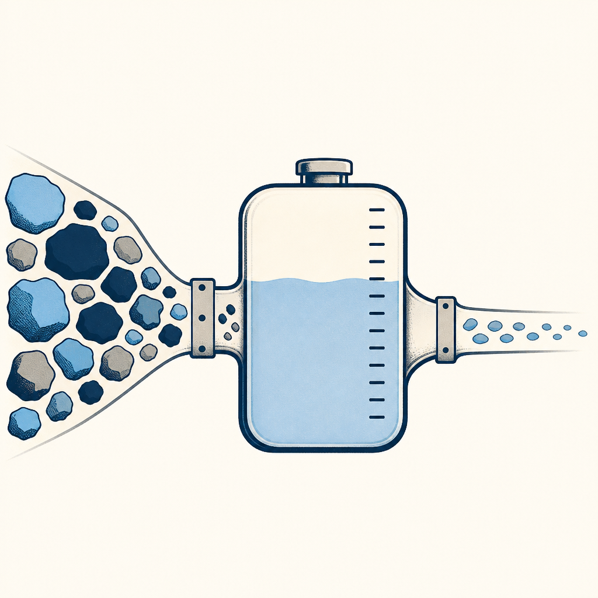

## 定義

針對 Claude 訂閱戶長對話場景的 token 控制四原則：資料降噪（轉 Markdown 再丟）、停止錯誤堆疊（用 Edit 改源頭不要罵 AI）、對話水位管理（15 句來回就壓縮）、模型適配（日常用 Sonnet 不要全程 Opus）。背後邏輯是 token 不只是錢、更是 AI 的智商空間。

## 關鍵面向

- **資料降噪**：同樣 15 頁文件，PDF 直丟燒 4 萬 token、轉 Markdown 只要 2000 token，20 倍差距；參考 [[markdown-vs-pdf-token-cost]]
- **停止錯誤堆疊**：AI 答錯時用對話框旁的 Edit 從源頭修指令、不消耗新額度；繼續打字罵它會把錯誤脈絡疊加進 context、token 跟錯誤一起累積
- **對話水位管理**：來回對話超過 15 句就請 AI 做總結壓縮；類比水庫洩洪，不洩洪上下文會變雜訊
- **模型適配**：日常寫程式、整理文件用 Sonnet（速度快 3 倍、省 5 倍額度）；只有需要深層邏輯推理才請出 Opus。展開版見 [[model-routing]]——判斷要拆成「派誰上場」乘上「叫他想多久」兩軸，而且有個前提：只有你驗收得了的工作才適合交給便宜模型大量做
- **核心邏輯**：省 token 的真正目的是維持 AI 智商，雜訊累積會讓 AI 變笨、不只是錢的問題
- **常駐規則瘦身**：整理 CLAUDE.md、AGENTS.md、hooks、memories、skills 這類每次都會讀到的 harness，省的是固定成本；Dustin 案例中每次新對話平均少約 4000 token，見 [[agent-harness-hygiene]]

## 應用場景

- Simon 工作場景：自架 Claude Code 處理長任務（KW γ migration、課程筆記批次）時，用「壓縮 + 切會話」維持 AI 表現；單檔複雜度高的工作主動切 Sonnet 4.6 留 Opus 給規劃／架構
- 一般場景：所有 LLM 訂閱戶的長對話通用，特別是 ChatGPT Pro／Gemini Advanced 等同樣有會話累積問題的工具

## 相關概念

- [[claude-usage-dashboard]]：守則直接降低三層中的 Current Session 跟 Weekly Limits 消耗
- [[claude-slash-commands-control]]：/compact /clear 是執行守則三的具體工具
- [[markdown-vs-pdf-token-cost]]：守則一的量化基礎
- [[progressive-disclosure]]：跟守則四相關，按需讀取也是一種模型適配
- [[prompt-cache]]：快取命中讓重複上下文只收 10% 費用，是省 token 的第五個面向（前四條省用量、這條省單價）
- [[model-routing]]：守則四「模型適配」的展開版，把它變成一整套可執行的分工流程
- [[deliverable-total-cost]]：提醒省 token 不等於省成本，重跑與人工檢查時間也要算

## 尚未解決的疑問

- 「15 句 = 壓縮閾值」是經驗法則、不同任務類型最適閾值是否不同？

## 來源（自動維護）

- [[2026-05-09-claude-token-limits-tutorial]]
- [[2026-05-24-anthropic-claude-code-cache-tips]]
- [[2026-06-05-dustin-claude-code-harness-cleanup]]
- [[2026-08-06-gary-chen-model-routing]]
