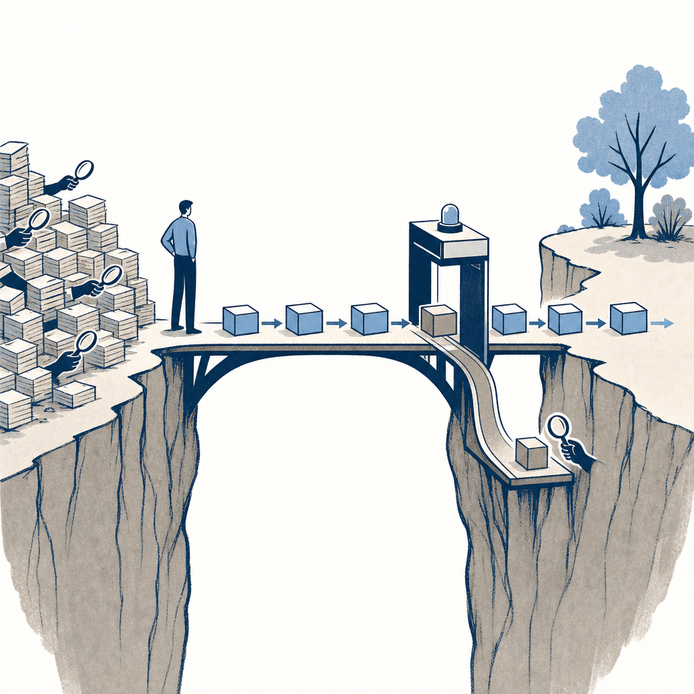

## 定義

AI 產出的準確率跨不過某個門檻，使用者就會全程重檢、AI 的淨效用歸零；跨過門檻才會從「每筆都驗」切到「只看例外」。所以 70% 準確率可能等於 0% 採用、90% 可能等於 100%。決定行為的不是準確率本身，是驗證成本與損失趨避。

## 關鍵面向

- **驗證成本決定淨效用**：使用者感受到的是「省下的時間扣掉驗證成本」。AI 客服準確率 70%、客服卻不敢用——不知哪三則錯、只好每則重讀，反而多了「檢查 AI」這道工序。驗證成本一旦超過節省時間，準確率再高都沒用（#效用理論）。
- **損失趨避造成跳躍式行為**：人對損失的敏感約是獲益的兩倍（Kahneman & Tversky 展望理論）。錯一則被客訴的痛遠大於對一則的爽，所以門檻上下的行為是跳躍、不是線性——這是「準確率差一點、行為差很多」的心理成因。（「兩倍」是統計平均、非精確係數。）
- **門檻的經驗值**：人因工程研究指出自動輔助系統的可靠度多要到七成以上、甚至更高，使用者才會從全面驗證切到只看例外。實際門檻依「答錯損失」高低而變——法務、醫療這種答錯代價高的場景，門檻更高。
- **跨門檻的設計手法不是衝準確率、是分流**：把訊息／欄位分成「敢直接放手」與「必須人審」兩類，先放手高把握類、把不放心的留給人（#受眾：拆成標準答案明確度、答錯損失、問題邊界三個條件）。對照 [[human-in-the-loop]]。
- **採用階段會把門檻變成操作分界**：在 [[ai-adoption-stage-model]] 裡，第 1 階的人逐步盯著單一代理，第 2 階則讓多個代理先自我檢查、人只驗收成品。能否可靠暴露錯誤、把人審集中在高風險例外，決定注意力瓶頸有沒有真的被移除；分身數增加並不會自動跨過信任門檻。

## 應用場景

- Simon 工作場景：判斷自建工具（記帳月結、Veeam 月報、資安週報）何時能從「每筆重看」放手到「只看例外」——不是等準確率 100%，是找出哪些欄位／訊息類型答錯代價低、先放手那些。記帳事中信封的人審分流就是這條的實作。
- Simon 個人場景：損失趨避也解釋投資（15 年隱者計畫別被短期虧損痛感嚇出場）與記帳事中護欄為什麼有效（超支的痛 > 省下的爽）。
- 一般場景：任何「AI 功能做出來但採用率低」的診斷——先問是準確率不夠、還是驗證成本太高跨不過信任門檻。

## 相關概念

- [[ai-adoption-gap]]：導入落差談「誰先用、怎麼推」，信任門檻談「準到什麼程度才有人敢放手」，同一章的一體兩面。
- [[human-in-the-loop]]：分流後「必須人審」那半就是人在迴圈的設計。
- [[loud-failure]]：AI 對不確定的部分要大聲暴露，正是幫使用者省下「全程重檢」的驗證成本、拉低信任門檻。
- [[minerva-hc]]：本概念由《AI 超級大腦》CH1 用 #問對問題／#效用理論／#心理成因／#受眾 串出。

## 尚未解決的疑問

- 損失趨避「兩倍」在不同答錯代價場景的實際倍率，課程沒給場景化的量測法。

## 來源（自動維護）

- [[2026-07-03-ai-super-brain-ch1]]
- [[2026-07-21-ai-adoption-five-stage-map]]
