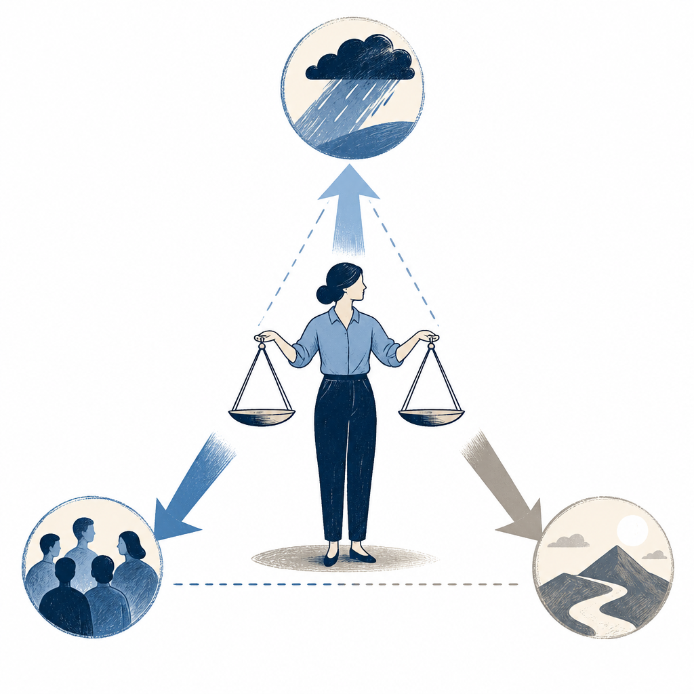

## 摘要

iPAS AI 應用規劃師 115 年命題核心從「What 名詞解釋」全面升級為「When 何時用、How to fix 怎麼補救」的情境決策題型，考官要的是顧問思維而非學生背誦。影片提出三大應考策略：反射矩陣（資料樣態直覺對應演算法）、決策三角（效能／成本／速度三軸取捨）、提示工程框架死穴（CoT／ToT／ReAct 各自弱點）。並預測下波加分題集中於向量資料庫、多模態、RAGAS 評估指標。最終導向：最強 AI 應用規劃師不追求完美技術，而是在限制條件下找出最不差解。

## 核心概念

- 顧問思維：iPAS 115 年的命題方向從「這個名詞的定義是什麼」全面轉向「在這個情境下你該怎麼判斷、怎麼補救」。考官要的不再是能背定義的學生，而是能在限制條件下做決策的顧問。這個思維同樣適用於 CISSP 等情境式考試。
- 反射矩陣：一種應考直覺訓練法——看到特定資料形態（例如影像、時序、表格）就能立刻對應到該用哪類演算法（CNN、LSTM、XGBoost 等），不需要逐步推理。目標是把「資料樣態 → 演算法選擇」的對應關係練成反射動作。
- 決策三角：工程決策中效能、成本、速度三個軸之間的取捨框架。三者不可能同時最大化，必須根據題目給的限制條件（預算不夠？延遲要低？硬體受限？）選擇犧牲哪一軸。影片提到一個實用技巧：題目出現「預算受限」「硬體不足」「低延遲」等關鍵字時，直接選 LoRA、模型量化等降本方案，命中率超過八成。
- [[prompt-framework-weakness]]：光知道 CoT（Chain of Thought）、ToT（Tree of Thought）、ReAct 這些提示工程框架怎麼用還不夠，更重要的是記住它們各自的致命弱點——例如 CoT 在需要回溯的問題上會卡住、ToT 計算成本高。考試考的是「什麼時候不該用某個框架」，而不是「某個框架的定義」。
- 技術超前部署：影片預測 iPAS 下一波加分題會集中在三個領域：向量資料庫（用 Embedding 做語意檢索）、多模態（影像加文字並行處理）、進階評估指標（ROUGE、RAGAS 取代傳統的 Accuracy）。這些是目前產業正在大量採用但考題尚未大量出現的技術。
## 對 Simon 的應用（當下想法）

> 以下為 reading 當下想到的應用、隨時間／工具／興趣變化可能已失效；後續落地狀態見下方「落地動作與效益」段（若有）。
- ✅ **iPAS AI 應用規劃師備考**：直接用三大策略當應考綱要，反射矩陣與決策三角分別整理成兩張對照表，考前 30 天每天看一次
- ✅ **CISSP / SSCP 備考遷移**：顧問思維與決策三角可直接套到 CISSP 情境題（manage / lead 視角）、SSCP OPS 操作取捨；可在 CISSP 筆記中拉出「決策三角」概念頁，把 CIA 三軸取捨並列
- ❌ **工作場景**：ISO 27001 風險決策、Omnissa MDM 功能 vs 終端體驗取捨、Veeam 備份 RPO / RTO / 成本平衡，都能直接套決策三角思維框架做書面論述 — 工作事項不刻意寫成三角
- ❌ **Knowledge Wiki 與 n8n 自動化**：CoT / ToT / ReAct 死穴可直接套到 Knowledge Wiki 收錄流程設計（目前是線性 CoT，遇到複雜判斷可考慮 ToT 或 ReAct）；Embedding 與 RAG 是 Simon 個人知識庫長期可演進方向 — n8n 已棄、KW γ 不升級、reading 夠用

## 原文要點

- iPAS 115 年命題從「What 名詞解釋」全面進化到「When ／ How to fix 情境決策」，考官找的是顧問而非學生
- 三大應考裝備：反射矩陣（資料 → 演算法）、決策三角（效能／成本／速度三軸）、提示工程框架死穴（CoT／ToT／ReAct 弱點）
- 解題黃金法則：題目出現「預算受限／硬體不足／低延遲」關鍵字 → 直接選 LoRA、模型量化等降本方案，命中率超過八成
- 下波加分題預測三領域：向量資料庫（Embedding 與檢索）、多模態（影像加文字並處）、進階評估指標（ROUGE、RAGAS 取代 Accuracy）
- 實戰演練（物流影像辨識專案）：Z-score 異常值排除 → CNN 影像架構 → 邊緣設備受限改用 INT4 量化，展示完整顧問決策流
- 終極心法：最好的 AI 應用規劃師不追求完美技術，而是務實的戰略家，在限制條件中找出最不差解

## 原始連結

- YouTube：https://youtu.be/wiBj6x4y43k
- 來源：Gemini 2.5 Flash v0.4 備援（原字幕被禁用）
- 字幕長度：6172 字
