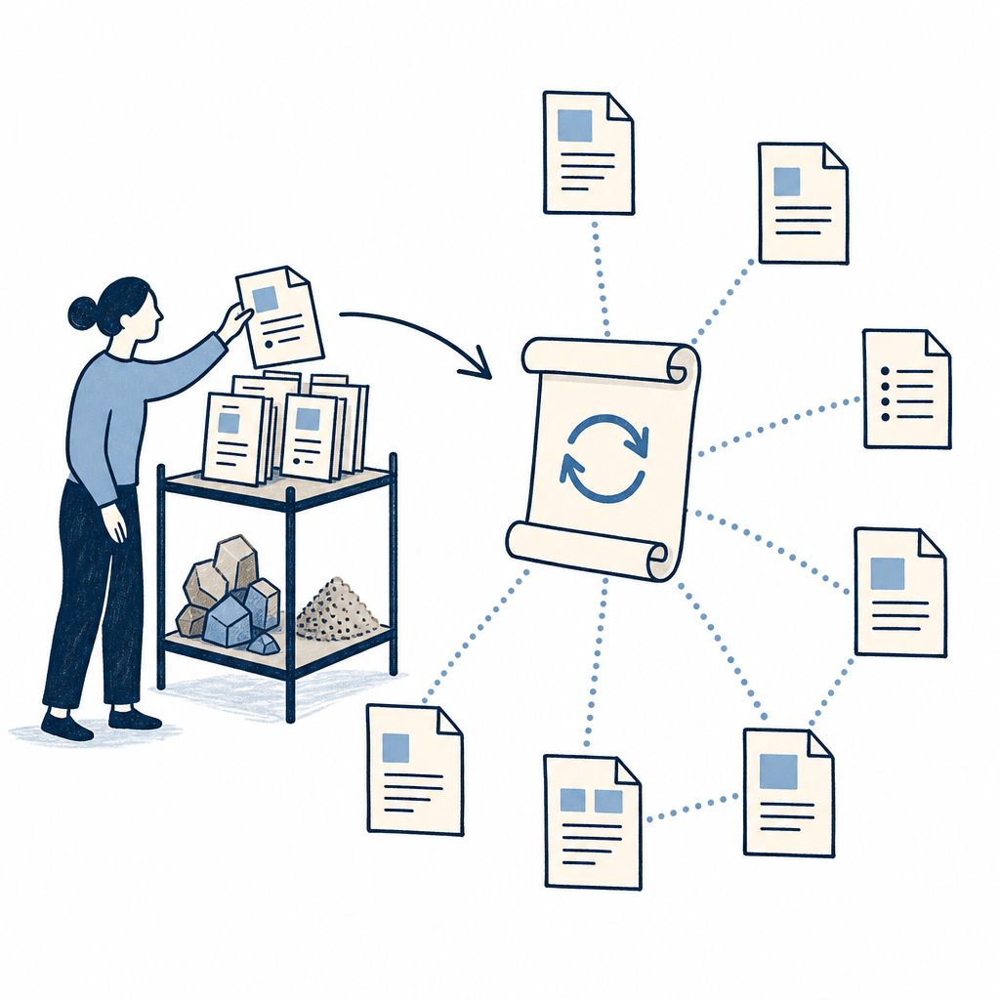

## 摘要

Paula 拆解 Andrej Karpathy 在 X 上分享的個人知識庫做法：用 Obsidian 當載體，靠 Claude Code 自動讀文章、產 Wiki 頁、寫索引、留日誌。架構只有兩個資料夾——Raw 收原料、Wiki 放 AI 整理產出，加上一份 Index 當全庫目錄、一份 Log 留稽核軌跡、一份 claude.md 當 AI 常駐指令。Karpathy 用此法管理約 100 篇文章，發現不必自建 RAG，讓 LLM 直接維護索引就夠用。Paula 實作示範收錄兩篇文章，AI 自動萃取概念、人物、來源三類頁面，產出共用節點形成知識圖。

## 核心概念

- [[index-based-knowledge-base]]：Karpathy 不用向量資料庫或 embedding 做語意搜尋，而是維護一份純文字的 Index 檔案當作整個知識庫的目錄。AI 要找資料時就讀這份 Index，靠標題和摘要判斷該打開哪個檔案。這種做法在約 100 篇文章的規模下完全夠用，而且比建 RAG 系統簡單得多。
- [[raw-wiki-split]]：整個知識庫只有兩個資料夾——Raw 放原始素材（收進來的文章原文），Wiki 放 AI 整理過的產出（概念頁、人物頁、來源頁）。這樣切開的好處是原始資料永遠不會被 AI 改動，而 AI 的產出也有明確的位置可以追蹤和修正。
- [[graph-emergence]]：當 AI 處理越來越多文章時，會自動發現跨文章的共用概念並建立 wikilink 連結。例如兩篇不同文章都提到「注意力機制」，AI 就會把它們連到同一個概念頁。文章收得越多，知識圖譜就越密，這個結構是自然長出來的，不需要人工規劃。
- [[log-traceability]]：每次 AI 對知識庫做任何操作（新增頁面、更新索引、建立連結），都會在 Log 檔裡留下一筆紀錄。這樣做有兩個好處：一是出問題時可以回溯是哪一步出錯，二是 AI 下次執行前會先檢查 Log，避免重複處理已經收錄過的文章。
- [[instructions-file]]：在知識庫根目錄放一份 claude.md，寫清楚 AI 操作這個知識庫時該遵守的所有規則（檔案命名規範、分類邏輯、寫入格式等）。這份檔案等於是 AI 的常駐合約，每次啟動都會自動讀取，不需要每次對話都重新解釋「你要怎麼幫我整理資料」。
![[2026-04-29-karpathy-obsidian-claude-wiki-index-based-knowledge-base.png|275]]

## 對 Simon 的應用（當下想法）

> 以下為 reading 當下想到的應用、隨時間／工具／興趣變化可能已失效；後續落地狀態見下方「落地動作與效益」段（若有）。
- ❌ **校對 Knowledge Wiki 設計**：Simon 的 Notion KW（資訊收集箱／概念庫／閱讀頁／變更日誌）跟 Karpathy 的（Raw／Wiki Concepts／Wiki Sources／Log）是同構結構，可確認自己流程沒漏掉哪個角色，例如「Index 頁」這層 Simon 目前散在 Notion 三 DB 各自的 view，沒有單一目錄頁，未來可考慮加一份「主索引閱讀頁」統一導引 — KW γ 已多份索引、不再加
- ❌ **Obsidian vault 補位**：Simon 4/22 才剛把 Obsidian vault 搬到 Windows 原生路徑，可在同 vault 試做 Raw／Wiki 雙資料夾 + claude.md 的副本實驗，不影響 Notion 主流程，純做小規模對照 — KW γ 已主場、不退回 Raw／Wiki 結構
- ❌ **指令檔分層**：Simon 已有全域 + 專案 CLAUDE.md 兩層，可比對 Karpathy 的單層 claude.md 看自己的分層是否過度 — 分層基於跨專案需求、不是過度
- ❌ **n8n 自動化點**：可把 RSS／LINE 抓進來的內容直接落到 Obsidian Raw 資料夾，再觸發 Claude Code 收錄，當作 Notion KW 之外的副本實驗 — n8n 已不用

## 原文要點

- Karpathy 在 X 公開 prompt（Gist 連結）；他用此法管理約 100 篇文章
- 兩資料夾結構：Raw（收件匣）+ Wiki（AI 產出），Wiki 內含 Concepts／Entity／Source 三類頁
- Index 與 Log 是核心：前者讓查詢快、後者讓動作可追溯
- 跟 RAG 的差異：無向量、無 embedding、無相似度搜尋；上限約數百篇文章
- 三種使用情境：跨文章提問、找知識缺口、讓 AI 抓外部資料補洞
- 限制：Claude Code 付費、收錄慢（每篇數分鐘）、Token 隨庫成長、規模有上限

## 原始連結

- YouTube：https://www.youtube.com/watch?v=FdSO1Yhr76I
- 來源：影片字幕 v0.3 路徑（yt-transcript.py、原語言英文）
- 字幕長度：10054 字
