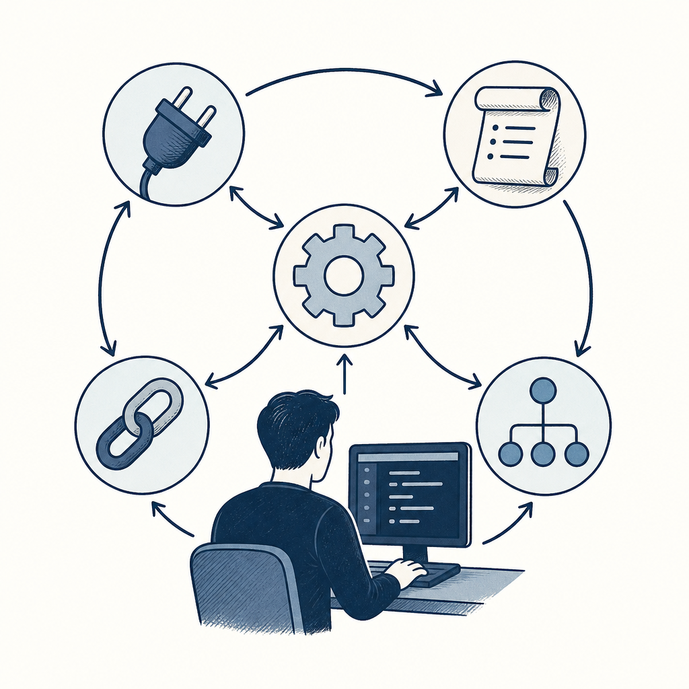

## 摘要

海大叔整理的 Claude Code 從 install 到進階用法完整教學：跨平台安裝（Windows 需 Git + PowerShell、Mac 用 Terminal）、VS Code 整合 + Plan Mode、三個模型 Haiku / Sonnet / Opus 用 /model 切換、CLAUDE.md 作為重要備忘錄、Skills 可用 GitHub URL 安裝、Hooks 條件觸發 100% 執行、Subagents 並行任務分派、MCP 接 Notion / Gmail / Calendar、進階指令 /init / /compact / /plugins / /Account、以及 Vibe Coding 實驗。強調 Plan Mode + Opus 是複雜專案「先規劃、再動手」的關鍵組合。

## 核心概念

- [[claude-code]]：Anthropic 推出的終端型 AI 助手，直接在命令列裡跟你對話、讀寫檔案、執行程式。海大叔示範了跨平台安裝（Windows 需先裝 Git + PowerShell、Mac 用 Terminal）、VS Code 整合，以及三個模型 Haiku／Sonnet／Opus 之間用 `/model` 即時切換。
- [[skill]]：把一套可重用的工作流程打包成一個「技能」，之後用自然語言就能觸發。海大叔展示直接用 GitHub URL 安裝別人寫好的 skill（例如 pptx 簡報產生器、Skill Creator），裝完馬上就能用。
- [[hooks]]：在 Claude Code 的特定事件（例如對話開始、檔案儲存、session 結束）上掛一段自動執行的腳本，跟 Git hook 概念類似。重點是 hooks 100% 會執行，不像 AI 指令可能被忽略。
- [[subagents]]：讓 Claude Code 同時派出多個子代理並行處理不同任務。海大叔用 `/Agents` 建立永久型 agent 做示範，適合把大任務拆成互不相依的小塊分頭做。
- [[mcp]]：Model Context Protocol 的縮寫，讓 Claude Code 透過統一協定連接外部工具，像是 Notion、Gmail、Google Calendar 等。設定好之後 AI 就能直接讀寫這些服務的資料。
- [[plan-mode]]：在 VS Code 裡切到 Plan Mode 後，Claude Code 會先產出完整的執行計畫讓你審核，確認才動手。海大叔強調搭配 Opus 模型做複雜專案時，「先規劃、再動手」能大幅降低改錯方向的風險。
- [[vibe-coding]]：用自然語言描述你要什麼，讓 AI 全程負責寫程式碼。海大叔用開發一個 Chrome extension 當範例，從頭到尾沒手動寫一行 code。
![[2026-05-02-haiuncle-claude-code-intro-claude-code.png|275]]

## 對 Simon 的應用（當下想法）

> 以下為 reading 當下想到的應用、隨時間／工具／興趣變化可能已失效；後續落地狀態見下方「落地動作與效益」段（若有）。
- ✅ **驗證現行 Claude Code 架構**：Simon 現行架構（全域 + 專案雙層 CLAUDE.md、Hooks 有 user-memory-inject 跟 knowledge-wiki-lint-catchup、MCP 掛 Notion / Gmail / Calendar、superpowers 跟 example-skills）跟海大叔整理的進階用法高度重疊，可驗證 self-trained 的架構選擇跟主流一致
- ❌ **Plan Mode 是未學到的招**：Simon-Agent 寫 skill、Knowledge Wiki 改 schema、n8n flow 變更這類高風險任務應加進 Plan Mode 公認「規劃 → 複核 → 動手」哨 — superpowers 已覆蓋、不另用 Plan Mode 按鍵
- ✅ **/init 跟 /compact 是可以加上手的指令**：/init 可在新複製專案裡一鍵生 CLAUDE.md；/compact 跨長 session 寫作離長後

## 原文要點

- **安裝**：Windows 需 Git + PowerShell；Mac 用 Terminal
- **VS Code 整合**：擴充功能 + 圖形介面 + Plan Mode + 自動編輯
- **三種模型**：Haiku / Sonnet / Opus，用 /model 切換
- **CLAUDE.md**：每次自動讀取的重要備忘錄
- **Skills**：可用 GitHub URL 直接安裝（pptx、Skill Creator、Nano Banana 等）
- **Hooks**：條件觸發 100% 執行（例如桌面通知）
- **Subagents**：並行任務分派、/Agents 建立永久型 agent
- **MCP**：連接 Notion / Gmail / Calendar 等外部工具
- **進階指令**：/init、/compact、/plugins、/Account
- **Vibe Coding**：用自然語言開發 Chrome extension 範例
- **Plan Mode + Opus**：複雜專案先規劃再實作

## 原始連結

https://youtu.be/2pM-7fBXc_M
