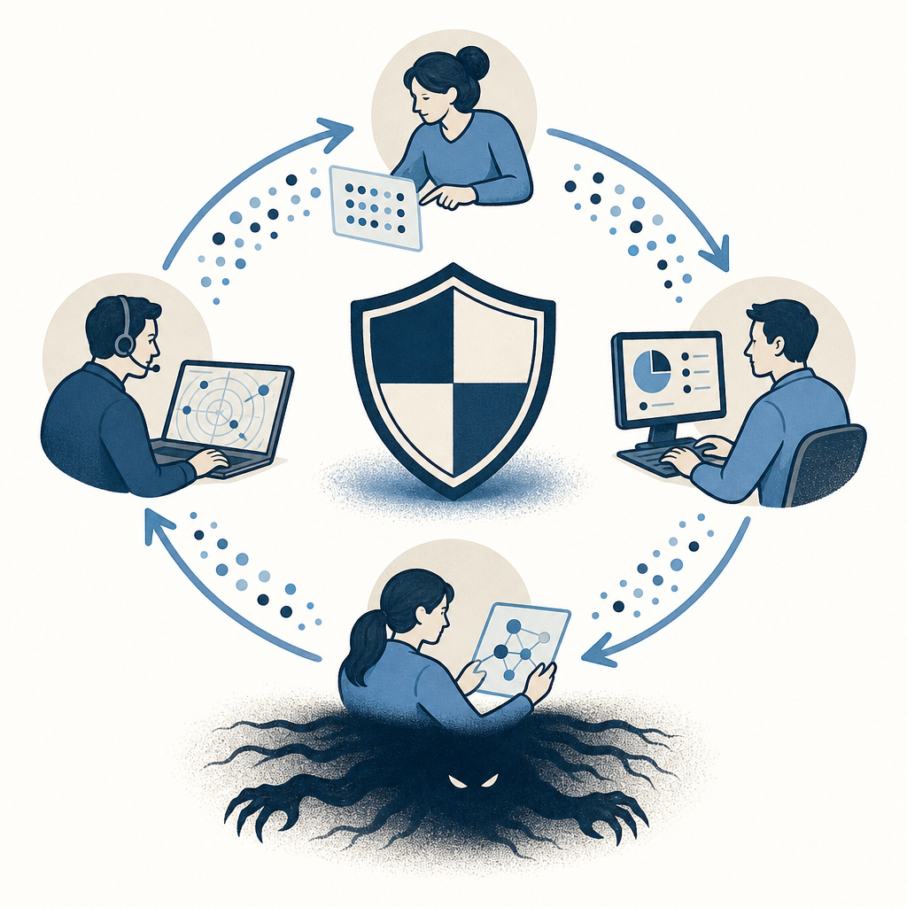

## 摘要

趨勢科技 TrendAI 資深威脅研究員 Nick Dai 與 Sunny W Lu 在 CYBERSEC 2026 拆解東南亞 APT「Earth Kurma／EarthMaker」自 2020 年 11 月起的工具鏈與內網潛伏手法，鎖定菲律賓、越南、汶萊、馬來西亞、泰國、印尼的政府單位與電信商。攻擊鏈分為初始入侵（利用網站漏洞 + Aurora Backdoor）→ 橫向移動（NBTScan／Nessus／FRPC + 自製 ICMPinger／keylogger）→ 持久化（KRK／Moriya／MMLOAD 多種 rootkit + Doppelganger 等 loader）→ 資料竊取（PowerShell + Audrey's／SimpleBoxSpike／SimpleWebExSpike）。技術重點是 MMLOAD/Yadnux 多階段反射式載入器透過 Google.sys／Boot.sys 在記憶體載入未簽章驅動繞過 Windows DSE，再由 NsdiProxy 注入 svchost、隱藏檔案／登錄、移除 ObRegisterCallbacks 反監控；以及創新濫用 Cisco Webex 會議室（建立 keep／message／file／shell 四個會議室分工）作為 C2 與資料外洩通道、加上 DFSR/SysVol 跨 DC 搬運資料。後門家族迭代清楚：door loader（2022-11）→ test state（2024-01）→ dataloader（2024-10）→ Dolby Vision（2024-11 至今）。

## 核心概念

- [[earth-kurma]]：一個自 2020 年 11 月起活躍的東南亞 APT（進階持續性威脅）組織，主要攻擊菲律賓、越南、汶萊、馬來西亞、泰國、印尼的政府單位與電信商。趨勢科技研究員在 CYBERSEC 2026 完整拆解了他們從入侵、橫向移動、持久化到資料竊取的全攻擊鏈，並發現其工具與 Lazarus、Tunnel Snake、Sharp Dragon 等已知 APT 有關聯跡象。
- [[mmload-yadnux-rootkit]]：Earth Kurma 使用的多階段反射式 rootkit，設計非常精密。它會在記憶體中載入未簽章驅動程式，然後做四件事來隱藏自己：用 mmFilter 攔截 Windows 的檔案系統回呼來隱藏惡意檔案、用 NsdiProxy 移除系統的物件監控回呼讓防毒軟體看不到它、用 RegProtect 隱藏特定的 Windows 登錄機碼（registry key）、以及注入 RdpThief 模組到遠端桌面程式（mstsc.exe）來偷 RDP 登入憑證。
- [[dse-bypass]]：Windows 預設會阻擋未經微軟數位簽章的驅動程式載入（這個機制叫 Driver Signature Enforcement）。Earth Kurma 用偽裝成合法名稱的載入器（Google.sys、Boot.sys）在記憶體中直接反射式載入壓縮過的 .zlib 驅動，繞過了這道防線，讓未簽章的惡意驅動可以在核心層執行。
- [[living-off-cloud-c2]]：攻擊者不自己架設指揮控制伺服器（C2），而是濫用企業本來就在用的合法雲端服務來傳遞指令和偷資料，這樣防火牆和 proxy 很難分辨正常流量跟惡意流量。Earth Kurma 的做法特別有創意——他們在 Cisco Webex 上建立四個會議室，分別用來做心跳確認（keep）、傳遞指令（message）、傳檔案（file）、和執行遠端命令（shell），另外也用 OneDrive、Dropbox 和 Windows DFS 複寫功能來搬運竊取的資料。
- [[red-team]]：研究真實 APT 組織的工具鏈和攻擊手法，本身就是紅隊演練和威脅情報工作的核心輸入——知道攻擊者怎麼做，才能設計對應的偵測規則和防禦措施。
- [[supply-chain-risk]]：Earth Kurma 大量複用不同 APT 組織的後門工具家族（如 S.Manager、Sharp Penta），這暗示 APT 組織之間可能存在共同的工具供應者，供應鏈安全風險因此被放大。
![[2026-05-05-earth-kurma-apt-rootkit-cybersec-earth-kurma.png|275]]

## 對 Simon 的應用（當下想法）

> 以下為 reading 當下想到的應用、隨時間／工具／興趣變化可能已失效；後續落地狀態見下方「落地動作與效益」段（若有）。
Simon 是公司內部 IT 工程師、負責資安／伺服器／機房／ISO 27001 推進。這場演講有四個直接可帶回的偵測重點：

1. ❌ **Tomcat／Web 服務落地檢測**：Earth Kurma 透過 CMS／Tomcat 漏洞落地後執行 cmsequip\*.exe／dp.exe／DB.exe 並 sc create Service。建議掃描 Web root 目錄是否有非預期的 .exe 落地檔、檢查近期 sc create 與 schtasks（特別是 SYSTEM 帳號每日觸發）。 — 公司無 Tomcat／Web 服務
2. ⏳ **Webex／OneDrive／Dropbox 出站連線異常**：Cisco Webex 連線正常應由 Cisco 官方 client 發起；如果偵測到 Microsoft 簽章 binary（特別 rundll32.exe）連到 Webex／Dropbox／OneDrive，幾乎可確定異常。建議 Proxy/EDR 加規則。
3. ⏳ **DFS/DFSR 與 SysVol 監控**：Earth Kurma 透過 DFSR 把資料丟到 SysVol 自動同步到所有 DC，再從對外 DC 上傳 Dropbox。SysVol 應該只放 GPO，出現非預期壓縮檔／執行檔需告警。
4. ⏳ **Group Policy 阻擋未簽章驅動**：Windows DSE 是預設防線，但反射式載入會繞過。建議用 GPO 強制阻擋未受信任驅動安裝、定期審核已載入驅動的數位簽章來源。

ISO 27001 推進過程中，這份案例可作為「資安事件偵測能力」章節的具體威脅情境參考。

## 原文要點

- 攻擊者極具創意：根據受害者環境客製化工具、改良後門（door loader → test state → dataloader → Dolby Vision）、濫用合法服務隱蔽
- Moriya rootkit 不寫死 C2，靠攔截網路流量裡六位元組 magic number 觸發、IOCTL 22404 註冊；這設計極難偵測
- NsdiProxy 對 mstsc.exe 注入 RdpThief、把 RDP 憑證寫入 C:\Users\All Users\Windows\KB911911.log（看似 KB 修補檔名稱降低可疑度）
- Doppelganger 後門有兩變體：Raw TCP（檔案操作 cmd 210/230/410）與 Cisco Webex（建立 4 個會議室分別作 keep 心跳／message 指令／file 檔案／shell 命令）
- 攻擊者複用其他 APT 公開 PoC 後門（如 S.Manager、Sharp Penta／Victory），可能反映 APT 之間共用 provider 工具
- 偵測建議：監控 ccSvcHst.exe 非預期終止（攻擊者會殺安全產品）、未簽章驅動載入、svchost.exe 異常注入、ICMP 大量掃描

## 原始連結

- https://web.plaud.ai/s/pub_f76ac29d-9c00-4230-bdb3-2a4233d0548a::FitTcPGVv5mdpzMkT8-EQFLxKhsUitb6pmO3VPOuIC-l1UbqRTYQaDhVBPcmj4nSGm1ho5ma-LjJlbwC
