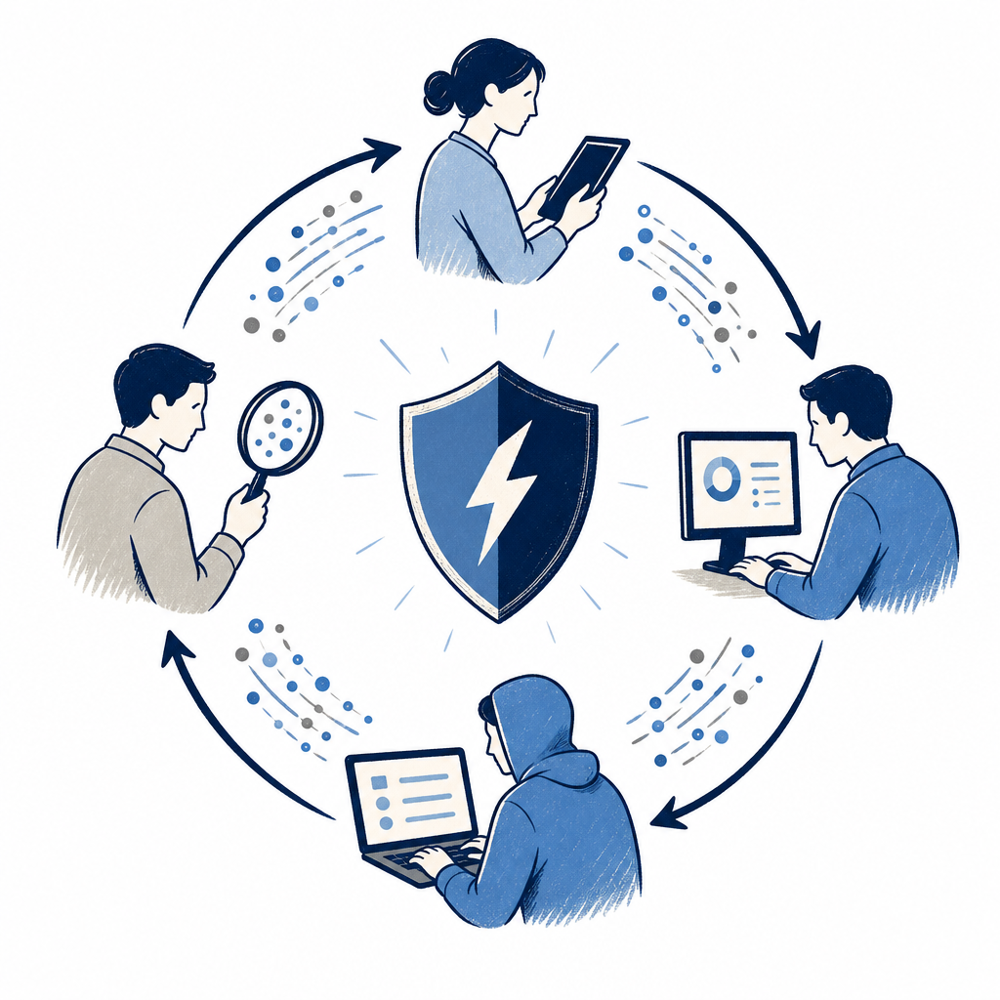

## 摘要

Google Cloud 全球資安解決方案架構師陳偉霆（William Tam）在 CYBERSEC 2026 演講，臨時把原訂題目改成過去一個月 AI 找漏洞能力大爆發後的緊急應對。重點訊息：CVE 從公開到出現實際武器化攻擊的平均時間從 24 小時壓縮到 8 秒，企業必須以「短期縮小攻擊面、中期 Agentic SecOps 自動化、長期自我修復系統」三階段框架因應。Google 自家工具鏈包括 Mythos（Anthropic × Vertex AI 私測，已找出數千個高嚴重性漏洞）、Big Sleep（DeepMind AI bug hunter，已揭露 SQLite CVE-2025-6965）、CodeMender（自動修補，6 個月對上游提交 72 項修復）。框架層提出 SAIF（Secure AI Framework）、Assured Open Source Software（AOSS）、Security Command Center 的 AI Protection、Cloud Model Armor、跟 Mandiant 顧問服務。Demo 重頭戲是收購自 Wiz 的多代理（Green/Blue/Rule/Red Agent）跨雲風險平台，從發現 → 調查 → 修補建議 → 指派 repository owner 全閉環，已逼近 self-healing 雛形。

## 核心概念

- [[agentic-secops]]：用 AI 代理來驅動資安維運中心（SOC）的完整閉環——從偵測告警、自動分揀優先序、調查根因、產生回應建議、到改進偵測規則，取代過去大量依賴人力的流程。Google 在自家 Security Operations 平台裡用 Gemini 做到讓分析師寫查詢語法的速度提升 76%。講者把企業因應 AI 時代資安的策略分成三階段：短期縮小攻擊面、中期用 Agentic SecOps 自動化、長期走向能自我修復的 AI 系統。
- [[cve-weaponization-time]]：漏洞從被公開揭露（CVE 發布）到出現真實攻擊武器的平均時間，已經從過去的 24 小時壓縮到 8 秒。這個數字徹底改寫了企業修補漏洞的節奏——過去「先收著、季底再修」的做法已經行不通，高風險 CVE 必須在天級甚至小時級內處理。
- [[secure-ai-framework]]：Google 提出的 SAIF（Secure AI Framework），涵蓋 AI 從資料收集、模型訓練、部署到應用的全生命週期治理。具體措施包含 prompt 安全防護、防止 jailbreak 的對策、以及讓模型具備自我感知能力（proprioception）來偵測自己是否被操縱。
- [[wiz-platform]]：Google 收購的跨雲資安平台，用多個 AI 代理協作——Green Agent 負責發現風險、Blue Agent 調查影響範圍、Rule Agent 比對合規規則、Red Agent 模擬攻擊驗證。平台用 Security Graph 分析一個漏洞被利用後可能波及的爆炸半徑，並能把修補建議直接推回開發者的 GitHub repo，接近「發現→調查→修補」全自動閉環。
- [[ai-vuln-discovery]]：AI 用來主動挖掘軟體漏洞的能力正在爆發。Google 在這場演講揭露了三個工具：Mythos（與 Anthropic 合作、用 Vertex AI 跑的私測工具，已找出數千個高嚴重性漏洞）、Big Sleep（DeepMind 的 AI bug hunter，已揭露 SQLite 的 CVE-2025-6965）、CodeMender（自動修補工具，6 個月內對上游開源專案提交了 72 項修復）。
- [[supply-chain-risk]]：演講特別強調開源軟體供應鏈的風險。Google 推出 AOSS（Assured Open Source Software），提供經過 Google 安全團隊驗證過的開源套件，確保企業引用的 dependency 沒有已知漏洞或惡意程式碼。

![[2026-05-05-google-cloud-agentic-secops-cybersec-agentic-secops-v4.png|275]]

## 對 Simon 的應用（當下想法）

> 以下為 reading 當下想到的應用、隨時間／工具／興趣變化可能已失效；後續落地狀態見下方「落地動作與效益」段（若有）。
Simon 是公司內部 IT 工程師、負責資安／伺服器／專案導入，這場演講有三個直接可帶回工作的訊息：

1. ⏳ **CVE 武器化時間 8 秒**：Veeam 備份調整、SQL MFA、ISO 27001 推進的時程不能再用「漏洞先收著、季底再修」的舊節奏。建議盤點高風險系統（特別是對外暴露的 Tomcat／IIS／Web 服務）的修補 SLA，把高風險 CVE 的補丁從「月」壓到「天」。
2. ❌ **Agentic SecOps 入門路徑**：公司若有採用 Google Workspace／GCP，可評估 Gemini 在 SecOps 的 NL 查詢能力做 PoC；不一定整套上，先試「告警分流自動摘要」這一塊。 — 公司 Microsoft 體系、無 GCP/Gemini
3. ⏳ **AI 部署順序**：演講提醒「應用先行、安全滯後」是常見地雷。Simon 公司若計畫導 AI 工具（不論 Microsoft Copilot 還是自架），應該把資安納入設計階段，而不是上線後補。

❌ 不直接相關但值得記的：Wiz 平台 50% 客戶不是資安部門，反映「跨團隊 DevSecOps 採用度」是平台選型的關鍵指標。 — 公司無 DevSecOps／平台選型計畫

## 原文要點

- 演講開場臨時改題：因為過去一個月 AI 找漏洞能力大爆發（Anthropic Mythos／Google Big Sleep／CodeMender 接連公布），原本準備兩個月前內容已過期
- 三階段框架：
  - 短期：縮小攻擊面、micro-segmentation 隔離無法快修系統、把漏洞優先序加上即時情資
  - 中期：Agentic SecOps 自動化日誌分析／告警分流／調查／修補建議
  - 長期：self-healing AI 系統 +「AI or bye」全生命週期治理
- 澄清迷思：AI 找漏洞需要原始碼，封閉軟體目前不易突破；FreeBSD 之所以容易被找出 25 年老漏洞是因為原始碼公開
- AI 安全事故案例：某美國租車公司用昂貴 AI 模型，AI 自己誤動作把 storage 全清掉，company 花 30 小時 restore backup
- Mandiant Threat Defense 提供「漏洞管理流程設計／審計／代營運」服務，臺灣已有多家大企業在用
- Wiz Demo 核心：跨雲 + AI 資產（模型／應用／dataset／agent／MCP server／pipeline／guardrails）統一可視化；多 agent 協作、修補建議直接 push 回 GitHub repo

## 原始連結

- https://web.plaud.ai/s/pub_1d056f42-6980-4ea9-9a08-3d9952ad8e14::y4UZ9SHsD02ifsn52EZ4dCsskfuyxW3POxNx-e3rygIUH2NMD4vLOj1nSMn1a2lmKjBmecnFN8DSIpMC
