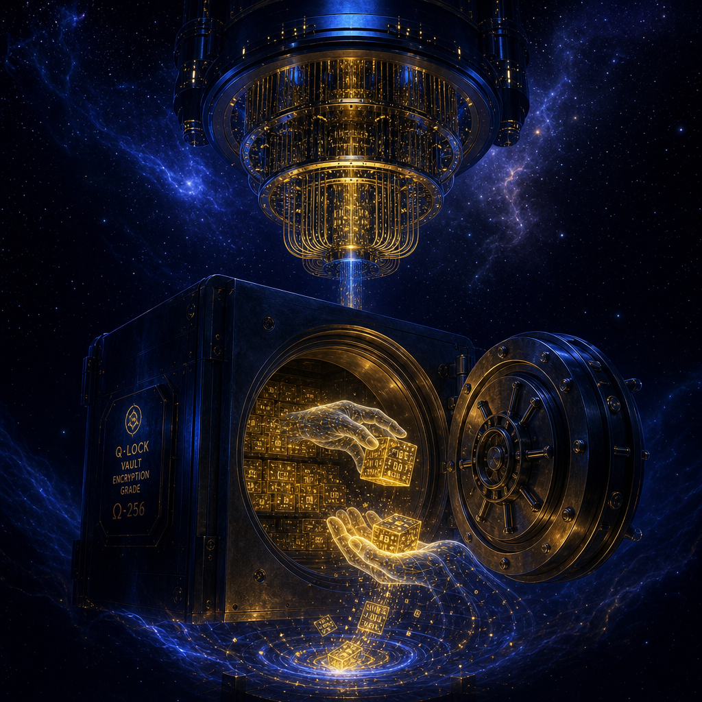

## 摘要

Palo Alto Networks 亞太政策與政府關係副總裁 Nicole Quinn 在 CYBERSEC 2026 Day 2 主題演講，從政策視角點出三個攻擊側已在發酵的長期風險。Harvest Now Decrypt Later：國家級攻擊者已在大量收集加密敏感資料、等量子電腦成熟解密；對應解方是後量子密碼學（NIST 2024 標準化）+ 企業密碼遷移計畫。Shadow AI：員工自帶 ChatGPT／Cursor／Copilot 進企業形成不可見資料外流。建議三層治理：跨國對齊全球標準、政府不過度限縮、公私部門情資共享。

## 核心概念

- [[harvest-now-decrypt-later]]：一種長線攻擊策略——國家級攻擊者（以及組織犯罪集團）現在就大量攔截、收集加密的敏感資料，雖然目前還解不開，但等到量子電腦成熟後就能一次全部破解。這種攻擊特別針對壽命超過 10 年的高價值資料，例如政府機密、醫療紀錄、商業智財。Nicole Quinn 在演講中強調「This is no longer hypothetical」，攻擊者已經在執行了。
- [[post-quantum-cryptography]]：能抵抗量子電腦攻擊的新一代密碼學演算法。NIST 在 2024 年完成了第一批標準化（ML-KEM、ML-DSA、SLH-DSA），企業現在就需要開始規劃從傳統的 RSA／ECC 密碼遷移到這些新標準。遷移過程很漫長，慢一年就多暴露一年的風險。
- [[shadow-ai]]：員工未經公司批准就自行使用 ChatGPT、Cursor、Copilot 等 AI 工具處理工作資料，形成企業看不見的資料外洩通道。Ponemon 報告顯示 73% 的組織擔心 AI 導致資料外洩，但只有 18% 建立了 AI 治理機制——落差非常大。
- [[critical-infrastructure]]：關鍵基礎設施（電力、通訊、金融、醫療等）是 Harvest Now Decrypt Later 的主要攻擊目標，因為這些領域的資料壽命長、影響範圍廣。Nicole Quinn 特別點出台灣因為地緣政治壓力，面臨的風險比多數國家更高。
![[2026-05-06-palo-alto-harvest-now-decrypt-later-cybersec-harvest-now-decrypt-later.png|275]]

## 對 Simon 的應用（當下想法）

> 以下為 reading 當下想到的應用、隨時間／工具／興趣變化可能已失效；後續落地狀態見下方「落地動作與效益」段（若有）。
公司目前無後量子密碼遷移計畫、若涉長壽命資料（員工醫療紀錄、財務歷史、商業機密）已在 risk window；下一步盤點哪些系統用 RSA／ECC 等會被量子破解的舊加密。Shadow AI 治理是 ISO 27001 可內建的章節、跟 insider threat 一起寫；先做 SaaS 流量盤點抓出實際正在用的 AI 工具清單。Nicole Quinn「This is no longer hypothetical」的時間軸視角直接可拿去主管簡報。

❌ 全段 — 公司資安大會行動方案目前用不到

## 原文要點

- 1B 用戶用 AI 只花 3 年（原預測 7 年）、政策制定的反應視窗壓縮
- Harvest Now Decrypt Later 已在進行、不只是國家級、組織犯罪集團也在做
- Cryptographic Migration「遷移應用程式所需時間非常長」、慢一年就被動一年
- 政策三層：跨國對齊全球標準、政府不過度限縮、公私部門情資共享
- 與台灣／新加坡／菲律賓／澳洲／日本協作、借鑑各國監理經驗

## 原始連結

- 現場錄音：`~/audio-inbox/語音 260506_104440.m4a`、逐字稿 `~/audio-inbox/transcripts/語音 260506_104440.txt`
- 議程資料：Drive `1ALC_3p4qA9vx_tz3oJfa4Z2TTiLRNtTG`／議程截圖
- NIST Post-Quantum Cryptography Standardization（2024）
