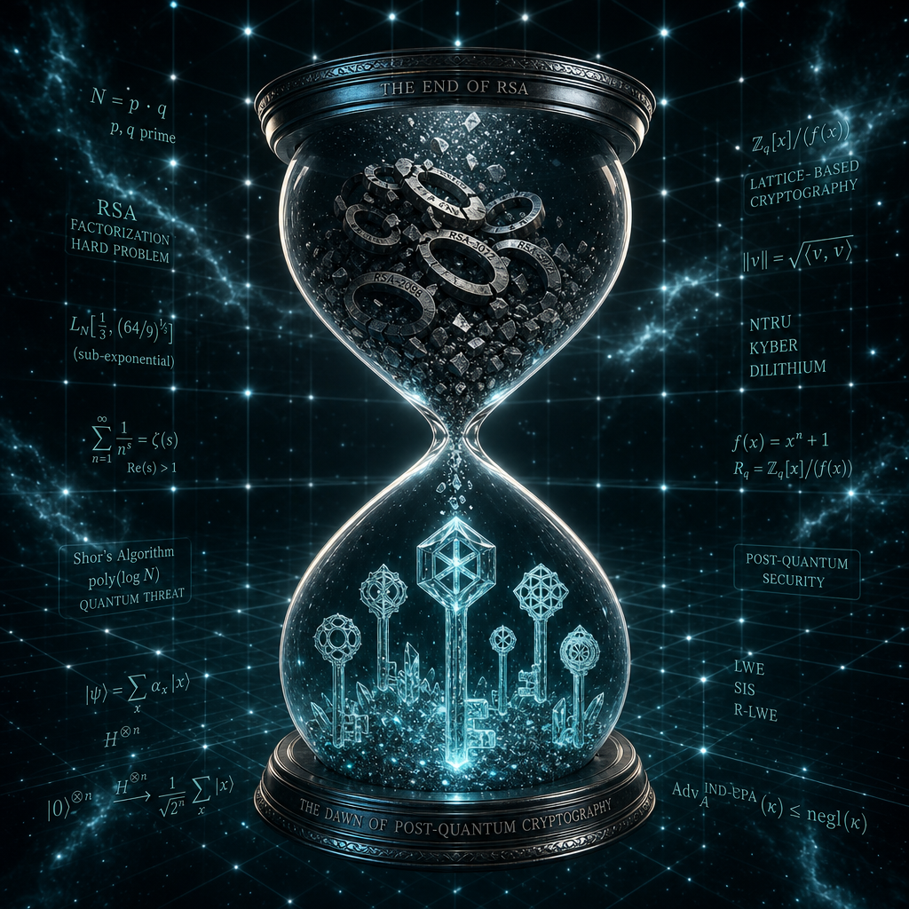

## 摘要

台大數學系兼任助理教授陳君明在 CYBERSEC 2026 PQC Forum 開場演說，把 PQC 遷移從「未來議題」拉到「現在排程」。對稱式密碼受 Grover 演算法影響有限（金鑰長度加倍即恢復安全度），但公鑰密碼受 Shor 演算法直擊：RSA 質因數分解與 ECDLP 都可化約為「找週期」問題，被量子電腦高效破解。Google 2025-05 研究把一週內破解 RSA-2048 所需的 noisy qubits 從 2,000 萬降到 100 萬、後續研究進一步降到 50 萬，威脅時程往前壓。NIST PQC 標準現況拆解清楚：FIPS 203（ML-KEM/Kyber）、204（ML-DSA/Dilithium）、205（SLH-DSA/SPHINCS+）已於 2024-08 定案；206（FALCON）、207（HQC）2026 出草案 2027 定案；SP 800-208（XMSS/LMS）已可用。其中 203、204、SP 800-208 可用於美國國安（CNSA 2.0），205、206、207 不可。陳君明強調遷移**不必等所有演算法定稿**，現有 203/204 已足夠展開；晶格密碼工具鏈成熟。NSA CNSA 2.0 時程：2027-01-01 新採購須合規、2030-12-31 不支援設備分階段汰除、2033-12-31 強制使用。常見誤解一一澄清：Google 沒宣布 Q-Day 在 2029（那是 Google 自己內外部完成 PQC 遷移的目標）、ECC-256 可能比 RSA-2048 更早被破（位元數更短）、IBM 不是 PQC 標準唯一設計者（Crystals 團隊 12 人只有 2 位來自 IBM）。落地三大瓶頸：X.509 與協定整合接近定稿但仍有缺口（多數仍是 POC）、FIPS 140-3 CMVP Level 3 HSM 尚未可用（金融級無法部署）、供應鏈「依賴性義大利麵」放大延誤。

## 核心概念

- [[post-quantum-cryptography]]：能抵抗量子電腦攻擊的新一代密碼學標準。NIST 在 2024 年 8 月已經定案三個標準：FIPS 203（ML-KEM/Kyber，用於金鑰交換）、FIPS 204（ML-DSA/Dilithium，用於數位簽章）、FIPS 205（SLH-DSA/SPHINCS+，基於雜湊的簽章）。另外兩個標準 FIPS 206（FALCON）和 FIPS 207（HQC）預計 2026 年出草案、2027 年定案。陳君明強調一個常見誤解的澄清：ECC-256 可能比 RSA-2048 更早被量子電腦破解，因為 ECC 的位元數更短；另外，Google 所說的「2029」是他們自己完成 PQC 遷移的內部目標，不是量子電腦破解 RSA 的預測日期。
- [[harvest-now-decrypt-later]]：Harvest Now Decrypt Later（先偷再解）是推動 PQC 遷移急迫性的根本原因，直接對應到 Mosca 不等式——如果資料需要保密 x 年、遷移需要 y 年、量子電腦在 z 年後成熟，那麼只要 x + y > z，你的資料就已經暴露在風險中了。
- [[mosca-theorem]]：陳君明用 Mosca 不等式（x + y ≤ z）作為判斷「哪些系統該先遷移」的框架。x 是資料需要保密的年限，y 是完成密碼遷移所需的時間，z 是量子電腦能破解現有密碼的預估時間點。實務上一個棘手的問題是憑證有效期的協調——有些憑證只簽 2 年、有些簽 8 年，交叉依賴讓遷移排程變得複雜。
- [[lattice-based-cryptography]]：目前 PQC 主流標準（ML-KEM、ML-DSA）背後的數學基礎，叫做晶格密碼學。核心原理是 LWE（Learning with Errors）問題：給定一組方程式 b = As + e，其中 e 是刻意加入的小誤差，要從 b 反推出秘密向量 s 極其困難。這個「錯誤項」正是量子電腦的 Shor 演算法無法用「找週期」技巧破解的關鍵——因為加了雜訊後就沒有乾淨的週期可找。
- [[crypto-agility]]：在遷移過渡期採用「混合密碼」策略，同時使用傳統加密（RSA/ECC）和 PQC 演算法，確保即使其中一邊被破解另一邊仍有效。更重要的是，crypto agility 讓系統在未來標準修訂時可以替換演算法而不需要整個重做。NSA 的 CNSA 2.0 時程本質上就是在推動這個彈性框架：2027-01-01 新採購須合規、2030-12-31 不支援設備分階段汰除、2033-12-31 強制使用。
- [[cbom]]：Cryptographic Bill of Materials（密碼物料清單），就是把組織裡所有使用 RSA／ECC 等傳統加密的系統、函式庫版本、相依套件全部盤點出來。陳君明把這列為 PQC 遷移的 Day 1 工作——你必須先知道「哪裡用了什麼加密」，才能排出遷移優先序。實務上最大的困難是「依賴性義大利麵」：一個系統可能間接依賴多層 library，每層都有自己的加密實作。
![[2026-05-07-jimmy-chen-pqc-migration-cybersec-post-quantum-cryptography.png|275]]

## 對 Simon 的應用（當下想法）

> 以下為 reading 當下想到的應用、隨時間／工具／興趣變化可能已失效；後續落地狀態見下方「落地動作與效益」段（若有）。
公司 IT 角度可以直接做的三件事：

1. ❌ **CBOM 盤點**：列出所有用 RSA/ECC 的系統與函式庫版本（OpenSSL、Bouncy Castle、HSM、晶片卡韌體），標註資料保留年限。這是 ISO 27001 資產盤點的擴充章節，可順便交差。 — 用不到
2. ❌ **CNSA 2.0 時程當對齊基準**：2027-01-01 雖然是國安採購門檻、但台灣金管會 + 數位部會跟進類似時程。提前做憑證 lifecycle、HSM 升級評估、給 Sam 看的資安 KPI 月簡報加「PQC 遷移預備度」這條。 — 用不到
3. ❌ **澄清向上溝通**：把 Q-Day 2029 誤傳釐清、ECC 可能更早被破的事實納入給董事會的風險敘事。Plaud 錄音可作為一手資料。 — 用不到

⏳ 對個人證照規劃：CISSP Domain 3 已含 PQC 概念、SSCP 出題機率提高、Google Cyber Course 3 也會碰到。陳君明這場可以當 SSCP/CISSP 戰備教材重看。

## 原文要點

- 量子威脅：Grover 對稱影響小（加倍金鑰）、Shor 對 RSA/ECC 致命（化約為週期尋找）
- Google 2025-05：1 週內分解 RSA-2048 從 2,000 萬 noisy qubits 降到 100 萬、後續降到 50 萬
- 已定案：FIPS 203 ML-KEM、FIPS 204 ML-DSA、FIPS 205 SLH-DSA（2024-08）
- 即將出爐：FIPS 206 FALCON、FIPS 207 HQC（2026 草案 2027 定案）；SP 800-208 XMSS/LMS 已可用
- 國安適用（CNSA 2.0）：203、204、SP 800-208 可；205、206、207 不可
- Mosca 定理：x（資料保密期）+ y（遷移期）≤ z（量子臨界）；憑證 2 年 vs 8 年協調困難
- NSA 時程：2027-01-01 新採購、2030-12-31 不支援設備汰除、2033-12-31 強制使用
- 歐盟時程：2026 First Steps、2030 高風險完成、2035 全面轉型；HNDL 是核心 driver
- 物件尺寸膨脹：Kyber 公鑰 800–1568 bytes、SPHINCS+ 簽章 7,856–29,792 bytes、HQC 更大
- 生態瓶頸：X.509 + 協定整合多為 POC、FIPS 140-3 CMVP Level 3 HSM 尚未可用、供應鏈相依複雜
- 誤解澄清：Google 2029 是遷移目標非 Q-Day、ECC-256 可能比 RSA-2048 早被破、IBM 非 PQC 標準唯一設計者
- 台灣展望：數位發展部數位產業署主導 PQC 遷移指引（PQC-CIA 聯盟）、金管會規範金融業；時程預期對齊 NIST/EU

## 原始連結

- Plaud 錄音：[05-07 講座：後量子密碼遷移挑戰、標準進度與實務路線圖](https://web.plaud.ai/s/pub_2bdd7e6d-c245-4e8d-beb5-ab6581f75cc8::rksjzRRCJQPk_YAcS-vWcgJR5Z1P3YuLIYjbOjQZBXDxNmb-gClQ_eCVeJKKr_kOZ1TWAf0cQ92JcggC)
- 議程：5/7（四）14:00–14:30、7F 701F、後量子密碼論壇
- 講者：陳君明 Jimmy Chen（國立臺灣大學數學系兼任助理教授、資通電腦獨立董事）
