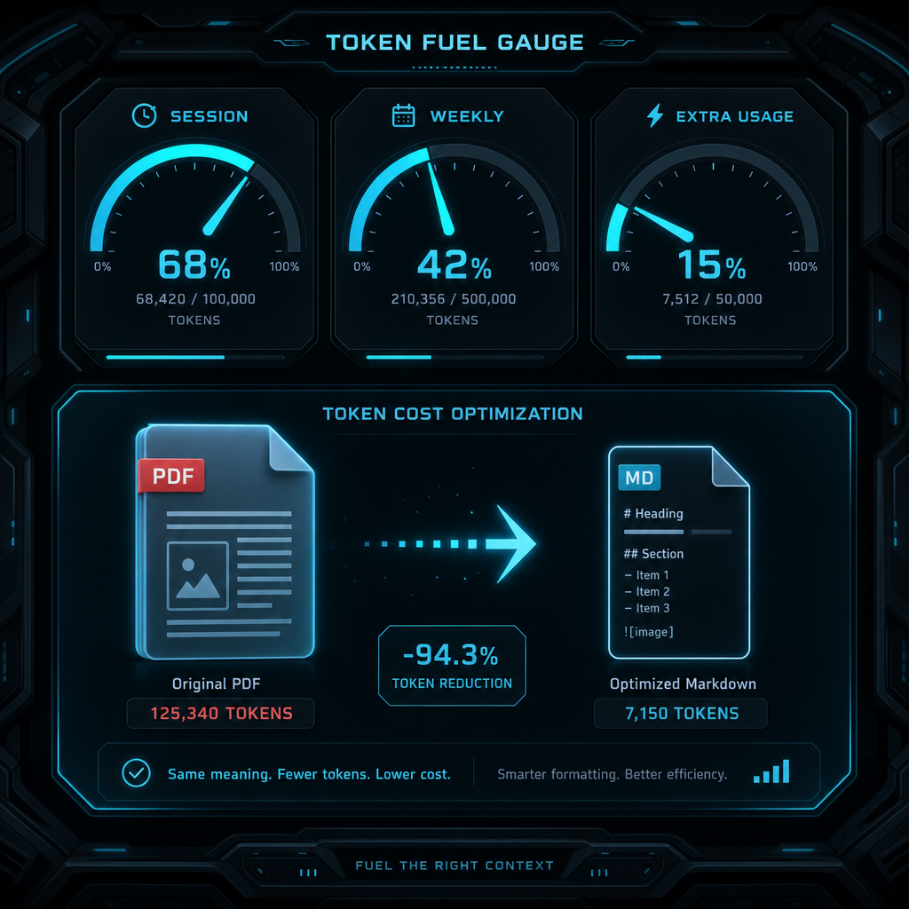

## 摘要

YouTube 短影片（Notebook LM 配音）以「大師級實戰指南」包裝、四模組系統化講 Claude 訂閱戶的 token 控制：(1) 解密額度面板區分 Current Session／Weekly Limits／Extra Usage；(2) 四大省 token 守則（資料降噪、停錯誤堆疊、水位管理、模型適配）；(3) 斜槓指令 /compact /clear /context /btw；(4) 標準化 SOP 工作流。核心洞察是 token 不只是錢、更是 AI 智商空間，省 token 的真正動機是維持 AI 表現。

## 核心概念

- [[claude-usage-dashboard]]：Claude 的額度面板其實有三層各自獨立的計量，搞混會誤判用量。**Current Session** 是當前對話的 token 水位（越高 AI 表現越差）；**Weekly Limits** 是訂閱帳號每週的總額度上限，用完就限速，這才是真正的「血條」；**Extra Usage** 是超出週額度後切換到按量計費模式，會直接扣錢。三者各自獨立計算，不能混為一談。
- [[token-saving-rules]]：省 token 不只是省錢，更是維持 AI 回答品質——context 塞太滿 AI 會開始遺漏跟答錯。四個守則：（1）資料降噪，丟給 AI 的資料先清理掉不相關的部分；（2）停錯誤堆疊，AI 答錯時不要打字罵它，用 Edit 從源頭改，避免對話裡累積一堆錯誤回覆佔 token；（3）對話水位管理，來回 15 句就該用 /compact 壓縮、換主題就 /clear 重開；（4）模型適配，日常用 Sonnet 就夠，Opus 留給需要深度推理的任務。
- [[claude-slash-commands-control]]：Claude Code 有四個斜線指令可以在不重開對話的前提下精準控制 token 用量。/compact 壓縮對話歷史但保留重點；/clear 徹底清空當前對話；/context 查看目前佔了多少 token；/btw 在不干擾主任務的情況下插入一個旁支問題。
- [[markdown-vs-pdf-token-cost]]：同一份 15 頁文件，直接丟 PDF 給 AI 會消耗約 4 萬 token，但先轉成 Markdown 再丟只需要約 2,000 token，差距高達 20 倍。對訂閱制用戶來說，「先轉 Markdown 再丟」是 ROI 最高的單一改動。
![[2026-05-09-claude-token-limits-tutorial-claude-usage-dashboard.png|275]]

## 對 Simon 的應用（當下想法）

> 以下為 reading 當下想到的應用、隨時間／工具／興趣變化可能已失效；後續落地狀態見下方「落地動作與效益」段（若有）。
- ✅ Simon-Agent 自架 CC 雖然走 plan-mode + skill 為主、但對話水位管理跟模型適配仍適用；CC 的 /compact /clear 跟 web 同名語意相同
- ⏳ 公司 IT 文件處理（CISSP 教材、ISO 27001 規範、廠商規格 PDF）改先轉 Markdown 再丟、預期 token 用量下降一個量級
- ✅ 跟 Simon 剛建的 Action「Obsidian Reading 改 HTML 網頁模式」呼應反向思考：vault 內部閱讀走 HTML（提升閱讀體驗）、丟給 AI 仍走 Markdown（壓 token）

## 原文要點

- 額度面板要看懂三層、特別是 Weekly Limits 是真血條、Extra Usage 切到按量計費要警覺
- PDF 直丟極吃 token；轉 Markdown 是 ROI 最高的單一改動
- AI 答錯不要打字罵、用 Edit 從源頭改、避免錯誤堆疊
- 對話來回 15 句就該 /compact、換主題就 /clear
- 日常用 Sonnet、Opus 留給深層推理

## 原始連結

- [https://youtu.be/50-MQWAzk-U](https://youtu.be/50-MQWAzk-U)
