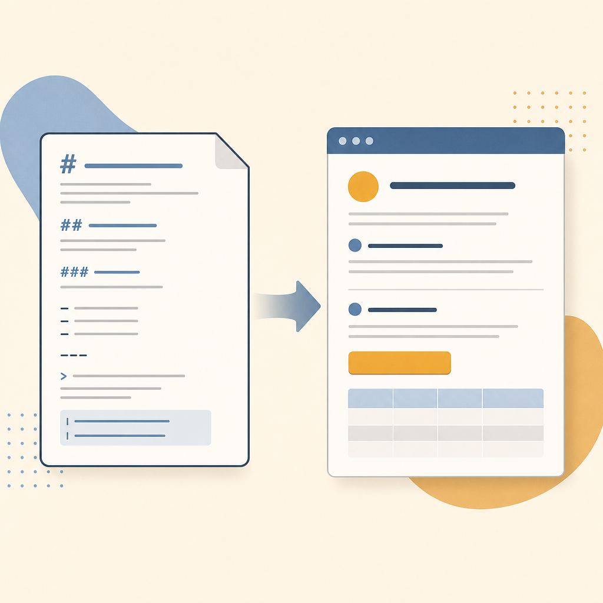

## 摘要

延伸 Anthropic Thariq Shihipar 2026-05 主張的 NotebookLM 配音解讀版，把「我已停止寫 Markdown」拆成 5 段重點：Markdown 失靈、HTML 補回的四個能力、脈絡吸收才是核心、五個具體用例、權衡與反建議。對比 [[2026-05-09-thariq-html-replaces-markdown-ai]] 原文，這版補了「用完即丟客製介面」第五用例（30 條待辦變可拖曳看板）跟結尾「不要寫超長 prompt 模板」反建議。AI 寫 HTML 的關鍵不是 HTML 語法、是 AI 對使用者真實工作脈絡的吸收能力——讀檔案系統、Slack、Linear、Git，再生成高度客製化的功能性網頁。

## 核心概念

- [[html-vs-markdown-ai-output]]：這篇是 Thariq 原文（見 [[2026-05-09-thariq-html-replaces-markdown-ai]]）的 NotebookLM 配音延伸版，補充了五個 HTML 具體用例（探索企劃、程式碼審閱、設計原型、研究學習報告、用完即丟客製介面），以及一個重要的反建議：不要因為 AI 會生 HTML 就寫出超長的 prompt 模板試圖控制格式，保持簡單、告訴 AI 想解決什麼就好。
- [[disposable-ui-html]]：五個用例中最讓人意外的是「用完即丟客製介面」——你有 30 條待辦事項散落在純文字裡，叫 AI 幫你生成一個可拖曳的看板網頁，直接在看板上拖拉排序、標記完成，整理完再匯回文字格式。這個網頁不需要部署、不需要維護，用完就丟。
- [[context-resend-token-paradox]]：HTML 輸出確實比 Markdown 多耗 token，產出速度也慢 2–4 倍。但回到 token 的重送數學：每次來回對話都重送整段歷史，如果 HTML 能讓你一次看懂、一次確認，省下的來回輪次所節省的 token 通常遠超 HTML 本身多用的量。
- [[interactive-confirmation-ui]]：HTML 的雙向互動能力直接應用在 AI 決策介面上。例如 AI 產出一份計畫，每個步驟旁邊放勾選框跟修改按鈕，使用者直接在介面上操作，而不是在文字聊天裡描述「請把第三步改成 XX」。
![[2026-05-12-notebooklm-html-vs-markdown-deep-dive-html-vs-markdown-ai-output.png|275]]

## 對 Simon 的應用（當下想法）

> 以下為 reading 當下想到的應用、隨時間／工具／興趣變化可能已失效；後續落地狀態見下方「落地動作與效益」段（若有）。
1. ⏳ 下次跟 Claude Code 講「幫我把這份報告做成 HTML 看版」而不是要 Markdown 條列
2. ❌ 30 條 Knowledge Wiki 待辦的盤點，可以丟一句「給我可拖曳 HTML 看板」由 AI 生介面、整理完再匯回 Notion — KW migration 已用其他方式結案
3. ✅ 對既有「習慣寫長 prompt 模板」傾向的反建議——保持簡單，告訴 AI 想解決什麼、不要寫死格式

## 原文要點

- Markdown 在 AI 時代失靈的原因：人不再讀、人不再手動改，過去兩大優勢蒸發
- HTML 補回的四個能力：資訊密度、雙向互動、SVG／表格／動畫、跨端分享
- 核心洞察：真正的差異化是 AI 對使用者脈絡的吸收能力，不是 HTML 生成能力本身
- 五個用例：探索企劃／程式碼審閱／設計原型／研究學習報告／用完即丟客製介面
- 反建議：不要把工作流寫成超長 prompt 模板、保持簡單、讓 AI 自己決定展現方式

## 原始連結

- https://youtu.be/TFC7d63EpK4
