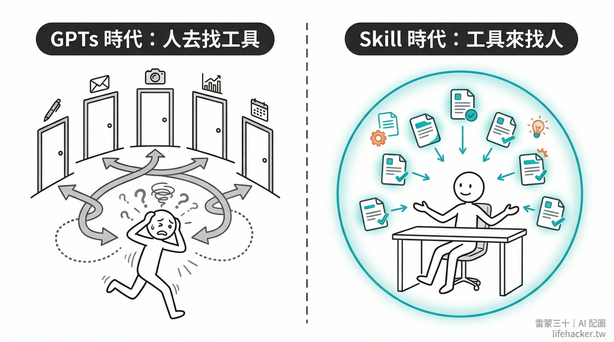
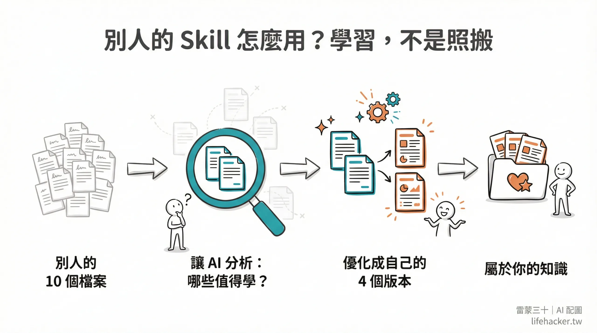

## 摘要

雷蒙用一句話把 [[instructions-file]] 跟 [[skill]] 的分工講清楚：CLAUDE.md 是「記住你是誰」的入職手冊、Skill 是「記住怎麼做事」的 SOP。每次對話都載入的通用偏好放 CLAUDE.md、按需載入的特定任務流程放 Skill。文章再給判斷準則「連續三次在不同對話跟 AI 講同一件事 = 該寫成 Skill」、進化路徑（SKILL.md → references/ → scripts/ → 版本 → Plugin）、安全紅旗（陌生 Skill 先丟 AI 評估別無腦裝）、跟 GPTs/Gems 範式翻轉（從「人找工具」變「工具找人」）。

![[2026-05-12-raymond-claude-code-skill-instructions-file.png|275]]

## 核心概念

- [[skill]]：Claude 的 Skill 就是一份寫給 AI 的 SOP（標準作業流程），教它在特定任務裡該怎麼做事。跟 prompt 模板的差別在於 skill 是持久存在的——寫一次就能反覆觸發，而且可以帶參考資料跟腳本。雷蒙給了一個簡單的判斷準則：如果你在不同對話裡跟 AI 講了同一件事三次以上，那就該把它寫成 skill。他自己寫了 25 個 skill，涵蓋寫作風格、個人 API 設定、工作流程等，最大價值在於「個人知識封裝」。進化路徑是 SKILL.md → 加 references/ 資料夾放參考資料 → 加 scripts/ 放自動化腳本 → 版本管理 → 打包成 Plugin（大部分人到第三步就夠）。
- [[instructions-file]]：CLAUDE.md 是 Claude Code 的「入職手冊」，放的是每次對話都會載入的通用偏好——你是誰、你喜歡什麼格式、有什麼禁止事項。雷蒙用一句話講清楚跟 skill 的分工：CLAUDE.md 是「記住你是誰」，Skill 是「記住怎麼做事」。不要把整本 SOP 塞進 CLAUDE.md（那是 skill 的工作），也不要把個人偏好寫進 skill（那是 CLAUDE.md 的工作）。

## 對 Simon 的應用（當下想法）

> 以下為 reading 當下想到的應用、隨時間／工具／興趣變化可能已失效；後續落地狀態見下方「落地動作與效益」段（若有）。
- ✅ **驗證自己 KW γ + journal + course-notes 等 Skill 的設計符合雷蒙範式**：每個 Skill 都聚焦單一任務、CLAUDE.md 只放通用偏好（語言／回答長度／繁中規則）、敏感資料另外分專案 CLAUDE.md。整體分層跟雷蒙建議一致、不必重構。
- ✅ **「三次重複交代 = 寫 Skill」判準可以反向掃描**：未來感覺「又在跟 AI 重複講」時就直接觸發新 Skill 設計。最近一次符合的場景是 substack-publish skill（連續三次發 Substack 都要交代 cover/H2/italic 檢查）、已經做成 skill。
- ✅ **進化路徑提醒第三步是上限**：大部分人到 references/ 就夠、不要過早追求 Plugin 化。Simon 目前 KW γ 已經有 references/、course-notes 跟 weekly-review 還停在單 SKILL.md、符合「不過度設計」原則。
- ✅ **GPTs/Gems 範式翻轉的價值**：Simon 從 GPTs 切過來最大感受就是不必再記「A 任務找 A 機器人」、直接講需求 Claude 自己抓對應 skill 跑。這個體感跟雷蒙描述完全一致、給 Triforce 共學團或新手介紹 Claude Code 可以直接借這個說法。
- ⏳ **安全紅旗值得轉達**：未來幫朋友／同事推薦 Skill 時、強調「先把網址丟 AI 評估再裝」、避免 superpowers／example-skills 以外的來源造成資安問題。

## 原文要點

- Skill = 工作 SOP；CLAUDE.md = 入職手冊；別把整本 SOP 塞進簡介
- Skill 結構：description（觸發）+ 步驟 + references（資料）+ scripts（自動化）
- 兩種觸發：自動（description 比對）+ 手動（slash command）
- 兩個位置：`~/.claude/skills/`（全域）+ 專案 `.claude/skills/`（局部）
- 雷蒙自己寫了 25 個 Skill、最大價值在「個人知識封裝」（寫作風格／個人 API 設定／工作流程）
- GPTs/Gems 痛點：每包知識散落在不同對話機器人、要先想「找誰」才能做事
- Skill 解法：description 自動匹配、AI 自己決定調用哪個 Skill、「工具來找人」
- 新手三步路徑：裝幾個實用 Plugin → 連續三次重複講就寫 Skill → 穩定後考慮打包成 Plugin
- 進化路徑：SKILL.md → references/ → scripts/ → 版本與 changelog → Plugin（大部分人到第三步就夠）
- 安全紅旗：Skill 可內含 scripts/ 跑本機程式、陌生 Skill 先丟 AI 評估再裝
- Q&A：非工程師可寫（純 Markdown）；可請 Claude「幫我把這段對話整理成 Skill」

> **圖像解讀**
> 類型：插畫對比圖
> 內容：左側「GPTs 時代：人去找工具」——迷惑的人物在多扇門之間跑來跑去，象徵要先想「找哪個機器人」才能做事；右側「Skill 時代：工具來找人」——人物安坐桌前，文件自動匯入發光圓圈，象徵 Skill 的 description 自動匹配任務、工具主動找上人。直觀體現雷蒙文章的範式翻轉核心。
> 原文出處：雷蒙三十 lifehacker.tw（2026-05-12）
> 可檢索關鍵字：GPTs vs Skill、工具來找人、範式翻轉

> **圖像解讀**
> 類型：流程圖
> 內容：「別人的 Skill 怎麼用？學習，不是照搬」——四步驟：別人的 10 個檔案 → 讓 AI 分析：哪些值得學？ → 優化成自己的 4 個版本 → 屬於你的知識庫。強調 Skill 的正確使用方式是消化內化、而不是無腦複製貼上，防止引入未知的安全風險或不適合自己工作流的邏輯。
> 原文出處：雷蒙三十 lifehacker.tw（2026-05-12）
> 可檢索關鍵字：Skill 內化流程、安全評估、個人知識封裝

## 原始連結

- https://raymondhouch.com/lifehacker/digital-workflow/claude-code-skill/
