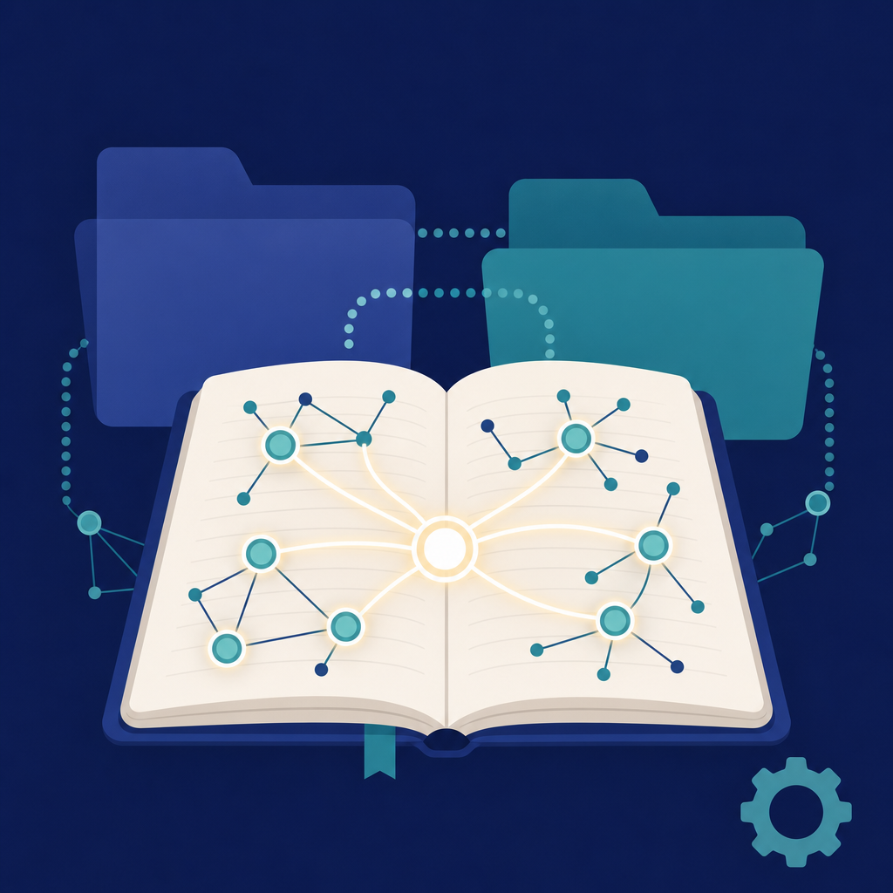

## 摘要

Dustin 示範用 Obsidian 當跨專案知識庫主軸，解決 Claude Code 在多專案間的「上下文視窗滿了」「跨專案連線斷裂」兩大痛點。核心是 wikilink 突破傳統樹狀資料夾結構——讓不同子目錄下的文件能跨層連線、AI 讀到某檔案時自動跳到關聯檔案讀全貌；不依賴向量資料庫、純語意連線。實作建議是 Plan Mode 起跑（請 AI 調查現有專案 + 上網找用法 + 問你問題）、安裝官方 Obsidian skill 讓 Claude 用 CLI 操作 vault；最重要的觀念是知識庫不是一夜建好的，從 projects + pillars 兩個資料夾起步、隨著使用逐步長出 decisions／日誌／週報／personal／insight／書籤等等。

## 核心概念

- [[wikilink-cross-folder]]：Obsidian 的 wikilink（`檔名`）不受資料夾層級限制——A 資料夾的檔案可以直接連到 B 資料夾的檔案。對 AI 來說這很關鍵：它讀到某個檔案時，看到 wikilink 就能自動跳過去讀關聯檔案，等於順著語意連線把分散在不同目錄的知識串起來，不再被樹狀結構困住。傳統資料夾結構下，AI 只能讀到當前目錄的內容，跨目錄的脈絡全靠人手動交代。
- [[progressive-vault-growth]]：知識庫不要一開始就追求完整的結構設計。Dustin 建議從 projects（專案）跟 pillars（核心支柱）兩個資料夾起步就好，隨著實際使用需求再慢慢長出 decisions、日誌、週報、insights 等資料夾。重點是讓結構「長出來」而不是「設計出來」，因為一開始就蓋大結構反而造成維護負擔。
- [[obsidian-claude-code-workflow]]：用 Obsidian vault 當資料層存所有知識筆記、Claude Code 當處理層負責讀寫分析的工作流架構。本篇補充了「跨專案連線」的觀點——多個不同專案的資訊放在同一個 vault 裡，靠 wikilink 互通，Claude Code 開任何一個專案目錄都能順著連線讀到全局脈絡。
- [[obsidian-cli-plugin]]：Obsidian 官方提供的 Claude Code skill，讓 Claude Code 能透過命令列介面直接操作 vault——建檔、搜尋、讀寫筆記，不需要打開 Obsidian 圖形介面。
- [[claude-md-dual-nav]]：用兩層 CLAUDE.md 幫 AI 導航知識庫的做法。根目錄放一份 CLAUDE.md 當「總目錄」，告訴 AI 整個 vault 的結構跟各區域的用途；各子資料夾再放 instructions.md 當「局部地圖」，說明該區域的細部規則。AI 進入任何資料夾都能先讀局部地圖、再回溯總目錄，快速理解脈絡。
- [[second-brain]]：個人知識管理的目標是建立一個外部化的「第二大腦」，讓大腦從記憶跟整理的負擔中解放出來，專注在思考跟決策上。
![[2026-05-13-dustin-obsidian-cross-project-vault-progressive-vault-growth.png|275]]

## 對 Simon 的應用（當下想法）

> 以下為 reading 當下想到的應用、隨時間／工具／興趣變化可能已失效；後續落地狀態見下方「落地動作與效益」段（若有）。
1. ✅ 對照 Simon 自己 vault `~/vaults/SimonVault/` 的七頂層 lowercase-dash 結構（2026-05-05 完成 1b 重構），確認當前架構已內建跨資料夾 wikilink
2. ✅ Dustin 的「漸進長出」很對 [[feedback-validate-then-upgrade]] 偏好，可以對應 Knowledge Wiki v0.1 → v1.0 演進軌跡
3. ⏳ 跨專案連線實際應用：Simon-Agent 的 project memory、SimonVault 的 reading／concept、Simon-Journal 的日記若能 wikilink 互通，Claude 開任何專案都能秒進入全局視角
4. ✅ 「不要一夜建好」對 [[feedback-surface-cost-first]] 反向印證——一開始就推完整方案反而負擔重

## 原文要點

- 核心痛點：Claude Code 上下文視窗會滿、跨專案資訊斷裂
- 解法：Obsidian wikilink 突破樹狀結構限制、AI 順著連線跨資料夾讀
- 起步流程：先建空 vault → 安裝 Obsidian CLI → Plan Mode 請 AI 調查 + 上網找用法 + 問你問題 → 看計畫再執行
- Dustin 自己的 vault 結構：projects／pillars／daily logs／weekly review／personal／decisions／insights／bookmarks（漸進長出）
- 維護方式：完全交給 AI，不親自打字；wikilink 也讓 AI 按語意自動建
- 官方 Obsidian skill 是教 AI 怎麼用 CLI 跟 Obsidian 對話的技能包

## 原始連結

- https://youtu.be/EhMKfG1dvnI
