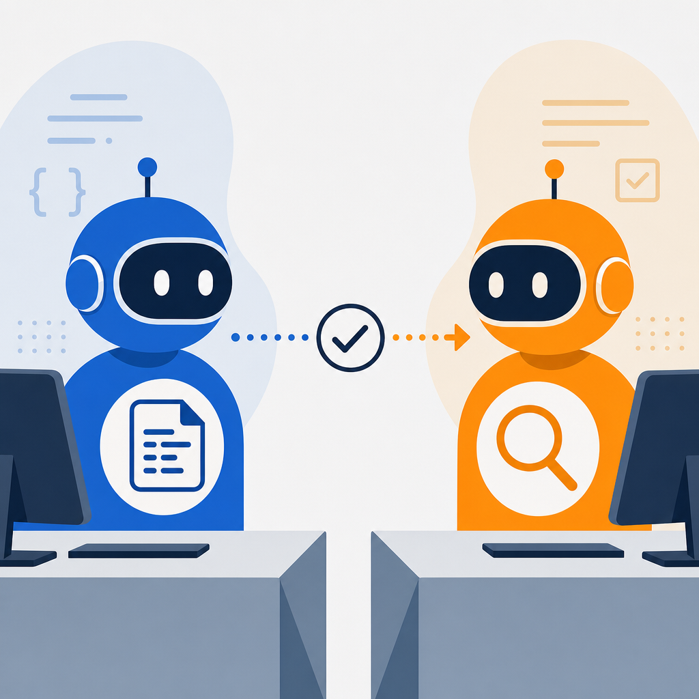

## 摘要

bnext 5/15 李先泰報導 Every 創辦人 Dan Shipper 從 Anthropic Claude Code 轉 OpenAI Codex Desktop 的決策邏輯。GPT-5.5 跟 Anthropic 性能打平後、模型不再是決勝點、應用層（速度、子代理、自動化推送）成主戰場。Shipper 主張這是「代理人管理介面」的桌面作業系統競賽、會決定未來在哪完成工作。三大趨勢：(1) 入口從瀏覽器移到桌面代理人；(2) 企業需季度評估競品避免 vendor lock-in；(3) 文件設計要為代理人可讀性優化。提到「3% 源頭誤差會在代理人決策鏈中複合放大」的系統性風險。

## 核心概念

- [[agent-os-competition]]：Anthropic、OpenAI、xAI、Google 正在搶「桌面代理人入口」的位置，這場競賽的本質跟當年 iOS vs Android 搶手機入口類似。關鍵轉折是 GPT-5.5 跟 Anthropic 性能打平之後，模型本身不再是決勝點，勝負移到了應用層——速度快不快、子代理好不好用、自動化推送做不做得到。Every 創辦人 Dan Shipper 從 Claude Code 轉去 Codex Desktop 就是這個邏輯：不是 Claude 模型不好，而是 Codex 的 app 體驗在速度和子代理上更順。Shipper 預測這場競賽 1-2 年內定勝負。
- [[agent-error-amplification]]：當 AI 代理人串成多步驟決策鏈時，源頭的小誤差會在每一步複合放大。文章舉的例子是 3% 的源頭錯誤率，經過多步代理人處理後，營運邏輯的整體偏差遠超 3%。結論是：在上游做資料驗證的成本遠低於在下游補救的成本。
![[2026-05-16-bnext-agent-os-codex-vs-claude-agent-os-competition.png|275]]

## 對 Simon 的應用（當下想法）

> 以下為 reading 當下想到的應用、隨時間／工具／興趣變化可能已失效；後續落地狀態見下方「落地動作與效益」段（若有）。

**A. 芙莉蓮優化類**（可套到 Claude Code／skill／rules／CLAUDE.md／user-memory）：

- KW γ 批次 ingest 流程內建的「每篇消化完顯式檢查點」（[[claude-md-12-rules]] 規則 10）+ [[loud-failure]] 已對應 agent-error-amplification 防禦、不額外加規則；但可在 user-memory 加一條「多步驟 AI pipeline 設計時主動列出驗證點」當預設意識
- ingest-flow Step 7「verify reading md + 寫 STATE 旗標」就是 loud-failure 應用案例、可以在 reading 內部例子化「這就是防誤差放大」、強化 concept 關聯

**B. Simon 個人動作類**（建 Notion Action 卡／動 vault／改個人工作流／看別的東西）：

- 季度評估 Codex Desktop／ChatGPT Desktop 是否值得補位（下次 Q3 復盤時看）；目前 Claude Max 5x + Agent SDK 結構已穩定、不急著動
- 觀察 Anthropic 是否推出對應 Codex Desktop 的桌面 app（Claude for Work）功能補位、影響訂閱結構決策
- 看一下 Every 創辦人 Dan Shipper 本人文章／podcast、了解他「6 種 AI 工作流」細節（bnext 文沒展開）

## 原文要點

- **Dan Shipper 轉跳 Codex**：從 Claude Code 投奔 Codex Desktop、主因是 app 層（速度、子代理、自動化推送）勝出、非模型差
- **GPT-5.5 跟 Anthropic 打平**：模型性能收斂、模型不再是決勝點
- **代理人作業系統競賽**：Anthropic／OpenAI／xAI／Google 搶桌面入口、類比 iOS vs Android、1-2 年定勝負
- **反向諮詢模式**：用戶向代理人詢問工具怎麼用、不自己設計流程、效率提升
- **3% 源頭誤差**：在代理人決策鏈複合放大、營運邏輯整體偏差；上游資料驗證關鍵
- **三大趨勢**：(1) 入口重定義桌面取代瀏覽器；(2) 快速迭代季度評估避鎖定；(3) 文件設計為代理人可讀性升級
- **Shipper 名言**：「工具與工作流變得太快、光跟著現在的工作方式跑、會被用新工具新範式的人靠預設值打敗」

## 原始連結

- https://www.bnext.com.tw/article/90960/ai-agent-desktop-operating-system-codex-vs-claude

## 落地動作與效益

**A. 芙莉蓮優化（高 ROI 組、2026-05-18 跟 Simon 對齊後執行）**：

- 無；本篇候選 A7／A8 在中／低 ROI 組、Simon 決定不做

**A 類不做**：
- **A7** user-memory 加「多步 AI pipeline 列驗證點」意識 — 中 ROI 組；既有 [[loud-failure]] + [[claude-md-12-rules]] 規則 10 + KW γ Step 7 verify + STATE 旗標已涵蓋誤差放大防禦、不重複建規則
- **A8** ingest-flow 加「防誤差放大」概念註 — 低 ROI 組、純文字註解、不做

**B. Simon 個人動作**（lazy 追蹤、Simon 自己看狀態）：

- 季度評估 Codex Desktop／ChatGPT Desktop 是否值得補位（下次 Q3 復盤時看）
- 觀察 Anthropic 是否推出 Claude Desktop 對標功能、影響訂閱結構決策
- 看 Every 創辦人 Dan Shipper 原文／podcast 了解 6 種 AI 工作流細節
