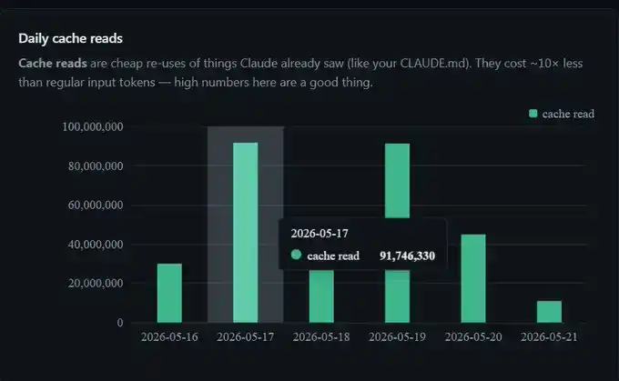
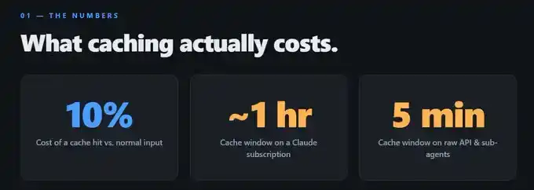
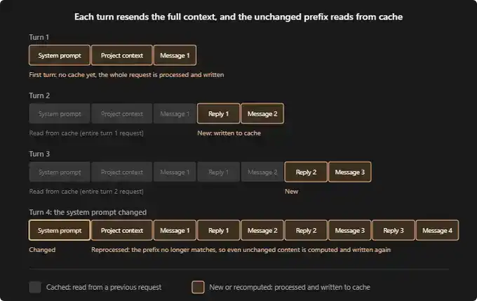
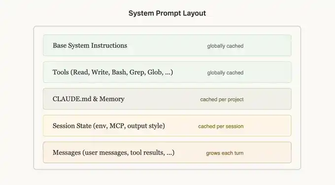

## 為什麼讀

正在追 Claude Code 省 token 主題（接續 [[2026-05-09-claude-token-limits-tutorial]]），這篇是 Anthropic 內部工程師 Thariq 的一手快取實測數據，補上之前 reading 沒覆蓋的 prompt caching 層面。

## 摘要

Anthropic 工程師 Thariq 公開分享 prompt caching 策略，實測每週省下超過 3 億 token。核心觀點是「上下文重用比減量更重要」。快取分三層（System 全域指令 → Project CLAUDE.md/memory → Conversation 對話歷史），快取命中的 token 只收正常 input 費用的 10%。TTL 在 Claude Code 訂閱制下是 1 小時、API 是 5 分鐘、subagent 固定 5 分鐘。三種行為會打破快取：切換模型、閒置超過 TTL、切 Opus plan mode。建議做法包括避免暫離超過一小時、用乾淨的 session handoff 取代 /compact、大文件放 Projects 層不要貼進對話。

## 核心概念

- [[prompt-cache]]：Claude Code 的 prompt caching 分成三層——System 層（全域指令、工具定義）、Project 層（CLAUDE.md、memory、專案規則）、Conversation 層（對話歷史）。快取命中的 token 只收正常 input 費用的 10%，所以 Thariq 實測一天 9,100 萬快取 token 實際只計費約 910 萬。快取靠的是前綴比對：只要後續請求的開頭跟已快取的內容一致，就能直接重用。TTL 在 Claude Code 訂閱制下是 1 小時、API 是 5 分鐘、subagent 固定 5 分鐘。三種行為會打破快取：切換模型（因為每個模型有獨立快取）、閒置超過 TTL、切 Opus plan mode（規劃階段用 Opus、執行階段用 Sonnet，每次切換等於換模型）。
![[2026-05-24-anthropic-claude-code-cache-tips-prompt-cache.png|275]]
- [[token-saving-rules]]：prompt cache 是省 token 策略的第五個面向。前四條守則專注在減少 token 用量（壓縮、拆對話、丟 subagent、監控水位），這條則是在同樣用量下降低單價——快取命中的 token 只要十分之一費用，等於同樣的對話長度花更少錢。
- [[context-rot]]：快取失效跟上下文腐爛往往出現在同一個場景——長對話或長時間暫離。當你離開超過 1 小時回來，不但快取過期需要重建（多花錢），對話本身的品質也可能因為上下文太長而下降（回答變差）。兩者交互影響，所以 Thariq 建議乾淨地結束舊 session、開新 session 帶摘要，比硬撐舊對話更划算。

## 對 Simon 的應用（當下想法）

> 以下為 reading 當下想到的應用、隨時間／工具／興趣變化可能已失效；後續落地狀態見下方「落地動作與效益」段（若有）。

**A. 芙莉蓮優化類**（可套到 Claude Code／skill／rules／CLAUDE.md／user-memory）：

- ❌ 對話中途切模型會清快取——Claude Code `/model` 切換時已有內建確認對話框警告，不需要額外寫 feedback memory

**B. Simon 個人動作類**（建 Notion Action 卡／動 vault／改個人工作流／看別的東西）：

- ❌ 找 Claude Code 快取命中率面板：Max 5x 固定月費、目前無額度異常痛點，等需要時再找
- ❌ 檢查暫離超過 1 小時的習慣：時機對不上，回來送訊息時快取已重建，建議切反而多付一次成本

## 原文要點

### 快取經濟學

- 快取 token 成本 = 正常 input token 的 10%
- 實測 9,100 萬快取 token ≈ 910 萬標準 token 計費

### 三層快取

- System 層（全域）：基礎指令、工具定義
- Project 層：CLAUDE.md、memory、專案規則
- Conversation 層：對話歷史

### TTL 差異

- Claude Code 訂閱制：預設 1 小時
- API：預設 5 分鐘
- Subagent：固定 5 分鐘

### 快取失效觸發

- 切換模型會清快取
- 閒置超過 TTL
- 切 Opus plan mode 會觸發重建

### 建議做法

- 避免暫離超過 1 小時
- 用乾淨的 session handoff 取代 /compact
- 大文件放 Projects 層而非對話層
- 用面板工具監控快取命中率

> **圖像解讀**
> 類型：數據圖表
> 內容：「Daily cache reads」長條圖，時間軸涵蓋 2026-05-16 至 2026-05-21，Y 軸最高 1 億 token。浮示框顯示 2026-05-17 單日快取讀取量為 91,746,330 token，即文章標題「每週省 3 億 token」的具體數據來源。視覺化證明快取機制在實際使用中的規模效益。
> 原文出處：文章截圖（Anthropic 內部儀表板，2026-05-17 實測）
> 可檢索關鍵字：快取讀取量、3 億 token、每日快取統計

> **圖像解讀**
> 類型：資訊圖表
> 內容：「What caching actually costs」列出三個關鍵數字：10%（快取命中 token 相比正常 input 的費用比例）、~1 小時（Claude Code 訂閱制的快取 TTL（存活時間））、5 分鐘（原始 API 與子代理的快取 TTL）。直接回答「快取省多少」與「能撐多久」兩個使用者最關心的問題。
> 原文出處：文章截圖
> 可檢索關鍵字：快取成本 10%、TTL 1 小時、subagent TTL 5 分鐘

> **圖像解讀**
> 類型：架構圖
> 內容：四輪對話橫向排列，每輪用區塊堆疊表示 context 組成：系統提示、專案脈絡、訊息、回覆。第 1 輪全部新建；第 2 輪系統提示與脈絡從快取讀取、只有新訊息和回覆是新計費；第 3 輪前綴快取更長；第 4 輪系統提示改動導致快取全部失效、重新計費。視覺化說明「前綴比對」機制與快取失效場景。
> 原文出處：文章截圖
> 可檢索關鍵字：快取前綴比對、每輪 context 重用、快取失效觸發

> **圖像解讀**
> 類型：架構圖
> 內容：「System Prompt Layout」垂直堆疊五層：Base System Instructions（全域快取）、工具定義（全域快取）、CLAUDE.md 與 memory（按專案快取）、Session State 包含環境設定、MCP 工具、輸出風格（按對話快取）、訊息（每輪增長）。呈現快取的三層分層架構，對應文章中「System → Project → Conversation」的說明。
> 原文出處：文章截圖（來自 Thariq 的 X 貼文）
> 可檢索關鍵字：系統提示分層快取、全域快取 vs 專案快取、CLAUDE.md 快取層

> **圖像解讀**
> 類型：截圖（使用者儀表板）
> 內容：Token Dashboard 總覽，最近 30 天：68 個對話、3,904 輪、74.5K input、3.2M output、317.6M 快取讀取、17.4M 快取建立、估算費用 $1,157.84。儀表板下方附按日長條圖，分工作量與快取讀取量兩條時間序列。作為「用面板監控快取命中率」建議的具體示範。
> 原文出處：文章截圖（作者個人 Token Dashboard）
> 可檢索關鍵字：Token Dashboard、快取命中率監控、317M 快取讀取

## 原文全文

## 落地動作與效益

**A 類芙莉蓮優化**：
- ❌ 不優化「同一 session 不切模型」：Claude Code 在 `/model` 切換時已有內建確認對話框警告，feedback memory 再寫一條是重複既有機制

**B 類 Simon 個人動作**：
- ❌ 找 Claude Code 快取命中率面板：Simon 是 Max 5x 固定月費、目前沒有額度燒太快的痛點，裝了也只是多一個偶爾看的數字，等哪天真的異常再回來找
- ❌ 暫離超過 1 小時後的 session 處理：討論後發現時機對不上——我能偵測到暫離是在 Simon 回來送訊息時，但那時快取重建已經發生了，此時建議切 session 反而多付一次重建成本。既有 session-split 規則已涵蓋，Simon 自己心裡知道就好

## 原始連結

- [KuCoin News — Anthropic engineer shares Claude Code cache tips](https://www.kucoin.com/news/flash/anthropic-engineer-shares-claude-code-cache-tips-to-save-300m-tokens-weekly)
