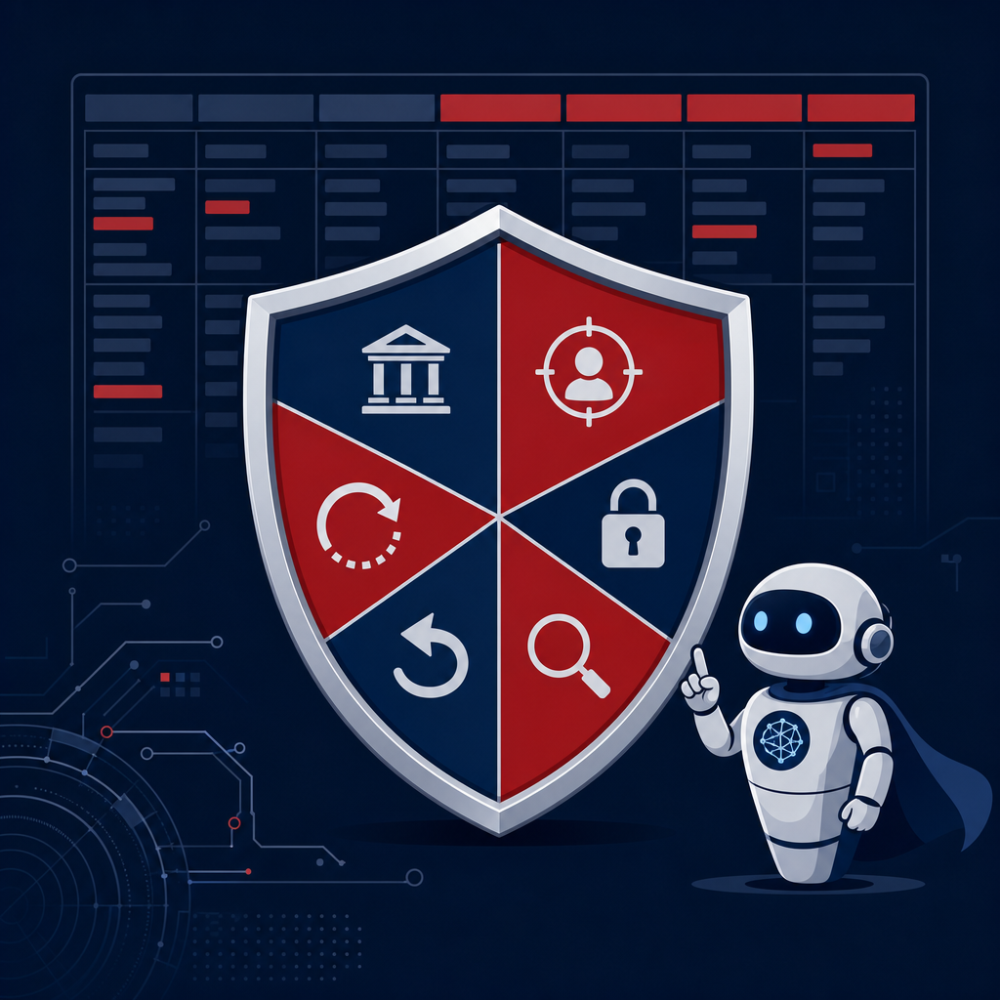

## 摘要

這是 Simon 在 2026-05-26 一天內，從零到完成「資安 AI 超級大腦」專案的完整建構紀錄。專案目標是打造一個能在資安事件發生時，即時引導 Simon 記錄事件、準備向上報告、並自動產出結構化分析（ATT&CK 對照、控制失效分析、根因分析、改善建議）的 AI 助手。

整個建構過程嚴格遵循李佳達老師的方法論：「不要直接讓 Claude 自己設計 skill，先用多平台 deep research 做調研，再把研究結果交給 Claude 綜合」。最終產出一個 [[claude-code]] incident-response skill，搭配每週自動執行的資安情報搜尋排程。

## 核心概念

- [[incident-response]]：整個 skill 的核心就是事件回應。建構過程中從 NIST SP 800-61r3（完整下載 1,166 行）、Mandiant IR Best Practices 2025、M-Trends 2026 三份權威文件中提取 IR 框架，再結合 Simon 自身 10 件真實事件的處理經驗，設計出「6 階段引導式問答」取代傳統「事後回溯整理」的工作流。6 階段分別是：止血→初步判斷→報告準備（AI 主動生成）→老闆回饋→最終定案→結構化分析（AI 自動生成）。

- [[nist-csf]]：Skill 的結構化分析模組直接映射 NIST CSF 2.0 的六大功能（Govern / Identify / Protect / Detect / Respond / Recover），並搭配完整的 CIS Controls v8 → CSF 2.0 對照表（453 行、208 筆 mapping）。三份 deep research 報告的共識之一是：CSF 2.0 新增的 Govern 功能把資安正式拉到董事會問責層級，這一點反映在 skill 會自動在改善建議中加入治理面建議。

- [[claude-code]]：Skill 的設計嚴格遵循 Anthropic 官方的 context engineering 最佳實踐。研究發現 5 條鐵律：流程放 SKILL.md、知識放 reference files（關注點分離）；漸進式載入（YAML → SKILL.md → references 按需讀取）；負面指令（「不要做 X」比「做 Y」更能防止偏移）；約束式優於程序式；每一行都是重複 token 成本。最終 SKILL.md 約 120 行，搭配 2 個 reference files 按需載入。

- [[shadow-ai]]：三份 deep research 報告不約而同指出，2025-2026 年企業最大的 AI 資安風險不是模型漏洞，而是開發者繞過資安政策使用未核准 AI 工具的 Shadow AI 治理危機。Verizon 2026 DBIR 指出員工使用未核准 AI 工具的比例在一年內升到 45%。這個洞察已寫入 skill 的 reference files，當事件涉及 AI 相關風險時，skill 會自動在分析中加入 Shadow AI 檢查。

## 對 Simon 的應用

> 以下為 reading 當下想到的應用、隨時間／工具／興趣變化可能已失效；後續落地狀態見下方「落地動作與效益」段（若有）。

- ✅ **incident-response skill 已部署**：在 `~/projects/Simon-Agent/.claude/skills/incident-response/` 上線。下次遇到資安事件時，對 Claude Code 說「出事了」或「有資安事件」即可觸發 6 階段引導式記錄。
- ✅ **資安週報已排程（v2 已升級）**：每週一 08:00 自動搜尋 8 個來源（Reddit 3 版 + SANS ISC + The Hacker News + BleepingComputer + CISA Alerts + iThome），整理成繁體中文 MD 存到 Obsidian `2-knowledge/weekly-intel/`，同時寄 Email 摘要。v2 改進：來源從 4 → 8 個、frontmatter 加入 issue/cover_range/highlights/tldr/concepts/impact、內文從「按來源分段」改為「按主題分段」（漏洞→攻擊→防禦→台灣→影響評估）、加入 WebFetch 抓重點文章全文。
- ✅ **老闆提問預測庫**：從 10 件真實事件提取 38 個老闆問題，按 7 大主題加權（營運衝擊 21%、根因追究 21%、再發防止 16%、責任歸屬 13%、成本 11%、通報義務 8%、資料外洩範圍 8%）。加上 16 個驗證有效的溝通類比和 6 種框架性溝通策略。
- ✅ **三平台 Deep Research 方法論驗證**：李佳達的「先研究再設計」方法論確實有效。三平台產出互補性非常好（ChatGPT = 案例導向、Perplexity = 學術導向、Gemini = 工具評估導向），如果只用一個平台會漏掉大量視角。

## 落地動作與效益

| 動作                         | 狀態    | 效益                                                                          |
| -------------------------- | ----- | --------------------------------------------------------------------------- |
| incident-response skill 上線 | ✅ 已部署 | 事件記錄從「事後花 2 小時回想整理」變成「事件中即時 15 分鐘累積」                                        |
| 資安週報 /schedule（v2 升級）      | ✅ 已排程 | 8 個來源（Reddit 3 版 + SANS ISC + THN + BleepingComputer + CISA + iThome），每週自動追蹤國際 + 台灣資安動態 |
| 知識庫素材建立                    | ✅ 完成  | 20 份 MD 檔（10 事件 + 3 研究 + 7 參考文件），可餵入 ChatGPT Custom GPT 或繼續在 Claude Code 使用 |
| Reading Garden 資安週報專區      | ✅ 已部署 | 2026-05-26 部署上線：WeeklyIntelList 時間軸列表頁 + WeeklyIntelHeader 內頁 + SiteNav「週報」連結 + 首頁第 5 張統計卡，sync-garden.sh 自動同步 |

## 建構過程（6 步驟詳細紀錄）

### 步驟 1：素材格式化

在 Simon-Journal 專案中，把 Simon 過去處理的 10 件資安事件對話紀錄，整理成固定架構的 MD 檔。每篇含：基本資訊 → 事件現況 → 第一反應 → 向上報告 → 老闆回饋 → 最終定案 → ATT&CK 對照 → 控制失效分析 → 根因分析 → 改善建議 → 事後反思 → 去識別化紀錄。

10 件事件涵蓋：勒索病毒（檔案伺服器加密）、帳號盜用（詐騙匯款郵件）、離職員工（ERP 異常登入）、業務資料誤寄、供應商帳號遭濫用、社交工程（財務部勒索軟體）、USB 隨身碟（產線停機）、BEC 變臉詐騙、離職員工竊取設計圖、舊系統漏洞（挖礦程式）。

產出：`~/projects/Simon-Journal/ai-superbrain/incidents/` 共 10 篇、1,117 行。

### 步驟 2：Deep Research 三平台並行

用 ChatGPT、Perplexity、Gemini 三個平台，以相同的主題 prompt 進行 deep research。主題：資安事件分析方法論、AI 輔助資安最新實務、國際框架對照、攻擊手法演進、論壇社群洞察。

三份報告的交叉比較：

| 平台         | 行數  | 定位   | 獨特貢獻                                                                                              |
| ---------- | --- | ---- | ------------------------------------------------------------------------------------------------- |
| ChatGPT    | 211 | 實務案例 | 案件 JSON schema、10 個事件攻擊鏈表、三層知識庫架構、匿名航運公司「成功防禦」正例                                                  |
| Perplexity | 659 | 學術文獻 | 同行評審論文引用、ATT&CK coverage 量化（SIEM 平均僅覆蓋 21%）、Security Ishikawa 魚骨圖、IRCopilot 幻覺控制架構                |
| Gemini     | 179 | 工具評估 | 5 平台 AI SOC 深度比較（含計價模式）、OWASP API Top 10、TeamPCP 供應鏈攻擊（SLSA Build Level 3 被擊潰）、PromptLock 多形態勒索軟體 |

三份報告共識區：身分是最大攻擊面（MFA 缺失為頭號控制失效）、NIST CSF 2.0 Govern 提升到董事會問責、AI SOC 是「高效副駕」不是自動駕駛、Shadow AI 比模型漏洞更急迫。

### 步驟 3：全文下載與知識庫累積

從三份報告中挑出最有價值的 7 份參考文件，用 firecrawl + PDF parser 下載並轉成 MD：

1. NIST SP 800-61r3（1,166 行 / 104K）— 事件回應框架全文
2. Mandiant IR Best Practices 2025（122 行 / 12K）— Google 官方 IR 最佳實踐
3. Google M-Trends 2026（92 行 / 14K）— 年度威脅報告
4. Mandiant Snowflake UNC5537（207 行 / 16K）— 案例分析
5. CIS Controls v8 → CSF 2.0 Mapping（453 行 / 56K）— 跨框架對照表（Simon 手動下載 xlsx，Claude 轉 MD）
6. OWASP API Security Top 10（22 行 / 4.7K）— API 安全風險
7. CTID Top ATT&CK Techniques（61 行 / 2.4K）— ATT&CK 優先技術

### 步驟 4：Workflow 重新設計

把現有的「事後回溯整理」格式，翻轉成「AI 即時引導 6 階段問答」。核心設計原則：每階段 3-5 題不超載（事件中壓力大）、報告草稿和老闆問題預測由 AI 主動產出（不等 Simon 要求）、可中斷恢復（事件處理可能跨數小時）。

### 步驟 5：Skill 設計最佳實踐研究 + 建構

先做「怎麼設計好的 skill」研究（選項 A：先研究再設計），搜尋三個面向：
1. IR GPT / Security AI Assistant 業界做法（GitHub + 論文）
2. Claude Code skill 設計最佳實踐（Anthropic 官方 + 社群）
3. GPT knowledge base 結構設計（OpenAI + RAG 最佳化）

關鍵發現：Microsoft Promptbooks 的 prompt chain 範式、Anthropic 的 context engineering 5 原則、MindStudio 的 process vs context 分離、Karpathy 的短約束清單模式、GPT 知識庫「少量大檔優於大量小檔」原則。

根據研究結果，建構 incident-response skill：SKILL.md（6 階段流程 + 行為規則）+ boss-qa-patterns.md（38 題老闆提問模式 + 16 個溝通類比）+ attck-control-reference.md（ATT&CK 對照 + 控制失效三維度 + 框架索引）。

### 步驟 6：時效性 Agent

設定 `/schedule` 每週一 08:00（台北時間）自動執行的遠端 agent，搜尋 Reddit 3 版 + SANS ISC Handler Diaries 過去一週的熱門討論，整理成繁體中文 MD 存到 Obsidian，同時寄 Email 摘要。

## 原文要點

- **李佳達方法論**：不要直接讓 Claude 自己設計 skill → 先用多平台 deep research → 把研究結果交給 Claude 綜合
- **三平台互補**：同一主題用 ChatGPT + Perplexity + Gemini 同時研究，覆蓋面遠超單一平台
- **Anthropic context engineering 5 原則**：關注點分離、漸進式載入、負面指令、約束式 > 程序式、token 預算意識
- **真實資料驅動**：老闆提問預測來自 38 個真實問題、溝通類比來自 16 個驗證有效的說法、控制失效來自 36 項統計
- **研究先於設計**：步驟 5 花了額外時間做 skill 設計 best practice 研究，而不是直接讓 Claude 照自己的模式做
