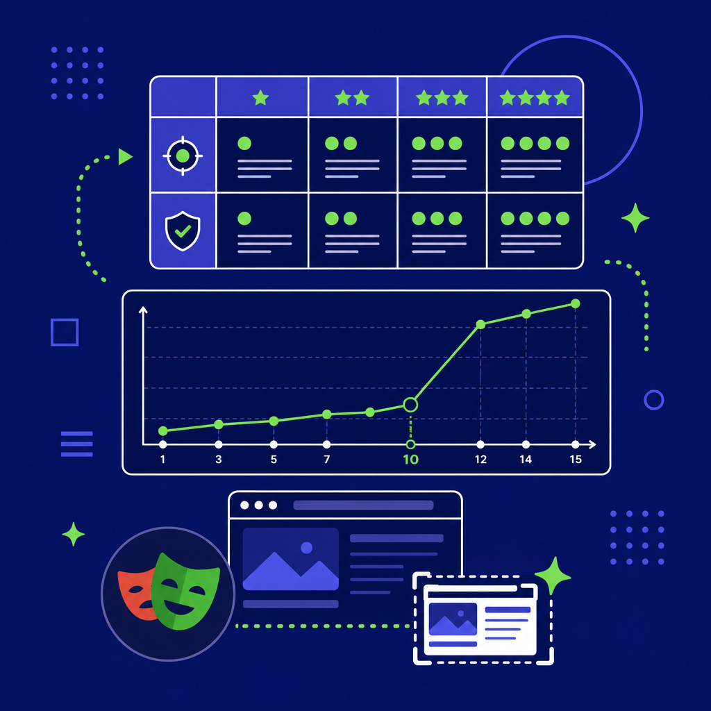

## 為什麼讀

收件箱自動收錄。Simon 正在用 Claude Code 跑長任務（KW γ 批次消化、vault migration），/goal 跟 evaluation rubric 直接影響任務品質和自動化程度。

## 摘要

這支影片從「AI 為什麼做到一半就停」切入，拆解三件事：① Claude Code、Codex、Hermes Agent 同時推出 /goal 功能的背後原因是 [[context-anxiety]]（Anthropic 2025 年底研究發現 LLM 感知 context 快滿就提前收工）；② 好的 goal prompt 需要五個要素（Outcome、Verification、Constraints、Iteration policy、Error handling）；③ 對品質型任務（寫作、設計），真正的關鍵不是 prompt 也不是 context，而是 [[ai-evaluation-rubric]]——你能不能把腦中模糊的「好」拆成 AI 評審可以打分的結構化量表。影片用 Anthropic 的網頁設計研究（四維度評分 + 加重弱項權重 + Playwright 截圖打分）做案例，最後給出六步驟建 rubric 的 SOP。

## 核心概念

- [[context-anxiety]]：Anthropic 研究發現 LLM 執行長任務做到一半停下來的根本原因。模型在訓練中學會「context 快滿 = 該收工」的模式，表現為突然寫漂亮的總結、說「我完成了」、或反問使用者要 A 還是 B 把球丟回來。影片作者稱之為「下班心態」——刻在 LLM 基因裡的惰性。

- [[claude-code-goal-command]]：三家公司（Claude Code、Codex、Hermes Agent）幾乎同時推出同名 /goal 功能來對抗 context-anxiety。運作原理是兩個角色協作：執行者產出、評審每輪結束後檢查「目標完成了嗎？」，沒完成就繼續。好的 goal prompt 有五個要素：Outcome（完成狀態，如反應速度 0.2 秒以內）、Verification（怎麼證明，如速度測試工具）、Constraints（不能動什麼）、Iteration policy（每輪記錄什麼）、Error handling（什麼時候該停下回報）。

- [[ai-evaluation-rubric]]：影片的核心論點——AI 長任務的真正瓶頸不是 prompt engineering 也不是 context engineering，而是 evaluation。Anthropic 的網頁設計研究把「漂亮」拆成設計品質、原創性、技術執行、可用性四個維度，還故意加重 Claude 弱項（設計品質和原創性）的權重做校正。評審用 Playwright 打開瀏覽器截圖打分，看的是使用者真正會看到的畫面而不是程式碼。迭代到第 10 輪時出現非線性的創意躍遷——把美術館網站重新想像成 3D 空間體驗。六步驟 SOP：先跑 baseline → 親自看、記皺眉原因 → 分類成維度 → 每維度用具體反案例當 reference → 多樣化案例避免 overfitting → 餵給評審跑看結果、校正幾輪。

- [[sycophancy]]：影片提到 AI 自評的問題——做出來的網頁明明很醜，模型還是會把自己的設計定義成「現代感、高質感」。這是為什麼需要外部評審、甚至 [[cross-provider-verification]] 的原因。

## 對 Simon 的應用（當下想法）

> 以下為 reading 當下想到的應用、隨時間／工具／興趣變化可能已失效；後續落地狀態見下方「落地動作與效益」段（若有）。

**A. 芙莉蓮優化類**（可套到 Claude Code／skill／rules／CLAUDE.md／user-memory）：
- KW γ 的 reading 品質評估可以用 rubric 思維改造——目前靠 skill 裡的寫作風格規則（writing-style.md），但那只是「不要做什麼」的負面指令，缺乏正面的維度評分。可以加一份 reading-quality-rubric 維度：白話程度（讀者不看原文能懂嗎）、應用具體度（對 Simon 的應用有幾條可落地）、概念連結度（wikilink 指向的 concept 真的相關嗎）
- 全域 CLAUDE.md §3 的修辭頻率上限表（對比句 ≤1、排比 ≤1、反問 ≤1、破折號 ≤2）本質上就是一份寫作 rubric 的負面維度，可以補正面維度

**B. Simon 個人動作類**（建 Notion Action 卡／動 vault／改個人工作流／看別的東西）：
- 嘗試用影片的六步驟 SOP 為 Substack 文章建一份寫作 rubric——讓 AI 先跑 5 篇文章的 baseline、自己看了皺眉的點記下來、分類成維度
- 資安週報（/schedule 每週一 08:00）的品質也可以套 rubric 思維做持續校正

## 落地動作與效益

| 動作 | 狀態 | 效益 |
|---|---|---|
| KW γ ingest-flow 加 Step 5b reading 品質自檢（三維度：白話程度、應用具體度、概念獨立性） | ✅ 已做 | reading 品質從「不犯規」提升到「積極好」；每篇多 30 秒自檢成本 |
| CLAUDE.md §3 修辭上限表補正面維度 | ❌ 不做 | 目前運作良好、暫不動 |
| Substack 文章建寫作 rubric（六步驟 SOP） | ⏸ 擱置 | 有價值但目前 Substack 節奏穩定、等下次寫到不滿意再啟動 |
| 資安週報套 rubric 校正 | ⏸ 擱置 | 等累積 4 期以上再看品質趨勢 |

## 原文要點

- **三家同時推 goal**：Claude Code、Codex、Hermes Agent 幾乎同名同功能同時推出，解決同一個問題
- **Context anxiety**：Anthropic 2025 年底研究，LLM 感知 context 快滿就開始 wrap up
- **Goal 五要素**：Outcome / Verification / Constraints / Iteration policy / Error handling
- **Definition of done 是關鍵**：寫得好 AI 跑到完且符合預期，寫得爛三分鐘就收工交差
- **品質型任務怎麼辦**：程式碼有單元測試可以當 verification，但「好不好看」「寫得好不好」沒有測試——需要 rubric
- **Anthropic 網頁設計研究**：四維度（設計品質、原創性、技術執行、可用性）、加重弱項權重、Playwright 截圖打分
- **非線性躍遷**：第 10 輪出現突破性創意，不是每輪線性改善
- **六步驟 SOP**：baseline → 皺眉原因 → 分類維度 → 具體反案例 → 多樣化 → 餵評審校正
- **Anthropic 踩坑**：寫「博物館等級質感」結果所有產出都變博物館風——用多樣化案例取代單一描述
- **Ralph Loop**：去年社群爆紅的 plugin，精神跟 goal 一樣——無論如何做到底的循環。三家公司把社群想法變成官方 feature

## 原文全文

> [!info]- 原文全文（未公開）
> 原文全文只保留在本機 Obsidian、未同步到這個 garden。[在 Obsidian 開啟這篇 →](obsidian://open?vault=SimonVault&file=2-knowledge%2Freadings%2F2026-05-26-yt-goal-evaluation-rubric-long-tasks)

## 原始連結

- https://youtu.be/PpeCur6fEXc
