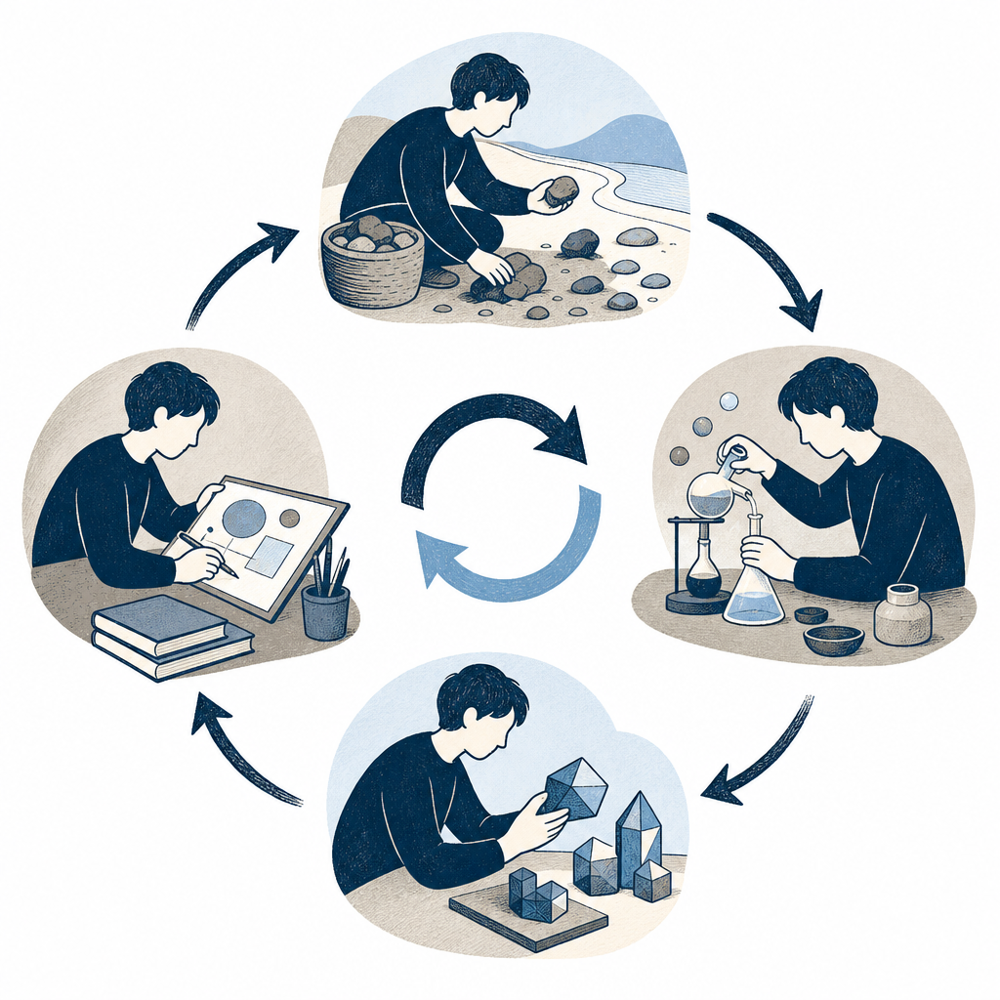

## 為什麼讀

從資訊收集箱抓進來的 YouTube 教學。主題正中 Simon 一直在維護的 KW γ + Obsidian vault 系統——這支影片用 Codex 視角把「自生長知識庫」的整套理念跟搭建步驟講了一遍，正好拿來對照自己的工作流，看有沒有還沒做到的環節。

## 摘要

這支影片教怎麼用 Codex 加 Obsidian，十分鐘搭出一個會自己長大的 AI 知識庫。核心理念來自 Andrej Karpathy：別把知識庫當成收了就忘的收藏夾，要把它變成一個由 AI 持續維護、會自我生長的系統。整個系統是一個迴圈：沒處理的原始資料先進資料夾 A，AI 定期消化、把有價值的內容提煉成概念進資料夾 B，再依任務沉澱成可重複使用的方法論或 Skill 進資料夾 C，每次的產出放進輸出資料夾 D；而 D 的輸出在下一輪消化時又會迴流回庫、變成新養分。實作分三階段：收集（用 GitHub 開源工具自動抓 Twitter／Reddit／RSS、加各種匯入外掛）、迭代（把 Karpathy 思路丟給 Codex 定製分層結構、設定時蒸餾任務）、輸出（用文風 Skill、配圖 Skill、一鍵出 PPT 與影片）。全程不必寫程式、不需架向量資料庫。

## 核心概念

- [[self-growing-knowledge-base]]：影片的主軸。把知識庫當成「會自己長大的系統」而不是收藏夾，靠 A→B→C→D 四層迴圈加上「輸出迴流」持續運轉。差別的關鍵在有沒有一個「AI 定期蒸餾」的動作——AI 主動幫你檢查哪些內容重複、哪些過時、哪些值得提煉成模板，知識庫才會越用越厚。（宣家影片）
- [[index-based-knowledge-base]]：這套做法不依賴向量資料庫，靠資料夾分層加索引讓 AI 直接讀本地 Markdown，是 RAG（檢索增強生成，靠向量資料庫做語意檢索的主流做法）之外的輕量路徑。
- [[raw-wiki-split]]：資料夾 A（原始、未處理）跟資料夾 B（AI 提煉過的概念）分開，就是把「人類丟進來的料」跟「AI 整理過的成品」分層，避免兩者混在一起。
- [[graph-emergence]]：B 層的概念越積越多，跨篇文章共用的概念會自動把不同文章連起來形成知識圖譜——這是知識庫「越長越密」的具體機制。
- [[skill]]：影片把任何重複三次以上的工作流（寫週報、選題判斷、文風、配圖）都封裝成 Skill，等於把自己的經驗變成隨調隨用的工作外掛，對應資料夾 C 方法庫。

## 對 Simon 的應用（當下想法）

> 以下為 reading 當下想到的應用、隨時間／工具／興趣變化可能已失效；後續落地狀態見下方「落地動作與效益」段（若有）。

**A. 芙莉蓮優化類**（可套到 Claude Code／skill／rules／CLAUDE.md／user-memory）：
- 影片的「定時蒸餾任務」用 cron 自動跑（每天下午 5 點讓 AI 判斷整理當天工作、產總結存回對應資料夾）。Simon 的 KW γ「健檢」目前是手動觸發——可評估把健檢或某種輕量蒸餾排成 cron／schedule，但要先想清楚頻率跟成本，避免變成負擔（這點已寫進 concept 的「尚未解決的疑問」）。
- 影片的「選題價值判斷 Skill」：新資訊進庫時自動判斷它的選題價值、可用亮點、機會與風險。Simon 有 Substack 寫作軸，可評估在 KW γ 收錄流程裡加一個輕量「這篇對寫作有沒有素材價值」的判斷欄位。

**B. Simon 個人動作類**（建 Notion Action 卡／動 vault／改個人工作流／看別的東西）：
- 影片附的 Skill 庫清單跟兩張知識庫架構圖放在原文文章裡。**暫不抓**——Simon 的 KW γ + skill 體系已比影片這套成熟，等哪天真要重組 skill 庫時再回來看這兩張圖。
- 影片提到的一鍵出 PPT（Presentations 外掛）、一鍵出影片（Hyperframes 外掛）是 Codex/Obsidian 生態的工具。Simon 目前走 NotebookLM 出簡報＋音訊，可不動；除非哪天想在 vault 內直接出 PPT 再評估。

## 落地動作與效益

> Step 9／10 自檢結論（2026-05-31 收錄當天跟 Simon 討論後落地）。

**A. 芙莉蓮優化**

- ✅ **收錄流程加「Substack 寫作角度掃描」**：改 `~/.claude/skills/knowledge-wiki/references/ingest-flow.md` Step 9，收每篇 reading 時順手判斷有沒有可寫成 Substack 的角度，有就在 B 類列具體切入點（不准寫「可以寫」這種空話）。出處：影片的「選題價值判斷 Skill」。效益：把知識收錄跟寫作軸串起來、不漏素材。
- ⏸ **定時蒸餾 cron 化（確認已存在、不重做）**：影片的「每天定時蒸餾」在 Simon 系統早有對應——`knowledge-wiki-lint-catchup.sh` 在 SessionStart 距上次健檢 ≥7 天就提醒、刻意設計成不自動跑、保留決策權。知識庫面已被這個提醒覆蓋，工作復盤面走週復盤（刻意手動）。所以不需新做。

**B. Simon 個人動作**

- ⏸ 影片附的 Skill 架構圖跟清單：暫不抓——KW γ + skill 體系已比影片這套成熟，真要重組 skill 庫再回來看。

## 原文要點

- **理念（Karpathy 自生長理論）**：不要把知識庫當收藏夾，要當成由 AI 持續維護的自生長系統。迴圈：原始資料夾 A → AI 消化提煉成概念進 B → 依任務沉澱成方法論／Skill 進 C → 輸出進 D → 輸出迴流回庫。
- **工具選擇**：只需 Codex（最強 agent 能力 + Skill + 定時功能）+ Obsidian（本地 Markdown、AI 可直接讀、查詢生態強）。透過 Obsidian 第三方外掛市場的 Claudium/Codex 外掛打通兩者，再把 Codex 的專案工作目錄連到 Obsidian 倉庫資料夾，雙向同步。
- **階段一：收集**。把一個 GitHub 開源資訊收集工具地址發給 Codex，它會自動從 Twitter／GitHub／Reddit／RSS 抓內容、去重、打分、生成結構化日報。AI 會提示要哪些 API Key、並教你去哪註冊。也可用各種匯入外掛（某書匯入、Clip 網頁剪藏、影片字幕提取）跟連動飛書（裝飛書 CLI）把舊資料導進庫。
- **階段二：迭代**。把 Karpathy 思路丟給 Codex，定製多層清晰結構（涵蓋輸入、AI 消化、輸出），它會幫你檢查重複、過時、值得做成模板的內容。再用 Codex 自動化功能把它變成定時任務：例如每天下午 5 點自動蒸餾、產總結存回 Obsidian；還能做 HTML 復盤看板 Skill 把資料視覺化。
- **階段三：輸出**。用整理好的 Skill 庫加速產出——文風 Skill 寫初稿、去 AI 味 Skill 調語氣、配圖 Skill 自動生圖插圖、Presentations 外掛一句話出 PPT、Hyperframes 外掛一句話把文章做成影片。產出再迴流回庫。
- **作者結語**：不用一開始就搭得完美，先建一個小知識庫試試，只要能幫你省下一次從零開始的時間就值得繼續。

## 原文全文

## 原始連結
- https://youtu.be/iTuuxdaXcns?si=QhQX6qyeYsqywysk
