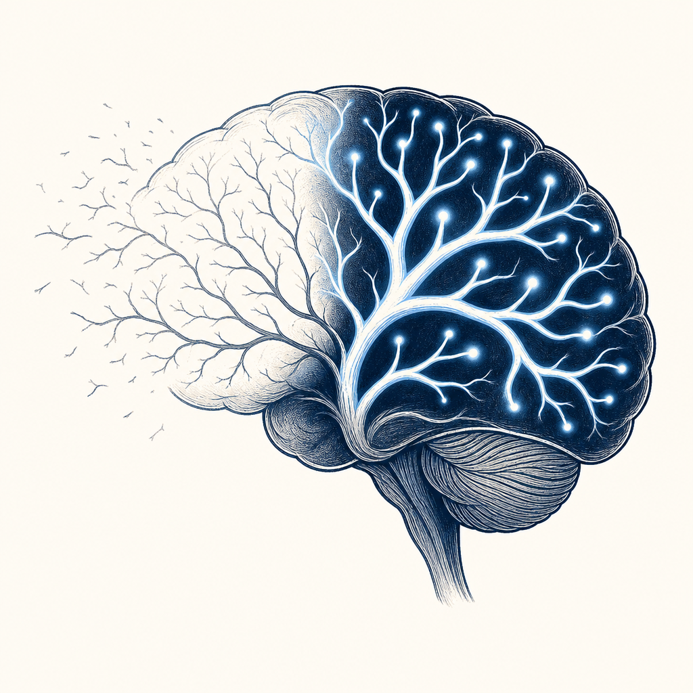

## 為什麼讀

從資訊收集箱抓進來的 YouTube 影片，標籤未分類。主題是注意力與大腦神經機制，跟 Simon 既有的「每天閱讀 10 分鐘」習慣、長線資安證照學習都有交集，拿來看有沒有能調整學習與閱讀方式的可落地點。

## 摘要

這支影片主張：長期只滑短影音、看碎片資訊，會讓大腦把負責深度思考、記憶、邏輯的神經迴路當成「冗餘」修剪掉（突觸減除），導致你連兩千字長文都讀不完。但這個修剪機制是雙向的——給大腦高難度、高負載的任務，反而會強制中斷修剪、把被頻繁呼叫的連結加粗（長時程增強）。影片提出三個「神經升級演算法」：第一，每天強行 15 分鐘讀幾乎看不懂的硬核內容、中途不停頓；第二，用手寫取代螢幕點選——手寫同時牽動觸覺、肌肉、空間移動，比滑光滑螢幕更能把資訊「焊」進記憶、不容易忘掉；第三，想滑手機的那一瞬間立刻站起來、把視線投向 6 米外的物體維持三秒，重設多巴胺迴路。科學內核（大腦會修剪長期不用的神經連結、用進廢退、手寫靠身體感官把記憶記得更牢）大致有依據，但影片用「物理性剪斷智商」這類誇張修辭販賣焦慮，結尾還用「留言我要升級送 PDF」引流，這層包裝要打折看。

## 核心概念

- [[synaptic-pruning]]：影片的科學主軸。大腦把長期不用的神經連結修剪掉、把常用的加粗，是神經可塑性的一環，也是「用進廢退」的神經版本。關鍵在它是雙向的——不是只會剪、高負載使用會反向加粗迴路。這解釋了為什麼學完不複習就忘、為什麼手寫比打字記得牢。影片把這機制戲劇化成「刷手機就刪掉你的智商硬體」，方向性合理但結論被誇大。（心智架構師影片）
- [[second-brain]]：弱連結（影片沒提、是 reading 延伸對照）。第二大腦是把記憶外包給數位系統、釋放大腦做思考；這篇講的是大腦內部留哪些連結。兩者不矛盾——外腦存資料、但深度思考迴路還是要靠自己定期高負載使用才不會被修剪。

## 對 Simon 的應用（當下想法）

> 以下為 reading 當下想到的應用、隨時間／工具／興趣變化可能已失效；後續落地狀態見下方「落地動作與效益」段（若有）。

**A. 芙莉蓮優化類**（可套到 Claude Code／skill／rules／CLAUDE.md／user-memory）：
- ccna-quiz skill 已有的「錯題追蹤、間隔重練」設計，本質就是在對抗突觸修剪。可評估在 ccna-quiz 或 course-notes 的學習流程裡，明確加入「主動回憶（active recall）」環節——先闔上筆記憑記憶答、再對照，比被動重讀更能強化迴路。這是可寫進 skill 的具體規則，不是空泛建議。

**B. Simon 個人動作類**（建 Notion Action 卡／動 vault／改個人工作流／看別的東西）：
- 既有的「每天閱讀 10 分鐘」習慣，可考慮把材料從輕鬆讀物換成一段「需要動腦」的硬內容（資安原文、CISSP 教材、論文），刻意製造認知負荷。
- 重要的學習筆記或決策思考，試試用手寫（紙本或平板手寫）而非打字，看記憶留存有沒有差。
- 手機滑到停不下來時，用影片那招：站起來 + 看 6 米外物體三秒。順帶也能護眼（遠眺鬆弛睫狀肌）。

## 原文要點

- **核心機制**：大腦約 860 億神經元透過突觸連結成迴路。常用的迴路會被加粗（更快更穩），長期不用的會被膠質細胞吞噬移除——這是大腦為了省能量的「用進廢退」。（神經科學確有突觸修剪，但指的是突觸層級的結構回收，不是影片暗示的「整條智力迴路被一根根剪掉」那種戲劇化尺度。）修剪終生持續，不是老了才開始。
- **碎片化的代價**：滑短影音、看碎片資訊時，前額葉幾乎不工作（不需邏輯推演、記憶鞏固、知識整合），耗能極低。久了大腦判定深度思考迴路「欠載」、當成垃圾回收。影片強調這不是意志力問題、是硬體層面的弱化。
- **雙向的刀（長時程增強）**：高難度、高資源佔用的任務會向神經網路廣播「核心佔用」訊號，強制中斷修剪、命令膠質細胞去支援被啟用區域、合成更多神經營養因子（BDNF）、增加受體密度。
- **演算法一：高壓過載觸發**。每天 15 分鐘讀幾乎看不懂的硬核內容（哲學原著、底層邏輯論文、陌生領域著作），手機放到另一個房間、倒數計時、中途絕對不停。頭三分鐘會不適、焦慮、想摸手機，這正是深度迴路太久沒拉滿、一啟動就過熱，必須按住跑完。
- **演算法二：物理座標錨定**。手寫時指尖觸覺、紙面摩擦、手腕肌肉微調一起衝進軀體感覺皮層，而這片皮層跟前額葉有密集神經投射，會把抽象資訊「焊」進多模態網路、提高被修剪的生理成本。所以手寫筆記記得比打字牢。
- **演算法三：多巴胺閾值重設（三秒階段）**。獎勵系統被 15 秒一次的即時反饋訓練成過敏警報器。想滑手機的瞬間立刻：(1) 站起來或挺直脊椎（改變本體感覺訊號）、(2) 視線投向 6 米外物體鎖定三秒（睫狀肌鬆弛、視覺皮層切換到有景深的畫面），切斷前額葉對手機畫面的依賴。重點是身體硬體比抑制力反應更快。
- **行銷套路（中性記錄）**：影片開頭用「你的智商正被物理性剪斷」製造焦慮、自稱「心智架構師」、結尾要觀眾留言「我要重聯」「我要升級」並承諾私訊送「注意力硬體修復程式碼 PDF」給最快的 50 位。屬於典型成長類頻道的互動與引流設計。

## 原文全文

## 原始連結
- https://youtu.be/Hb5x5vHGzzw?si=PhVZsxYRbJt-PrAe
