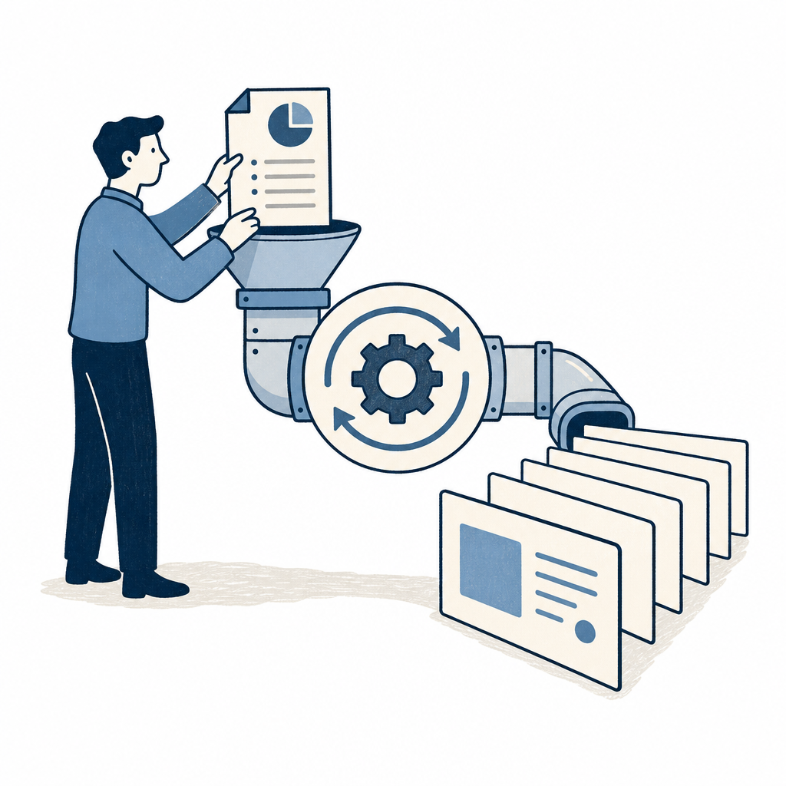

## 為什麼讀

這是資訊收集箱裡最舊的待處理 YouTube 連結。Notion 頁面只有 URL，沒有補充脈絡；從影片內容看，它屬於 AI 簡報產製流程，可以補 Simon 未來做資安 KPI 月簡報、公司內訓教材或 Substack 圖文素材時的工具參考。

## 摘要

AJ 示範用 ChatGPT 建一條「簡報風格規範 → 專案資料夾 → 簡報大綱 → 投影片圖片 → PDF」的快速產製流程。核心不是單次叫 AI 做簡報，而是先用 GPTs 產生可重複使用的 Markdown 風格規範，再把規範、架構與策略放進 ChatGPT 專案資料來源，把記憶範圍鎖在這個專案內，避免 ChatGPT 把別的對話內容誤抓進來、影響這次簡報生成。之後每次只要給文章或產品網址，就能先生成大綱、在 Canvas 裡改文字，再一次生成八張 16:9 投影片圖片並打包成 PDF。對 Simon 來說，這支影片最有用的是「把簡報品味先資產化」這個流程，而不是照抄它的每個按鈕。

## 核心概念

- [[design-system]]：影片裡的「簡報風格設計規範」就是輕量版設計系統。它把版面風格、架構模式與製作策略先寫成可重用文字，之後每份簡報都用同一套視覺語言，不必從空白頁重新決定風格。
- [[template-reference-pattern]]：把文章、官網、過去簡報策略、風格規範放進同一個 ChatGPT 專案，其實是在建立可重複引用的個人 reference。AI 不是只靠通用簡報知識，而是讀 Simon 給它的素材與規範來生成。
- [[skill]]：AJ 用 GPTs 做「AI 簡報設計大師」，本質接近把一段簡報前處理 SOP 封裝成可呼叫流程。差別是 GPTs 要人主動進去用，Skill 靠 description 自動匹配；兩者共同點都是把重複工作固化。這篇會連到 [[skill]]，是因為 AJ 的 GPTs 正是「把簡報 SOP 固化」的另一種封裝形式，可拿來對照 Simon 自己 KW γ／course-notes skill 的設計取捨。

## 對 Simon 的應用（當下想法）

> 以下為 reading 當下想到的應用、隨時間／工具／興趣變化可能已失效；後續落地狀態見下方「落地動作與效益」段（若有）。

**A. 芙莉蓮優化類**（可套到 Claude Code／skill／rules／CLAUDE.md／user-memory）：
- 暫不改 skill。這支影片偏 ChatGPT 使用流程，和 Simon 現有 vault-first、Markdown-first 的 KW γ 沒有直接衝突；若未來要做「簡報產製 skill」，再把「先產風格規範，再產大綱，再產投影片」抽成流程即可。

**B. Simon 個人動作類**（建 Notion Action 卡／動 vault／改個人工作流／看別的東西）：
- 做資安 KPI 月簡報前，可先建立一份「Simon 公司簡報風格規範.md」：包含色彩、版面、資料圖表樣式、常用頁型與禁忌。這比每次直接叫 AI「幫我做漂亮簡報」穩定。
- 下次發 Substack（如 Day X）後，拿該篇 markdown 丟進 ChatGPT 專案跑一次「摘要大綱 → 8 頁核心投影片 → 圖片或 PDF」，當作這條流程的首次自試，驗證值不值得固化成 skill。重點是先人工修大綱，再讓 AI 生視覺。
- 這支不值得另外建新概念或任務卡；當作簡報流程參考留在 reading 即可。

## 原文要點

- 先用 AJ 提供的 GPTs 產出「簡報風格設計規範」Markdown。入口有幾種：沒有靈感就請它問問題釐清需求；丟文章請它閱讀並給風格建議；用刁鑽方式討論風格；或分析既有簡報給視覺建議。
- ChatGPT 專案資料夾要在建立時設定「僅限專案」，避免不同專案的記憶互相污染。這一點一旦建立後不能改，錯了就要重建專案。
- 專案資料來源放入風格規範、架構模式、腦力激盪與簡報製作策略；專案設定另外放系統提示詞，用來生成簡報大綱。
- 正式做簡報時先丟產品或文章網址，請 ChatGPT 生成簡報大綱。大綱還是文字，應先進 Canvas 編輯，修好再進圖片生成。
- 圖片生成階段一次處理八頁大綱，要求寬螢幕 16:9，並使用 Thinking 延伸模式提高穩定性。
- 生成八張圖片後，可請 ChatGPT 直接把圖片放進同一份 PDF 供下載。若要改內容，可以回到 GPT 裡改，或用其他工具後製。
- AJ 認為 GPT 5.5 加 GPT Image 2 後，中文簡報圖片生成品質已贏過 NotebookLM。這是作者主觀評價，實際仍要看中文字、版面一致性與可編輯性。

## 原文全文

> [!info]- 原文全文（未公開）
> 原文全文只保留在本機 Obsidian、未同步到這個 garden。[在 Obsidian 開啟這篇 →](obsidian://open?vault=SimonVault&file=2-knowledge%2Freadings%2F2026-06-05-aj-chatgpt-presentation-flow)
## 原始連結

- https://www.youtube.com/watch?v=vmk4ToeAgpU
