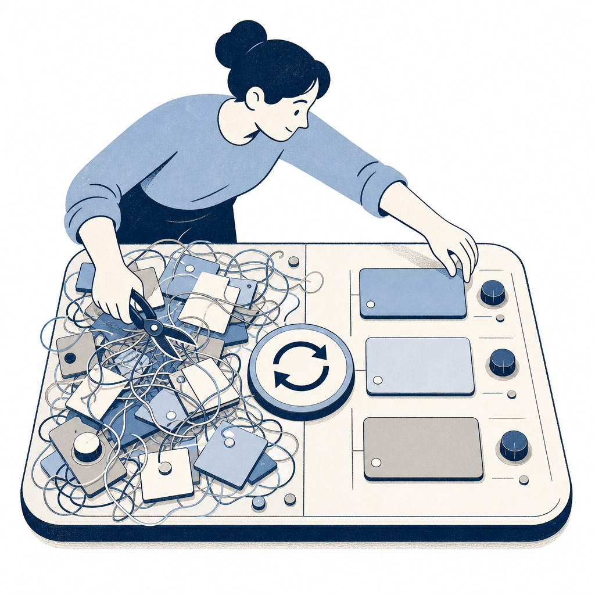

## 為什麼讀

這是資訊收集箱第二篇待處理影片，主題直接命中 Simon 目前的雙棲 Codex／Claude 設定：CORE_RULES、AGENTS.md、skill、hook、vault memory 都剛接上，接下來真正的風險是規則越加越肥、互相重複或衝突，模型反而更不穩。

## 摘要

Dustin 把 Claude Code 的 CLAUDE.md、rules、hooks、memories、skills 統稱為 agent harness，也就是約束模型的控制環境。影片指出：規則越寫越多不一定讓模型更聽話，因為常駐脈絡被重複、衝突、過時與冗長敘事塞滿後，模型會更容易忘規則、表現下滑。解法是把整理工作當成一個大型計劃：先派多個 subagent 分區盤點使用者層級（user level）與專案層級（project level）設定，查官方文件校正最新載入規則，再規劃去重、衝突解消、文字精簡與路徑範圍（path scope）下放。執行時每個小步驟都派一個全新、不知道主代理改過什麼的子代理來驗收（不繼承主對話，避免它順著主代理放水）；最後再用語義向量（把每條規則轉成數學向量、比意思相近度）找出字面不同但意思重複的規則。結果是原設定減少 36% 脈絡，平均每次新對話省約 4000 token。

## 核心概念

- [[agent-harness-hygiene]]：這支影片的核心。AI agent 的控制環境不只是一份 CLAUDE.md，而是一整組常駐或按需載入的規則、記憶、hook、skill。健康管理的目標是減少噪音，但不能犧牲原本有效的行為約束。
- [[context-rot]]：上下文腐爛不只發生在長對話，也可能從新對話一開始就被肥大的 harness 帶進來。常駐設定塞太多故事、日期、重複規則，會讓模型注意力被雜訊分散。
- [[token-saving-rules]]：Dustin 實測整理後每次新對話平均省約 4000 token。這種節省比單次 `/compact` 更根本，因為它減的是每次都會被重送的固定成本。
- [[subagents]]：影片示範 subagent 的兩種用法：先分工探索不同設定區域，再用全新、不繼承主對話的子代理做獨立驗證。驗證代理不能被提示「哪裡該保留」，只應拿到最終標準。
- [[instructions-file]]：CLAUDE.md／AGENTS.md 應保留最高層規則與路由，不該塞滿故事、過長例子或只在某些檔案才用的細節。細節可以下放到 path-scoped rules 或 skill references。影片中 Dustin 實際把 CLAUDE.md 裡「不加也不會犯錯」的路由刪掉、把只在特定路徑才用的規則下放成 path-scoped rules。
- [[hooks]]：hook 也是 harness 的一部分。若 hook 會注入文字到脈絡，注入內容同樣需要瘦身；沒用到或重複的 hook 應刪除或合併。

## 對 Simon 的應用（當下想法）

> 以下為 reading 當下想到的應用、隨時間／工具／興趣變化可能已失效；後續落地狀態見下方「落地動作與效益」段（若有）。

**A. 芙莉蓮優化類**（可套到 Claude Code／skill／rules／CLAUDE.md／user-memory）：
- 建議把「harness 健康管理」列為雙棲後的週期性維護題，而不是現在立刻大改。Simon 這幾天剛把 CORE_RULES、Windows Codex 腳本、Notion／Firecrawl／NotebookLM、skill vault-first 規則接起來，現在最適合先收觀察點。
- 把這三問加進 knowledge-wiki skill 的健檢段落（或新開 `9-ops/harness-checklist.md` 收）：每條常駐規則問「拿掉會不會犯錯」；每段故事問「是否可搬到 changelog 或 reference」；每個 skill description 問「觸發條件是否精準且互斥」。
- 若未來真要跑 harness 整理，應先產報告再改檔。尤其是 `CORE_RULES.md` 同時給 Claude 與 Codex 用，不能讓 agent 自行大量改寫後直接覆蓋。

**B. Simon 個人動作類**（建 Notion Action 卡／動 vault／改個人工作流／看別的東西）：
- 暫不建 Notion Action。這篇先作為方法論 reading，等下一次發現「規則重複、skill 觸發混亂、hook 注入太吵」時，再把它轉成具體整理任務。
- Substack 角度：可以寫「AI 越用越不聽話，不一定是模型變笨，而是你給它的桌面太亂」。用 Simon 雙棲 vault 當例子，主軸放在規則、記憶與工具也需要維護。

## 原文要點

- Claude Code 的專注環境包含 CLAUDE.md、rules、hooks、memories、skills。這些東西越長越多，會吃掉上下文，讓模型忘規則或幾輪後表現下滑。
- 大型整理任務應派多個 subagent，而不是把所有資料塞給同一個 agent。每個 subagent 分區調查 user level、project level、CLAUDE.md、rules、hooks、memories、skills。
- prompt 要寫清楚最終目的：精簡上下文占用，但維持原有規則效果不變。過程可以不完美，目的清楚才能讓模型補出合理計劃。
- 去重時要查官方文件與最佳實踐，因為設定規則會變。模型預訓練知識可能過時，不能只靠記憶判斷哪些設定會被載入。
- 分工盤點後，主 agent 需要處理跨 subagent 的重複。不同 subagent 各自看一批資料時，彼此不知道對方資料裡是否有同義規則。
- 執行計劃時，每個小步驟都用獨立驗證子代理檢查。驗證 agent 不該繼承主對話，也不該收到引導式提示，只能拿最終標準判斷成果。
- 驗證標準要包含「砍掉冗餘約束、行為效果不變、精簡上下文」。如果驗證子代理被主 agent 告知「哪些該保留」，它可能只檢查被提示的位置，漏掉其他問題。
- 除了文字精簡，還要逐條檢查規則必要性：如果拿掉模型也不會犯錯，這條規則就不應該留在常駐規則裡。
- 語義向量可當第二層去重保險，找出字面不同但意思相近的規則，再由 agent 判斷是否真的重複。
- Dustin 最後減少 36% harness 脈絡，平均每次新對話省約 4000 token；更重要的是減少衝突與噪音，讓模型更容易穩定遵守規則。

## 原文全文

## 原始連結

- https://www.youtube.com/watch?v=OFAPR52Zwd4
