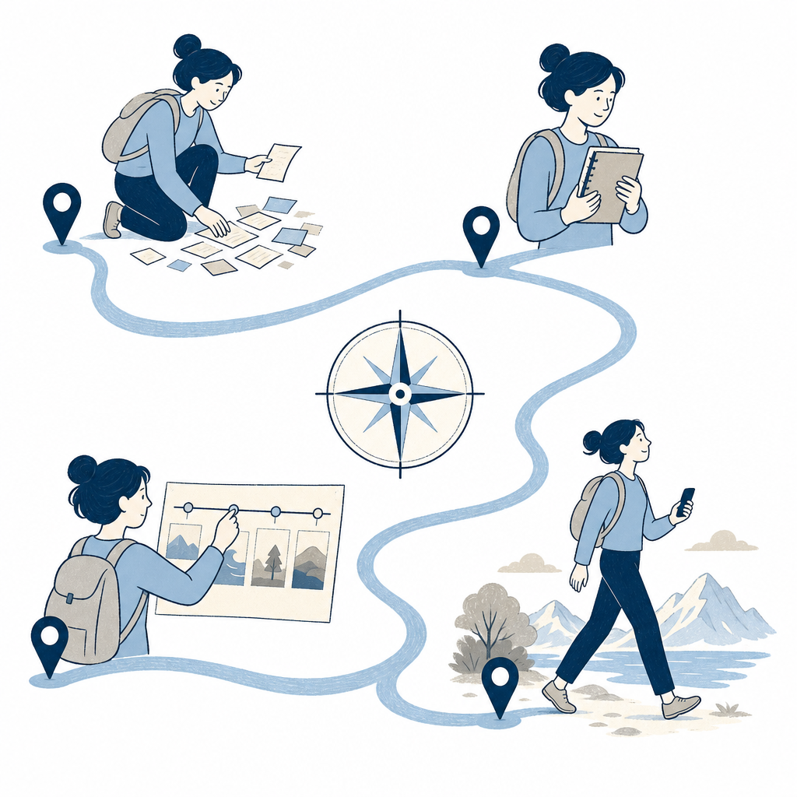

## 為什麼讀

6/5 收進收件箱的影片。Simon 的 KW 流程本來就用 NotebookLM（MCP 產簡報／音訊），這部講 NotebookLM 跟 Gemini 的官方串接新介面，跟現有工作流直接相關；順便看消費級 AI 旅遊規劃的完整流程長什麼樣。

## 摘要

泛科學院（Juju）示範一條完整的 AI 旅遊規劃流水線，把「查資料、整合、排程、導航、隨行」五段各交給最適合的工具：Gemini 連 Google 即時查房價與餐廳；NotebookLM 把文章、截圖、錄音檔整合成單一資料庫、回答只基於匯入的資料；Gemini 介面新增的「筆記本」入口直接讀 NotebookLM 資料、搭配 Canvas 畫布生成可即時修改的行程表；行程轉 CSV 一鍵匯入 Google My Maps 導航；旅途中用 Gemini Live 開鏡頭即時辨識植物、翻譯菜單、產生日語點餐句。核心精神是分工：每個工具只做它最擅長的那段。

## 核心概念

- [[notebooklm-as-rag]]（RAG＝檢索增強生成、回答只奠基於你餵的資料）：NotebookLM 擅長「整理既有資料」而不是「生成延伸企劃」——影片的分工正好印證這點：資料整合交 NotebookLM、行程創作交 Gemini。Gemini 左側工具欄的「筆記本」入口（5/26 國煜那篇介紹過的介面改版）在這支影片裡有了第一個完整應用實例：點開筆記本直接對話、回答奠基在匯入資料上、再接 Canvas 畫布把資料變成可即時編輯的行程表。（泛科學院）
- [[gemini-live]]：Gemini App 裡能即時看鏡頭畫面、聽你說話的功能（多模態＝同時吃影像＋語音＋文字）。開鏡頭對著路邊植物問「這是什麼花」、它即時辨識成長春花還主動提醒全株有毒；對著日文菜單講「四人份、一人蛋奶素」、它推薦餐點組合並產出一段可唸給店員聽的日語點餐句、關掉視訊後文字稿還在。是「行中」場景的隨行助理、跟 NotebookLM 的「行前」資料整合互補。（泛科學院）

## 對 Simon 的應用（當下想法）

> 以下為 reading 當下想到的應用、隨時間／工具／興趣變化可能已失效；後續落地狀態見下方「落地動作與效益」段（若有）。

**A. 芙莉蓮優化類**（可套到 Claude Code／skill／rules／CLAUDE.md／user-memory）：

- KW 流程的 NotebookLM 知識可補一塊：Gemini 介面已能直接讀 NotebookLM notebook。目前 KW Step 8b 用 NotebookLM MCP 產簡報／音訊後就結束；若日後需要「拿 notebook 內容繼續做延伸產出」（例如把 reading 的 notebook 變成行動清單或比較表），可以建議 Simon 直接開 Gemini 筆記本入口接著用、不必重餵資料。先把這個事實記在 [[notebooklm-as-rag]] concept（本次已擴寫）、待真有需求再動 skill。

**B. Simon 個人動作類**（建 Notion Action 卡／動 vault／改個人工作流／看別的東西）：

- 下次跟阿茹出遊可直接套這條流水線：收藏的 IG 景點截圖＋LINE 討論訊息丟 NotebookLM → Gemini 筆記本入口開 Canvas 排行程（給條件：步行上限、預算、誰不想早起）→ 行程轉 CSV 匯入 Google My Maps 當天導航。
- 手機 Gemini App 的 Live 功能值得先試用一次熟悉操作（拍照問、視訊問），出遊當下才不用現學。

## 落地動作與效益

**A 類芙莉蓮優化**（2026-06-10 與 Simon 討論定案）：

- **不優化**：候選「在 KW skill 的 NotebookLM 段落加 Gemini 筆記本入口延伸產出建議」決定不做。理由：事實已記進 [[notebooklm-as-rag]] concept（本次擴寫）、目前 KW 流程沒有「拿 notebook 繼續創作」的實際需求，等需求出現再動 skill，避免規則越加越肥（agent harness 衛生考量）。

**B 類 Simon 個人動作**（Simon 自行維護狀態）：

- ⏸ 下次跟阿茹出遊套用流水線（NotebookLM 整合 → Canvas 排行程 → CSV 進 My Maps）——等有出遊計畫
- ⏸ 手機 Gemini App 的 Live 功能先試用一次（拍照問、視訊問）

## 原文要點

- 旅遊規劃四痛點：AI 資料過舊、資料散落各處難整合、旅伴需求衝突難喬、當地語言溝通障礙。
- **第一步・查即時資訊（Gemini）**：直接連 Google 查詢、給預算／日期／在意的點請它做評分表格（例：「住宿預算 2000、6/15 有空房、乾淨安全靠近大眾運輸的東京房間」），可直接比較不同訂房網站價格。
- **第二步・整合資料（NotebookLM）**：新增筆記本、把文章連結、對話截圖、與朋友討論的錄音檔全部丟進去；回答只基於匯入的資料。示範丟 9 篇東京旅遊文章＋討論錄音檔、問「我們的旅行共同偏好是什麼、哪些景點不適合排」答得精準；也能把整理結果做成影片。
- **第三步・排行程（Gemini 筆記本＋Canvas）**：Gemini 左側工具欄「筆記本」直接開 NotebookLM 資料、搭配 Canvas 畫布下條件排程（「4 天 3 夜東京、文青咖啡廳＋平價古著店、一天步行不超過 1 萬步、點對點不超過 30 分鐘」），生成結果可直接編輯、臨時改需求即時修改。
- **旅伴衝突調解**：把三個旅伴的需求（誰要跑咖、誰要博物館、誰不想早起）餵給 Gemini、請它生成三版行程並說明「誰被滿足、誰要妥協」；懶得整理需求就直接丟討論錄音檔、它會做成會議紀錄還標註說話的人。
- **第四步・導航（Google My Maps）**：請 AI 把行程整理成 CSV（景點名稱、地址、建議停留順序、停留時間、營業時間）→ My Maps 匯入 → 一鍵建好可分享的旅遊地圖。
- **加映・行前準備**：把天數、目的地丟 AI 要穿搭規劃＋備品清單（會考慮天氣與特殊場景——神社不能穿拖鞋這類規定）；行程資料請 Gemini 匯出成 Google Doc 旅遊企劃書分享給旅伴。
- **第五步・隨行助理（Gemini Live）**：旅途中開 Live 拍照／視訊即時問——路邊的花是什麼品種（辨識出長春花、主動提醒有毒勿碰）、日文菜單怎麼點（推薦餐點＋產出日語點餐句、關視訊後文字留存可給店員看）。

## 原文全文

## 原始連結

- https://youtu.be/TN3ZrSQ4DTc
