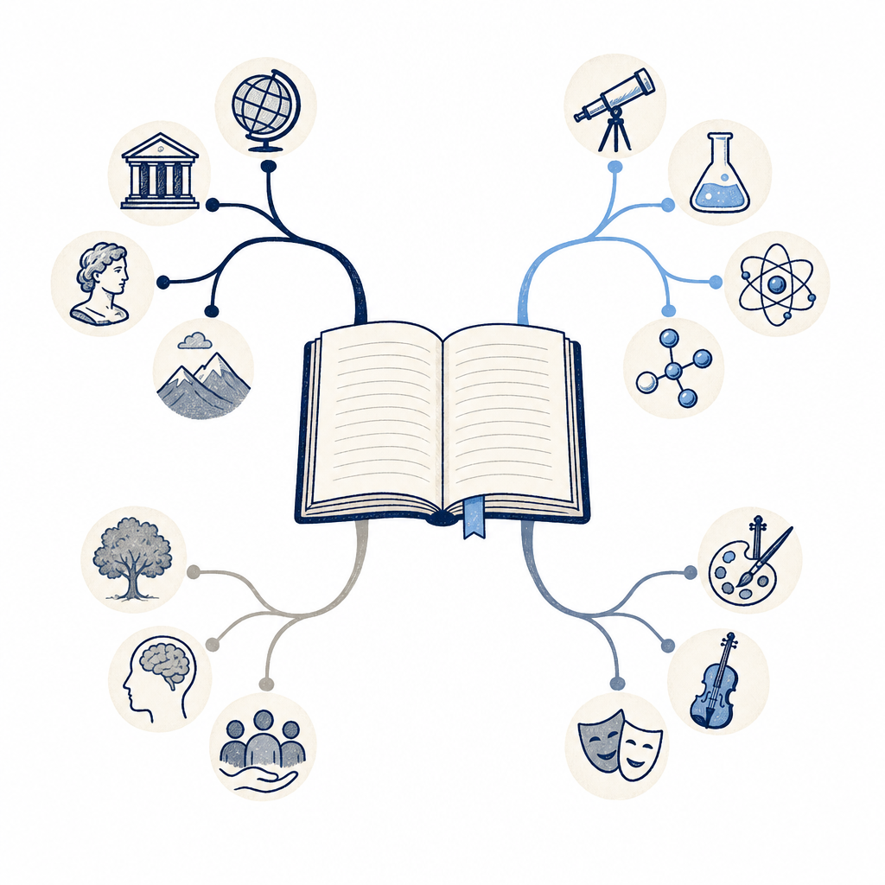

## 為什麼讀

Simon 重度使用 NotebookLM——KW γ 流程對 impact:high reading 會自動產 NotebookLM 簡報＋音訊，vault 也已收多篇 NotebookLM 相關 reading（RAG 卸載、Gemini+Gems 整合、旅遊規劃組合技）。這篇是數位時代的 22 篇精華索引，價值不在深度觀點而在「資源地圖」：一次看清 NotebookLM 的功能版圖跟哪些子題值得深挖。share.google 連結從手機丟進收集箱。

## 摘要

數位時代（蘇柔瑋）把站上 22 篇 NotebookLM 教學與應用報導，依「認識工具、建立知識庫、AI 產出、場景應用」四大架構順序，整理成一張完整學習地圖。第一類認識工具：入門總覽、收費、客製化教學影片、Deep Research、中文 podcast 語音摘要與心智圖。第二類建立知識庫（輸入端）：YouTube 一鍵匯入、Chrome／Grabbit 擴充批次匯入、跨平台筆記接進 Gemini。第三類 AI 產出：10 組進階提示詞、簡報生成 2 原則＋8 種官方範本＋修改美化、YAML 指令提升簡報質感。第四類實戰場景：會議紀錄、1 on 1 筆記、競品分析、市場研究、台股美股財報解讀、課業學習（MIT 研究生用 3 個關鍵提問 48 小時讀懂一學期）。文章定位 NotebookLM 為「內建 Gemini、根據上傳資料回答並附來源、大幅降低幻覺」的研究筆記工具，並指出多數人卡在「丟資料請摘要」的單一用法、只要調整提問邏輯與提示詞架構就能大幅提升產出。

## 核心概念

- [[notebooklm-as-rag]]：Simon 對 NotebookLM 的實際定位——當 Claude Code 的外掛 RAG 引擎，把影片處理、深度檢索、圖表生成卸載給走 Gemini 免費額度的 NotebookLM，省 Claude token。這篇索引文沒談這個卸載用法，但裡面「YouTube 一鍵匯入建知識庫」「進階提示詞抓重點」正是支撐這個卸載流程的底層操作。
- 這篇本身是資源索引（綜覽型），不另抽新概念。真正值得深挖的子題（進階提示詞、簡報範本、財報分析）若 Simon 後續點進去看，再各自決定要不要抽概念。

## 對 Simon 的應用（當下想法）

> 以下為 reading 當下想到的應用、隨時間／工具／興趣變化可能已失效；後續落地狀態見下方「落地動作與效益」段（若有）。

**A. 芙莉蓮優化類**（可套到 Claude Code／skill／rules／CLAUDE.md／user-memory）：
- 「10 組進階提示詞讓 AI 一眼抓重點」這類提示詞模板，若實際好用，可考慮收進 KW γ 產 NotebookLM 多媒體那步的 focus_prompt，提升簡報／音訊產出品質。但要先 Simon 點進原文看過、確認值得，才動 skill。先列著、不自己改。

**B. Simon 個人動作類**（建 Notion Action 卡／動 vault／改個人工作流／看別的東西）：
- 這篇是索引、不是終點。值得點進去看的子題：① NotebookLM 簡報提示詞 2 原則＋8 種範本（對應 Simon 在累積的簡報流）；② 財報解讀提示詞（對應他的投資組合追蹤）；③ MIT 研究生 3 個關鍵提問 48 小時讀懂一學期（對應他的證照備考，iPAS／CCNA 教材可試）。挑 1–2 個點進去，其餘略過。
- ③ 的「用 NotebookLM 加速讀完一門課」最貼 Simon 當前的證照學習，優先試這個。
- 不適合寫成 Substack（純資源索引、無個人觀點切入點）。

## 原文要點

- **定位**：NotebookLM 是 Google 推出、內建 Gemini 的研究筆記工具，根據上傳資料回答並附來源、大幅降低幻覺。
- **痛點**：多數人卡在「丟資料請摘要」、只得到段落濃縮；調整提問邏輯與提示詞架構能大幅提升產出。
- **四大架構**：
  1. 認識工具：入門總覽／收費／客製教學影片／Deep Research（可匯入 PDF、Word、Google Sheets）／中文 podcast 音訊（50 種語言）＋心智圖。
  2. 建立知識庫（輸入端）：YouTube 一鍵匯入、Chrome 擴充與 Grabbit 批次匯入、NotebookLM 筆記接進 Gemini（免費用戶也能用）。
  3. AI 產出：10 組進階提示詞、簡報生成 2 原則＋一組指令出定稿、8 種官方範本、YAML 指令提升質感、用 Canva／Lovart 拆圖層修改、免費版 2 招改簡報不重生。
  4. 實戰場景：會議紀錄（散會 3 分鐘發信）、1 on 1 筆記、競品分析簡報、Gemini＋NotebookLM 把 10 小時市場研究壓到 20 分鐘、台股美股財報分析提示詞、課業學習（MIT 生 3 提問 48 小時讀懂一學期）、國稅局 AI 稅務知識包。
- **延伸**：搭配站上「AI 提示詞完整地圖」（100＋ 組指令）建可複用提示詞庫；產出的知識庫可丟進 Claude 的 Cowork／Skill 接續處理。

## 原文全文

> [!info]- 原文全文（未公開）
> 原文全文只保留在本機 Obsidian、未同步到這個 garden。[在 Obsidian 開啟這篇 →](obsidian://open?vault=SimonVault&file=2-knowledge%2Freadings%2F2026-06-12-bnext-notebooklm-22-use-cases-map)

## 原始連結
- https://www.bnext.com.tw/article/91193/notebooklm-complete-guide-and-use-cases
- 收集箱原始短網址：https://share.google/xzlI58EElBSAfMPya
