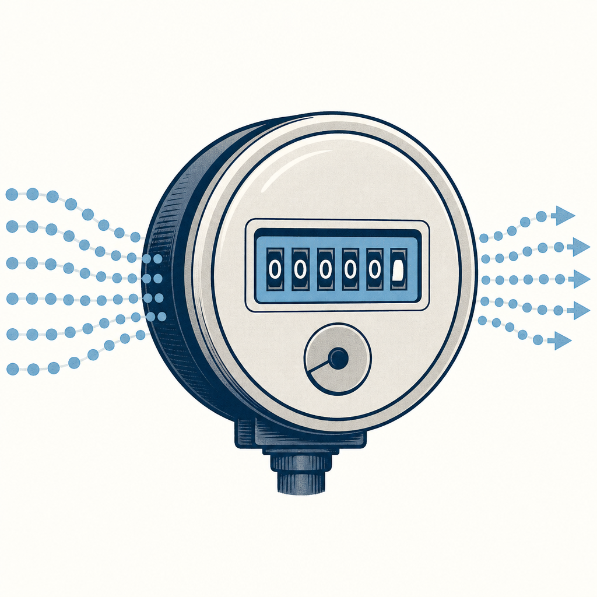

## 為什麼讀

Simon 2026-05 把 Claude Pro 升級到 Max 5x（月費 3,300），一直關注訂閱成本與額度管理；vault 已有多篇 token 管理、Claude 6/15 新制的 reading。這篇把分散的觀察收斂成一個框架「TaaS（Token 即服務）」，解釋 Claude／Gemini 近期收費調整背後的同一條邏輯，正好補上「為什麼吃到飽在退場」的全局視角。share.google 連結從手機丟進收集箱。

## 摘要

文章主張軟體計價正在從 SaaS（Software as a Service，按帳號／人頭收月費）轉向 TaaS（Token as a Service，按實際消耗的 token 收費）。原因是成本結構變了：傳統 SaaS 多一個使用者邊際成本接近零，但生成式 AI 每回答一次都要重新燒 GPU 算力、無法零成本複製，一個重度使用者可能比十個輕度使用者還貴。會推理的模型還多了「思考 token」——吐答案前在後台自我推理糾錯也燒 token，讓帳單更難預估。文章用 Claude（6/15 把程式化使用額度切開）與 Gemini（改依複雜度的算力計費）兩個實例佐證：訂閱沒消失，但吃到飽邏輯在退場，計價變成「月費＋算力額度＋額外加值」的混合。省錢手段是提示快取與邊緣 AI 分流。最後點出新的競爭指標已從「比參數、比跑分」變成「誰處理最多 token、誰推論成本最低」，中國模型靠低價 token 在全球呼叫量上反超美國模型。

## 核心概念

- [[token-as-a-service]]：AI 計價從「買帳號」變成「買一段可被精算的推論額度」。名字仿 SaaS 造成 TaaS。對 Simon 最實際的一句話是：未來要管的不是開幾個帳號，而是自己每個月的 token 預算花在哪。
- [[subscription-vs-api-cost]]：Claude 訂閱與 API 本來就分開計費。文章補上 6/15 的新變化——Anthropic 把「人類互動」跟「程式自動化」（Agent SDK、`claude -p` 非互動模式、GitHub Actions）切成兩個額度桶，程式化那桶用完要照標準 API 費率付。Simon 跑 KW γ 排程、`claude -p` 就落在這桶。
- [[compute-based-pricing]]：Gemini 走的另一條路——不是固定次數上限，而是依提示複雜度、使用功能、對話長度算「算力額度」，每 5 小時刷新、達週上限可加買點數。是 TaaS 的一種具體實作。
- [[prompt-cache]]：控管 token 帳單的關鍵省錢手段。重複送的長上下文（公司規範、固定指令）快取後命中通常省 50% 以上，這也是 Simon 在 CLAUDE.md／rules 大量重複內容下實際受益的機制。

## 對 Simon 的應用（當下想法）

> 以下為 reading 當下想到的應用、隨時間／工具／興趣變化可能已失效；後續落地狀態見下方「落地動作與效益」段（若有）。

**A. 芙莉蓮優化類**（可套到 Claude Code／skill／rules／CLAUDE.md／user-memory）：
- KW γ 批次消化、`claude -p` 週報排程都屬 6/15 切出來的「程式化使用」額度桶。可以考慮在 KW γ 或週報流程的記憶／規則裡標一句「這條走程式化額度桶、與互動式 Claude Code 分開計算」，避免未來額度爆掉時誤判是互動用量造成的。這條要不要寫成常駐規則，列給 Simon 討論。

**B. Simon 個人動作類**（建 Notion Action 卡／動 vault／改個人工作流／看別的東西）：
- 6/15 之後觀察一週：Max 5x 的「程式化使用」桶夠不夠 KW γ 批次 + 週報排程用？不夠的話再決定要不要降低自動化頻率或排程錯開。
- 這篇沒有「中國模型反超」的可落地動作，但 DeepSeek／Qwen 低價 token 對成本敏感任務（非機密、可外送的）是備選——日後若 Claude 額度吃緊、可評估把部分低敏感批次任務分流到便宜模型。先記著、不急。
- **Substack 寫作角度**：「我把 Claude Pro 升到 Max 5x 之後，才看懂 AI 訂閱正在從『吃到飽』退場」這個個人經驗，搭配 TaaS 框架，可寫成一篇給一般訂閱戶看的白話文——切入點是「你買的不是帳號，是電表」，對應 Simon 自己的升級決策與 6/15 新制踩點。

## 原文要點

- **SaaS vs AI 成本結構**：SaaS 多一個帳號邊際成本低、吃到飽划算；AI 每次推論都重新燒算力，重度使用者成本遠高於輕度，逼計價從「人頭」改「用量」。
- **Token 是新貨幣**：token 是模型讀取與生成的最小計量單位，不等於一個字；長文件、檢索、多輪推理會讓消耗呈指數成長。
- **思考 token（Reasoning Tokens）**：推理模型在輸出前後台自我推理辯證，最終字數少不代表 token 少，計價更動態複雜。
- **Claude 6/15 新制**：程式化使用（Agent SDK、`claude -p`、GitHub Actions）與互動使用分開計算；Pro 20 美元、Max 5x 100 美元、Max 20x 200 美元各有額度，用完照標準 API 費率計費。
- **Gemini 算力計費**：新增 100 美元 AI Ultra（5 倍 Pro 上限）、原 250 美元方案降到 200 美元；改 compute-based usage limits、每 5 小時刷新、可買 AI credits。
- **省錢手段**：提示詞快取（重複長文本快取、省 50%+）、邊緣 AI（AI PC／手機 NPU 跑日常、隱私敏感、重複任務、不付雲端 token 費）。
- **競爭指標位移**：從比參數、比跑分，變成比「誰處理最多 token、誰推論成本最低」。OpenRouter 數據：單週約 27 兆 token，中國模型約 48%、美國約 11.2%，中國模型靠低價與開放權重在全球開發者呼叫量上連續數週反超。
- **未來帳單長相**：像電費單／雲端帳單，逐項列輸入 token、輸出 token、模型層級、快取命中率、上下文長度、工具呼叫次數。

## 原文全文

> [!info]- 原文全文（未公開）
> 原文全文只保留在本機 Obsidian、未同步到這個 garden。[在 Obsidian 開啟這篇 →](obsidian://open?vault=SimonVault&file=2-knowledge%2Freadings%2F2026-06-12-technews-saas-to-taas-token-economics)
## 原始連結
- https://finance.technews.tw/2026/06/10/saas-to-taas/
- 收集箱原始短網址：https://share.google/tCjIYawPWNrRfqQNA
