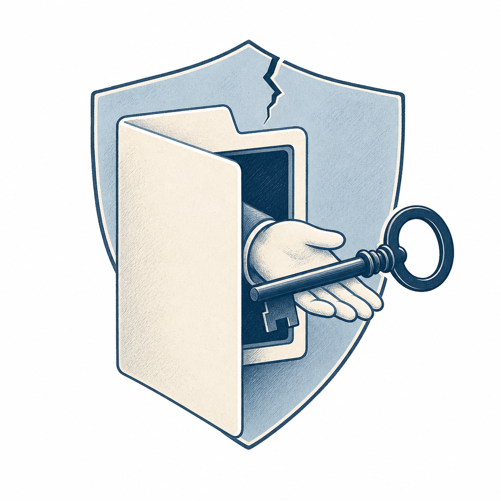

## 為什麼讀

從資訊收集箱抓進來的 YouTube。Simon 同時跑 Claude Code（WSL）+ Codex（Windows）、裝了 superpowers 等大量第三方 skill、也自寫不少 skill，`~/.secrets/` 還存著金鑰——正是這支影片講的高風險使用者。身為資安 IT 工程師，skill 的攻擊面值得認真盤一次。

## 摘要

泛科學院的 AI 主持人「國衛三號」用誇張口吻講 Claude Skill（技能包）的資安風險。核心訊息：裝一個 skill 不是裝瀏覽器外掛，而是把整台電腦的鑰匙交給一份你可能根本沒看過的文件。原因有三——AI 不會懷疑 SKILL.md 寫的內容、skill 以你的使用者身份執行、預設沒有沙箱保護，能讀寫刪檔案還能對外連網。影片舉三個真實案例：研究員改 Anthropic 官方 skill 偷塞勒索軟體、PromptArmor 用白底白字的隱形指令讓 Claude Cowork 把含個資的文件外傳、Koi Security 在 OpenClaw 的 ClawHub 市集掃出大量惡意 skill。最後給四招肉眼審核法：查有沒有要 API 金鑰、有沒有夾帶用不到的可執行檔、有沒有 curl／bash／base64 等規避字串、有沒有陌生的對外網址。

## 核心概念

- [[ai-skill-security]]：skill 以你的使用者身份執行、預設無沙箱，能讀寫刪檔案還能外連，所以裝一個來路不明的 skill 等於把帳號能碰的一切都交出去。影片把風險拆成「三個危險原因 + 三種攻擊型態 + 四招肉眼審核」，是這篇的主幹。
- [[prompt-injection]]：PromptArmor 那個案例的技術機制——把惡意指令用 1pt 白底白字（人看不到、AI 讀得到）藏進一份偽裝成 skill 的 Word 檔，讓 AI 把「文件內容」當成「要照做的命令」執行。這就是提示注入，而且是最難防的「隱形」版本。
- [[supply-chain-risk]]：Koi Security 在 ClawHub 市集掃出大量惡意 skill，是傳統軟體供應鏈攻擊（被污染的開源套件、被竄改的更新）在「AI skill 市集」這個新場景的具體化——你信任市集、市集被下毒。
- [[principle-of-least-privilege]]：skill 預設拿到你帳號的全部權限，一旦惡意就放大到「你能碰的全部」。這正是違反最小權限的後果；結構性防禦的方向就是把 skill 的權限收到剛好夠用（沙箱、唯讀掛載金鑰、限制對外連線）。

## 對 Simon 的應用（當下想法）

> 以下為 reading 當下想到的應用、隨時間／工具／興趣變化可能已失效；後續落地狀態見下方「落地動作與效益」段（若有）。

**A. 芙莉蓮優化類**（可套到 Claude Code／skill／rules／CLAUDE.md／user-memory）：

- **裝第三方 skill 前先跑四招肉眼審核**：Simon 大量裝 superpowers 等第三方 skill。可考慮把「裝任何非自寫 skill／plugin／MCP server 前，先看 SKILL.md 原始碼，過一遍四招（要不要金鑰、夾不夾帶可執行檔、有沒有 curl/bash/base64/密碼 zip、有沒有陌生外連）」寫成一條規則或一個小 skill。要不要寫、寫在哪（CLAUDE.md／rules／一個 audit skill），跟你討論。
- **補一條「第三方 skill 風險」進雙平台權限 posture**：你的雙平台權限刻意不對稱（WSL 可丟可重建、Windows 走最小權限）這個設計，剛好就是對「skill 用你身份跑」的緩解。可在既有的安全 posture 記憶補一句：第三方 skill 屬高權限執行體，未審核者只在可丟的 WSL 環境試、不在存有正式金鑰／公司資料的環境跑。要不要補，跟你討論。

**B. Simon 個人動作類**（建 Notion Action 卡／動 vault／改個人工作流／看別的東西）：

- 盤點一次 `~/.claude/skills/` 與 Codex 端 skills 裡，有沒有非自寫、來源不明、含 curl／外連、或會讀 `~/.secrets/` 的 skill，各跑一次四招審核。
- 公司 IT：把「AI agent / skill 供應鏈風險」納入資安意識宣導與 ISO 27001 第三方供應商風險（A.5.19~A.5.23）考量——員工若自行裝 AI agent skill 也是新攻擊面，可能成為一個內部宣導或資安 KPI 題材。
- **Substack 寫作角度**：「我是資安 IT + 重度 Claude／Codex 使用者，如何審核第三方 AI Skill」。從你自己雙平台 + `~/.secrets/` 金鑰管理 + 權限不對稱設計的實際經驗切入，對應影片的四招審核法，再補上影片沒講的結構性防禦（沙箱、最小權限、隱形注入擋不住肉眼）。這角度夠強、有個人實作可寫，值得單獨成文。

## 落地動作與效益（2026-06-13 收錄當天討論）

**A 類芙莉蓮優化（已落地）**：

- **新建 `skill-safety-audit` skill**（四招肉眼審核）：Simon 同意做成跨平台 skill。正本在 vault `0-context/skills/skill-safety-audit/SKILL.md`、Claude 端 symlink 已建、Codex 端待補 `.agents/skills` junction。觸發詞「審核這個 skill／這個 skill 安不安全／skill audit」。內容含四招（要不要金鑰／夾不夾帶可執行檔／有沒有 curl·base64·密碼 zip／有沒有陌生外連）＋零寬度隱形指令提醒＋拒裝／條件裝／可裝判定，並附 WSL grep 與 Windows PowerShell 兩套命令分支。效益：裝任何第三方 skill 前有固定檢查、降低惡意 skill 與供應鏈風險。
- **補雙平台權限 posture 記憶**：在 [[feedback-dual-platform-privilege-posture]] 補一條——第三方 skill 屬高權限執行體（以你身份跑、能讀 `~/.secrets/`、能外連），未審核者只在可丟可重建的 WSL 試跑、不在存正式金鑰或公司資料的環境啟用、裝前先跑 skill-safety-audit。效益：把「skill 用你身份跑」的風險邊界寫成常駐規則。

**B 類 Simon 個人動作（你後續自己維護狀態）**：

- ⏳ 盤點 `~/.claude/skills/` 與 Codex 端 skills，有沒有非自寫、來源不明、含 curl 外連、或會讀 `~/.secrets/` 的 skill，各跑一次 skill-safety-audit 四招。
- ⏳ 公司 IT：把「AI agent／skill 供應鏈風險」納入資安意識宣導與 ISO 27001 第三方供應商風險（A.5.19~A.5.23）；可能成內部宣導或資安 KPI 題材。
- ⏳ Substack 寫作角度：「資安 IT＋重度 Claude／Codex 使用者如何審核第三方 AI Skill」——從你雙平台＋`~/.secrets/` 金鑰管理＋權限不對稱設計切入，對應四招＋結構性防禦。

## 原文要點

- **一句話結論**：裝一個 skill 不是裝外掛，而是把整台電腦的鑰匙交給一份你可能沒看過的文件。
- **三個真實攻擊案例**：
  1. **改官方 skill（2025-10）**：研究員拿 Anthropic 官方放在 GitHub 的 gif-creator（做動圖用的 skill），偷塞幾行程式碼，表面像在後製動圖、實際一啟動就自動連網下載 MedusaLocker 勒索軟體並加密鎖死所有檔案。全程不需要懂程式；那幾行該放哪，研究員還直接問 Claude，Claude 乖乖告訴他。Claude 執行前雖會給你看程式碼並問「確定執行嗎」，但後面偷偷下載進來的勒索軟體不會再問一次。Anthropic 官方回應：使用者有責任只執行可信任的 skill。
  2. **偽裝成 skill 的注入文件（2026-01，登上 Hacker News）**：資安公司 PromptArmor 揭露對 Claude Cowork 的攻擊——使用者上傳一份看起來像 skill 的 Word 檔，裡面藏 1pt、白底白字、行距接近 0 的隱形指令。Cowork 一打開就被劫持，把使用者的真實房貸文件（含部分社會安全號碼）透過 curl 上傳給攻擊者，全程不需使用者按任何同意。
  3. **市集供應鏈（2026-02）**：資安公司 Koi Security 揭露針對 OpenClaw 官方 skill 市集 ClawHub 的大規模供應鏈攻擊。掃過全市集約 2632 個 skill、找出 341 個惡意，其中 335 個來自同一個攻擊行動；後續追蹤到市集擴張到 1 萬多個 skill 時惡意數量再翻倍。手法是側錄鍵盤、竊取帳號密碼。
- **三個攻擊方向（自家工具被改、第三方上傳、整個市集）都跑得通，所以不是個案、是大規模問題。**
- **skill 為什麼能做這麼多壞事（三個原因）**：（1）AI 不會懷疑 SKILL.md 寫的東西，叫它做什麼就做什麼，信任度等同你親手改電腦設定；（2）skill 一啟動就是用你的身份在動，你能碰的檔案它都能讀，包含存密碼、金鑰、雲端帳號的設定檔；（3）預設沒有殺傷保護，能讀、能改、能刪、能對外連網下載、能把你的檔案傳出去。
- **四招肉眼審核（到 GitHub 點 skill.md 的 RAW 按鈕直接看，零下載零安裝）**：
  1. 有沒有提到環境變數／API 金鑰——一個寫作文的工具沒理由要你的金鑰。
  2. 掃 Repo 裡有沒有夾帶可執行檔（`.sh` 等能直接跑東西的副檔名）——像請人掃地卻在工具箱多帶一把電鑽。
  3. 全文搜 `curl`／`bash`／`base64`／`eval`，或密碼保護的 zip——這是規避防堵掃描的經典招。
  4. 找不熟悉的對外網址——除了 skill 宣稱要連的服務，任何 telemetry／analytics／improvement 開頭的外部網址都該警覺。
- **肉眼審核擋不住隱形指令**：研究員在 OpenAI 自家的 Security Best Practice Skill 試過加料，整段攻擊指令藏在「字元寬度為 0」的零寬度 Unicode 隱形字元裡，肉眼一片空白、AI 卻讀得到。所以四招是必要、但不充分。

## 盲點與保留

**缺口／矛盾**：
- 影片把三案例都講成「整台電腦被勒索軟體鎖死」的災難級，但危害程度其實不同。案例二（PromptArmor × Cowork）查證後是「外傳含個資的檔案」（資料外洩），不是「加密鎖機」；資料外洩跟勒索加密是兩種不同的傷害，影片為了戲劇效果混為一談。
- 數字口徑不一。ClawHub 案「341 個惡意 skill」有 TheHackerNews 標題證實，但影片講的「翻倍到 824」我這輪未查到原始來源；不同資安公司給的數字差很多（有來源說 4500 個 skill 中約 900 個被武器化、後續累計到 1184 個，Snyk 的 ToxicSkills 審計則是 3984 個中 1467 個惡意 payload）。數量隨來源與時間點浮動，引用時別咬死單一數字。
- 案例一（改 Anthropic 官方 gif-creator 下載 MedusaLocker）我這輪未獨立查到原始出處；機制與已證實的 Cowork 案一致、屬合理，但要當成「確定發生過的事件」前建議再查一次原始來源。
- 影片幾乎沒提平台側與結構性緩解：Cowork 的程式碼其實跑在出站受限的虛擬機（只放行少數白名單網域，這次攻擊正是鑽「Anthropic API 被列白名單」的洞）、skill 執行前也有程式碼預覽提示；沙箱／容器隔離、唯讀掛載金鑰、限制對外連線這些防禦都沒講。對照 vault 既有 [[supply-chain-risk]]，過去只涵蓋企業第三方與 SBOM、沒涵蓋「AI agent skill 市集」這個新攻擊面——本篇與兩個新概念補上。

**過度吹捧／該打折**：
- VTuber 人設刻意用「愚蠢的人類」「人類災難」「智商跟不上下一個時代」這類焦慮話術，中段直接推銷頻道會員、結尾還把關鍵的「隱形指令偵測工具」藏在付費牆後（「進階功能必須加入會員才能觀賞」）。事實內核（skill 高權限、三案例屬實）可信，但「販賣焦慮 + 引流」這層包裝要打折看。
- 「四招走完 90% 有問題的 skill 露餡」這個 90% 是影片自己丟的、沒有依據；而且影片自己也承認隱形指令（零寬度字元）肉眼看不到、四招擋不住。所以別把肉眼審核當成充分防線，它是必要非充分——真正的防線是限制 skill 的權限與對外連線。

## 原文全文

> [!info]- 原文全文（未公開）
> 原文全文只保留在本機 Obsidian、未同步到這個 garden。[在 Obsidian 開啟這篇 →](obsidian://open?vault=SimonVault&file=2-knowledge%2Freadings%2F2026-06-13-pansci-claude-skill-security)
## 原始連結

- https://youtu.be/3rCPZizvb18
