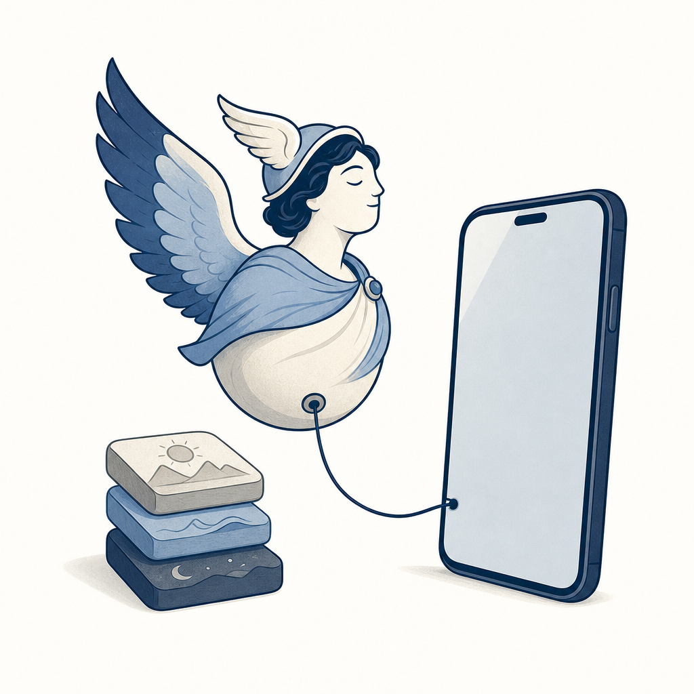

## 為什麼讀

從資訊收集箱抓進來的 YouTube（標題帶 fbclid，從臉書點進來的）。vault 5 月已收過一篇 Hermes vs OpenClaw 的新聞概覽，這支是動手教學的深掘版，能把「Hermes 架構到底長怎樣」從文字描述變成實際操作畫面。Simon 已決定主走 Claude Code + Codex，收這篇是競品意識與架構對照，不是要搬家。

## 摘要

PAPAYA 電腦教室的 Hermes Agent 安裝教學，把 Nous Research 這套「越用越聰明」私人 AI 助理的完整部署走一遍。Hermes 四個賣點：背景長時間待命、自我學習、分層記憶、危險指令審查。記憶拆成三個純文字檔——user.md 記使用者是誰與偏好、memory.md 記 agent 自己累積的工作心得、soul.md 定義 agent 的人設與語氣（教學裡把它命名為「豆豆」）。部署可選本機（幾乎免費、躲在家用網路後面、被入侵風險低）或 Hostinger 雲端（24 小時不斷線、不碰你電腦的私人檔）。模型可走 ChatGPT 訂閱、OpenRouter 按量計費或 DeepSeek。主要操作介面是 Telegram bot（用 BotFather 建機器人、靠 user ID 白名單擋外人）。進階能力包含子代理（一次派出多個分身、同時查不同來源）彙整成 HTML 儀表板、Go 目標模式（給一個完成條件就自動拆任務做到完）、排程晨報、語音輸入、串 Gmail/日曆/Notion、安裝 skill 前自動做安全檢查、每日凌晨打包備份到 Google Drive。

## 核心概念

- [[agent-architecture-comparison]]：這支教學把 2026-05 那篇新聞概覽講的 Hermes 架構具體走了一遍。5 月那篇只描述了大寫的 MEMORY.md + USER.md 兩個記憶檔，這支教學的實際畫面是小寫的 user.md + memory.md，還補上第三個記憶檔 soul.md（人設語氣）——大小寫差異只是新舊資料的寫法不同、講的是同一套東西。加上 Go 目標模式、70 幾個內建 skill、Telegram 當主介面，讓「Hermes 跟 Claude Code 架構幾乎同源」這個判斷有了實際操作畫面當佐證。
- [[ai-skill-security]]：Hermes 在使用者安裝第三方 skill 前，會先自動對 skill 做來源與安全性檢查，發現藏有惡意或高風險內容就擋下並提醒不要裝。這正好是 ai-skill-security 那條「平台會不會建官方審核機制」未解疑問的一個真實答案——已經有平台把這步內建進去，不再只能靠使用者肉眼審 SKILL.md。
- [[claude-code-goal-command]]：Hermes 的「Go 目標」跟 Claude Code 的 /goal 是同一個設計——給一個完成條件，agent 自動把大任務拆成小步、一回合一回合推進到做完為止。教學用它示範把整批商品資料搬進 Notion。兩家不同工具、同一個自主完成迴圈。
- [[cross-platform-agent]]：Hermes 用 user.md / memory.md / soul.md 三個純文字檔當記憶、skill 也是 Markdown——記憶與技能都是可搬走的文字檔、不綁死在某家平台。這跟 Simon 把 CLAUDE.md / AGENTS.md 記憶設計成跨平台可攜是同一條思路。

## 對 Simon 的應用（當下想法）

> 以下為 reading 當下想到的應用、隨時間／工具／興趣變化可能已失效；後續落地狀態見下方「落地動作與效益」段（若有）。

**A. 芙莉蓮優化類**（可套到 Claude Code／skill／rules／CLAUDE.md／user-memory）：

- Hermes 把記憶拆三層——user.md（使用者是誰）、memory.md（agent 工作心得）、soul.md（人設與語氣）——分工乾淨。具體可試的動作：在 vault `0-context/` 開一個獨立的 `frieren-soul.md`（或在 CORE_RULES 抽一節），把散在 CLAUDE.md／CORE_RULES 各處的「芙莉蓮人設、語氣、降 AI 語感規則」集中到一塊，跑一兩週看會不會比現行分散式更好維護。判定點：若集中後規則更好找、語氣更一致就留；若只是多一個檔沒實益就回退。（這條待跟 Simon 討論再決定要不要做）

**B. Simon 個人動作類**（建 Notion Action 卡／動 vault／改個人工作流／看別的東西）：

- 競品意識存檔：Hermes 是 Simon 已決定主走 Claude Code + Codex 之外的備選，這篇可當「訂閱變貴／隱私顧慮時的逃生路線」放著，不需現在動手部署。
- Substack 寫作角度：可寫「看完 Hermes 保姆級教學，為什麼我還是不搬家」——從一個重度 Claude Code / Codex 使用者的角度，把自架 AI 助理的真實門檻（雲端主機月費、OpenRouter 儲值、Telegram 串接、防火牆維護）攤開，對照行銷話術「用過就回不去」。素材接得上 Simon 雙棲 agent 的實戰經驗。

## 原文要點

- **四大賣點**：背景長時間待命可手機交辦、自我學習（每次任務後回顧優化）、分層記憶（記得交代過的事 + 學你的工作習慣）、安全（危險指令審查、刪檔時介入處理；原片此處逐字稿殘缺、僅能確認「遇到刪檔會幫忙處理」）。
- **三個記憶檔**：user.md（使用者的個人檔案卡）、memory.md（Hermes 自己的工作筆記本）、soul.md（agent 是誰、用什麼語氣、扮演什麼角色）。對話量到一定程度會自動壓縮，類似對 [[context-rot]] 的處理。
- **兩種部署**：本機（幾乎免費、躲家用網路後、入侵風險低，建議另開非管理員帳號跑）vs Hostinger 雲端 VPS（24 小時穩定、不碰本機私人檔、綁約越長越便宜、挑近的機房如馬來西亞）。
- **模型來源**：官方訂閱 / 既有 ChatGPT 訂閱（選 OpenAI 授權）/ OpenRouter 按量計費（儲值 10 美元、可切 DeepSeek 等便宜模型）。
- **主介面 Telegram**：BotFather 建 bot、用 UserInfo 查自己的 user ID 設白名單把外人擋掉、設 Home Channel；本機則用 Hermes Gateway Setup 綁定。
- **進階能力**：子代理（subagent）平行查多平台資訊彙整成 HTML 儀表板；內建網頁搜尋 + 可串 Tavily 做即時研究；Go 目標模式自主拆任務迴圈推進；排程（每天晨報、每晚推日文單字）；地圖路線規劃；語音輸入輸出（Telegram /voice）。
- **Skill 系統**：內建 70 幾個 skill、官方有 skill 目錄站、可貼安裝指令裝第三方 skill，**安裝前自動做來源與安全性檢查**；完成任務後會把摸索出的做法自動存成新 skill。
- **整合**：Gmail / Google 日曆（走 Google Cloud OAuth、自己授權不交密碼）、Notion（API 金鑰或 MCP）、Office 檔分析畫圖、收據照片 OCR 進 Google 試算表。
- **生圖生影片**：模型本身能生（Gemini Nano Banana、ChatGPT）或串 Fal（GPT Image 2、Seed Dance 2.0）。
- **備援與安全**：每天凌晨 3 點自動打包重要資料備份到 Google Drive；雲端主機設防火牆規則擋外部惡意連線。

## 原文全文

> [!info]- 原文全文（未公開）
> 原文全文只保留在本機 Obsidian、未同步到這個 garden。[在 Obsidian 開啟這篇 →](obsidian://open?vault=SimonVault&file=2-knowledge%2Freadings%2F2026-06-15-papaya-hermes-agent-tutorial)
## 原始連結

- https://www.youtube.com/watch?v=-EivK7vpOXY

## 落地動作與效益

**A. 芙莉蓮優化類**（待 Simon 拍板、未自行實作）：

- **候選：soul.md 式人設檔分層**。Hermes 把 user.md（你是誰）/ memory.md（agent 工作心得）/ soul.md（人設語氣）拆三層；可考慮把芙莉蓮的人設、語氣、降 AI 語感規則從 CLAUDE.md／CORE_RULES 各處集中成一塊（獨立檔或一節）。**狀態：⏸ 提案中**。傾向不急著動——CLAUDE.md 已有分層，效益（更好維護）不確定、純屬可選優化，等 Simon 覺得規則散了再說。

**B. Simon 個人動作類**（Simon 自行維護狀態）：

- 競品意識存檔（Hermes 當訂閱變貴／隱私顧慮時的逃生路線）：✅ 已做——這篇 reading + `agent-architecture-comparison` 概念就是存檔，未來要評估再回來看。
- Substack 寫作角度「看完 Hermes 保姆級教學，為什麼我還是不搬家」：⏸ 候選——標題、切入角度、素材清單已備（自架 AI 助理真實門檻 vs 行銷話術），待 Simon 決定要不要寫。
