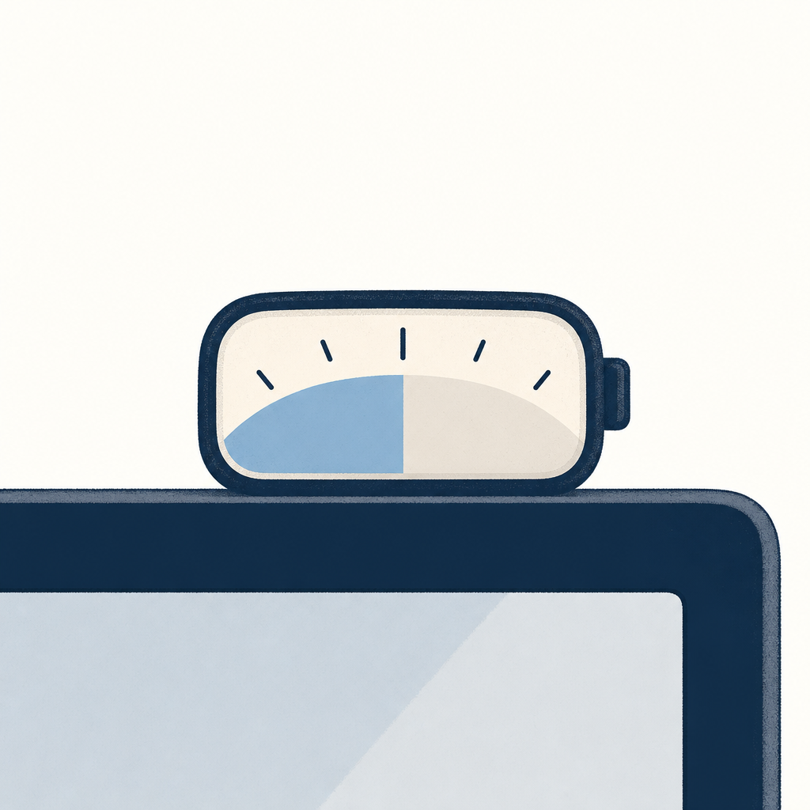

## 為什麼讀

從資訊收集箱抓進來的（GitHub Pages、從臉書點進來）。Simon 同時跑 Claude Code（WSL）+ Codex（Windows）、剛升 Claude Max 5x（3,300 元/月）、vault 有一串 token 經濟學 reading，額度可視化是活躍關注點。這支工具雖然是 macOS 專屬用不了，但它解的問題（隨時看得到還剩多少額度）正好打中。

## 摘要

usage 是一個開源（AGPL-3.0）的 macOS 選單列小工具，把 Claude Code 跟 Codex 的剩餘額度像電量百分比一樣釘在選單列。它同時顯示 Claude Code 的 5 小時 session 額度與 7 天週額度，點開有 per-project 用量與花費。核心設計是「純讀本機檔」——讀一個狀態檔（這個檔是它要你另外裝的 statusLine 紀錄器寫出來的、不是 Claude Code 內建現成的），加上 Codex 的 `~/.codex/sessions/` JSONL 紀錄，自己算用量，從不連 Anthropic 或 OpenAI 的 API、不碰 Keychain、無遙測。附帶一鍵 HTML 報表（token/花費趨勢、top 專案、模型分布，專案名預設隱藏方便給客戶或主管看）、10 種視覺主題、5 語介面（含繁中）。新功能 Resume 讓 CLI 自動接續上次進度、每天健檢 log 揪 token 浪費並在交接時加一行提醒。最大限制：只有 macOS 版，Simon 的 WSL + Windows 環境裝不了。

## 核心概念

- [[claude-usage-dashboard]]：Claude 官方額度面板分三層（當前 session / 週額度 / 額外用量），但要主動點開才看得到。usage 這個第三方工具把同樣的額度資訊（Claude Code 5h + 7d）搬到選單列常駐顯示、還多塞了 Codex 的額度並排，等於把「要去查」變成「隨時釘在眼前」。差別是它純讀本機檔自己算、不打官方 API。
- [[token-saving-rules]]：usage 的「每天健檢 log、發現 token 浪費就在交接時加一行提醒」是把省 token 從「人要記得去看」變成「工具主動點你」。這跟省 token 守則同一個精神，只是把它做成自動巡檢。

## 對 Simon 的應用（當下想法）

> 以下為 reading 當下想到的應用、隨時間／工具／興趣變化可能已失效；後續落地狀態見下方「落地動作與效益」段（若有）。

**A. 芙莉蓮優化類**（可套到 Claude Code／skill／rules／CLAUDE.md／user-memory）：

- 可借的設計是「每天健檢 log 揪 token 浪費、在交接時加一行提醒」這個自動巡檢模式：把額度感知從「用爆才發現」變成工具每天主動點一下。**但這條依賴 B 類那個 DIY 動作**——morning skill 跑在 WSL，現在沒有可讀的本機用量來源（這支工具的 statusLine 狀態檔是 macOS 上那個 hook 產的、Simon 環境沒有）。所以順序是：先照 B 類做出 WSL 版用量來源，再回頭在 morning skill 加「上週 token 用量 / 額度還剩多少」這行提示；當下不可單獨做。

**B. Simon 個人動作類**（建 Notion Action 卡／動 vault／改個人工作流／看別的東西）：

- 這支是 macOS 專屬、WSL + Windows 用不了。具體動作：要嘛找一個跨平台（Linux / Windows）的 Claude Code + Codex 額度追蹤器，要嘛記下它的做法（讀 statusLine hook 狀態檔 + `~/.codex/sessions/` JSONL、本機自算、不打 API），未來真的想盯緊 Max 5x 額度時自己 DIY 一個 CLI 版。
- 隱私角度可放心：它強調 local-only、不連 API、不碰 Keychain、無遙測、AGPL-3.0 開源，符合 Simon 對工具「資料不外送」的偏好；之後若評估同類工具，這幾點可當檢查清單。

## 原文要點

- **定位**：macOS 選單列小工具，把 Claude Code + Codex 的剩餘額度當「token 的電量百分比」顯示。
- **顯示**：Claude Code 5 小時 session 額度 + 7 天週額度同時釘在選單列；點開 popover 看 per-project 用量與花費；Codex 從 `~/.codex/sessions/` 自動偵測、免設定。
- **純本機**：讀 statusLine hook 寫出的狀態檔 + Codex session JSONL log，自己算，不連 Anthropic / OpenAI、不碰 Keychain、無遙測、無帳號、無雲端。
- **HTML 報表**：今日/本週/本月/全期，含 token 與花費趨勢、top 專案、模型分布；專案名預設隱藏，方便當客戶帳單附件或給主管看。
- **Resume（新）**：讓 CLI 自動接續上次 session 進度、免重講；每天健檢 log、發現 token 浪費就在交接加一行提醒（預設關、單一選單開關）。
- **其他**：10 種視覺主題（Matrix、Win95、報紙、水族箱、世界盃 HUD 等）、5 語介面（繁中/簡中/英/日/韓）。
- **安裝**：Homebrew（`brew install --cask aqua5230/usage/usage`）或 GitHub Releases 下載 .app；AGPL-3.0。
- **限制**：只有 macOS 版。

## 原文全文

## 原始連結

- https://aqua5230.github.io/usage/
- GitHub: https://github.com/aqua5230/usage

## 落地動作與效益

**A. 芙莉蓮優化類**（待 Simon 拍板、未自行實作）：

- **候選：morning skill／開工 hook 加 token 額度提示**（借 usage 的「每天健檢揪 token 浪費、主動點你」自動巡檢模式）。**狀態：⏸ 阻塞中**——依賴下方 B 類那個 DIY 動作先做出 WSL 版本機用量來源（這支工具的資料來源是 macOS 上的 statusLine 狀態檔、Simon 環境沒有）。先有資料來源、才談得上在 morning 加提示。

**B. Simon 個人動作類**（Simon 自行維護狀態）：

- 找／DIY 跨平台（Linux／Windows）Claude Code + Codex 額度追蹤器：⏸ 候選——usage 只有 macOS 版用不了；做法可參考它（讀 statusLine 狀態檔 + `~/.codex/sessions/` JSONL、本機自算、不打 API），等真要盯緊 Max 5x 額度時再 DIY 一個 CLI 版。
- 同類工具隱私檢查清單：✅ 已記——local-only／不連 API／不碰 Keychain／無遙測／開源（AGPL-3.0）這幾點，下次評估任何額度或用量工具時當檢查項。
