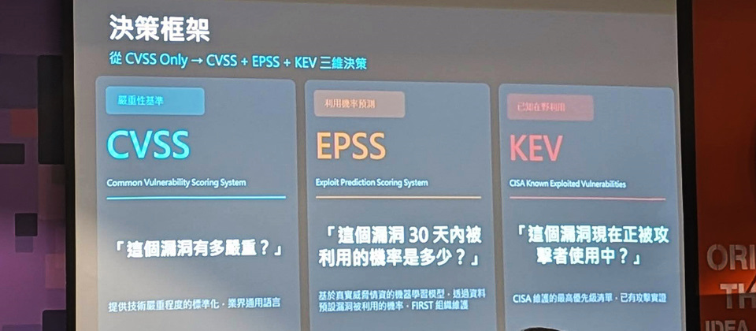
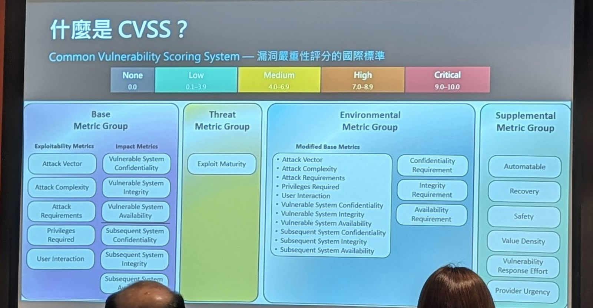
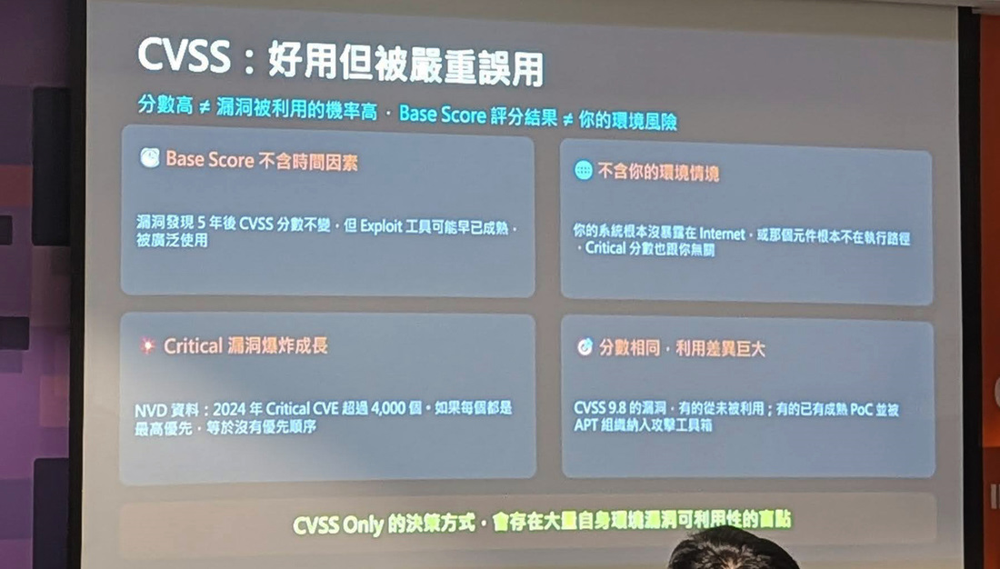
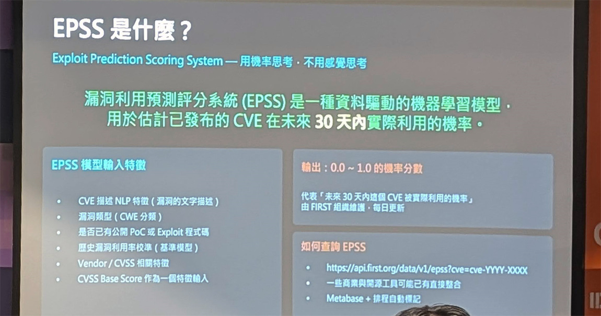
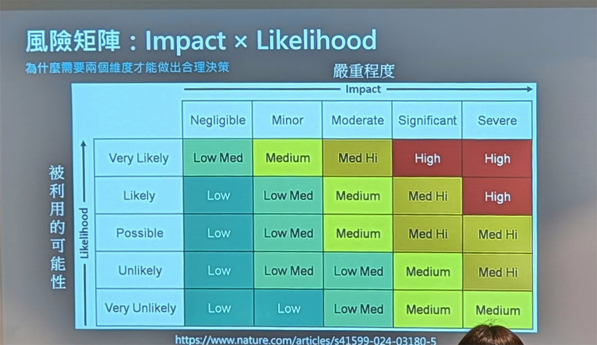
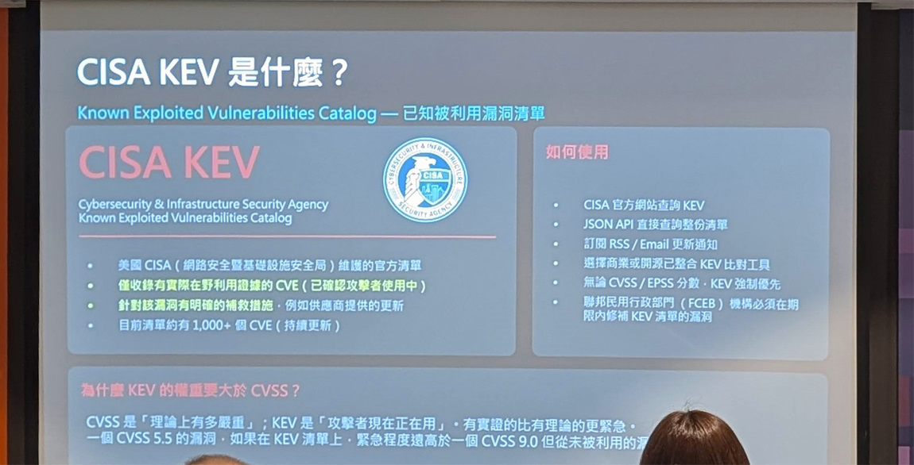
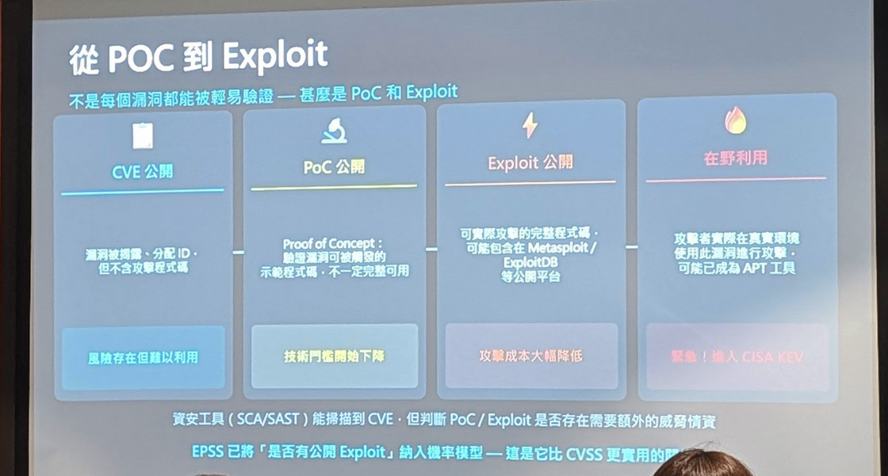
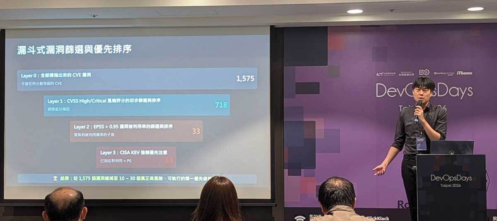

## 為什麼讀
收件箱 2026-07-01 進來的 Google 分享連結（只留網址、沒帶備註）。CVSS／EPSS／KEV 是 iPAS 科目二「資訊安全防護實務」弱點管理的基礎指標，對公司端的漏洞修補與資安 KPI 簡報也可能用得上；vault 既有 [[cvss]] concept 只有骨架、這篇正好補滿三指標的完整拼圖。

## 摘要

iThome 對 DevOpsDays Taipei 2026 演講的報導，講者是資安社群人稱 HackerCat 的高于凱。他把漏洞修補三大指標講白話：CVSS 是理論嚴重度（「這個漏洞有多嚴重？」、由美國國家漏洞資料庫 NVD 評分）；EPSS 是未來 30 天被實際利用的機率，他在企業端（甲方）的實務門檻是大於 1% 就優先修；KEV 是美國網路安全暨基礎設施安全局（CISA）維護的清單、證實漏洞已在真實攻擊中被利用、緊迫性最高。三者組成漏斗式篩選：掃描器吐出的 1,575 個 CVE 三層過濾後只剩 11 個最優先（示例用 EPSS 大於 0.95 的展示門檻、與 1% 營運門檻用途不同），把「修不完」變成「優先修對的」。文末談溝通：用開發者聽得懂的威脅情境取代分數恐嚇、展示平均修復時間（MTTR）下降趨勢降低修補摩擦。

## 核心概念

- [[cvss]]：業界最常引用的漏洞嚴重度分數（0.0–10.0、NVD 評分），但它有結構性盲點：基礎分不含時間因素（漏洞發現 5 年後分數不變、Exploit 工具可能早已成熟）、不含你的環境情境（若系統根本沒暴露在網際網路上，Critical 分數也跟你無關）、RCE 類漏洞幾乎全被標「重大」（NVD 2024 年 Critical 級 CVE 超過 4,000 個——每個都最高優先等於沒有優先順序）。理論上該按環境加權（4.0 版新增 CVSS-BT／BE／BTE），實務上資安人員鮮少有餘裕，「NVD 給幾分就照單全收」。
- [[epss]]：FIRST（國際資安事件應變組織）維護的資料驅動機器學習模型，預測「這個已公開的 CVE 未來 30 天內被實際利用的機率」（0.0–1.0、即 0–100%）、每天更新。它講機率不講嚴重度，跟 CVSS 是兩個維度、互補不取代。高于凱在甲方的實務門檻：EPSS 大於 1% 就列高風險、優先排修。
- [[kev]]：CISA 維護的「已知被利用漏洞清單」（Known Exploited Vulnerabilities Catalog），列入代表該漏洞已在真實世界被攻擊者利用、不再是推測。權重高於分數：一個 CVSS 5.5 但在 KEV 清單上的漏洞，緊急程度遠高於一個 CVSS 9.0 但從未被利用的漏洞。
- [[vulnerability-prioritization]]：從「只看 CVSS」轉向「CVSS＋EPSS＋KEV」三維決策的漏斗式篩選——CVSS 高／重大初篩排除低分雜訊（1,575→718）、EPSS 高機率聚焦會被打的子集（→33）、KEV 強制優先（→11）。核心心法：「漏洞永遠修不完，正確的目標是優先修對的」。
- [[security-storytelling]]：對開發者溝通漏洞時，別只丟「CVSS 9.8 非常危險」，改講具體威脅情境——「這個漏洞能讓攻擊者僅用 5 行 Python 程式碼就取得資料庫帳密」；別只給待修清單、要展示平均修復時間（MTTR）的下降趨勢讓團隊看到自己的進步（成效的視覺呈現另見 [[visual-dashboard]]）。分數是資安人的語言、後果才是對方的語言。

## 對 Simon 的應用（當下想法）

> 以下為 reading 當下想到的應用、隨時間／工具／興趣變化可能已失效；後續落地狀態見下方「落地動作與效益」段（若有）。

**A. 芙莉蓮優化類**（可套到 Claude Code／skill／rules／CLAUDE.md／user-memory）：
- 資安週報（weekly-intel skill）報漏洞新聞時，除 CVSS 分數外補查並列出 EPSS 分數與是否已列入 KEV（FIRST API 即可查），讓週報讀起來「該不該緊張」一眼可判〔AI 推論〕

**B. Simon 個人動作類**（建 Notion Action 卡／動 vault／改個人工作流／看別的東西）：
- iPAS 科目二「資訊安全防護實務」七月讀書窗口正在跑：CVSS 分級與弱點管理是常見考點（EPSS／KEV 是否直接入題未查證、漏斗框架作理解輔助），可把本篇的五張概念卡（cvss／epss／kev／vulnerability-prioritization／security-storytelling）連結補進對應子章節的 Notion 行動卡備註〔AI 推論〕
- 若公司有定期弱點掃描報告，其排序可實驗 EPSS 過濾：先用 CVSS 高／重大初篩、再用 EPSS 大於 1% 排優先、最後比對 KEV 強制置頂；EPSS 查詢走 FIRST API（`https://api.first.org/data/v1/epss?cve=CVE-YYYY-XXXX`）或 CVE Details 網站〔需 Simon 確認——有無弱掃管線是假設；門檻 1% 與 API 網址為原文支撐〕
- 若資安 KPI 月簡報目前以漏洞清單呈現、且修補時效可回溯計算，可考慮加「MTTR 下降趨勢＋漏洞總數變化」的成效呈現〔需 Simon 確認簡報現況〕
- Substack 寫作角度：「漏洞修不完是常態、修對的才是本事」——從企業端 IT 視角寫自己的修補排序現實、對應原文漏斗框架〔AI 推論〕（靈感備忘、非行動項）

## 原文要點

- 三指標一句話定位（高于凱）：「CVSS 是起點但不是終點，EPSS 告訴你機率，而 KEV 則代表緊急性，同時企業也必須考量自身環境。」

> **圖像解讀**
> - **類型**：架構圖（演講投影片）
> - **內容**：決策框架三卡並列——CVSS（嚴重性基準、「這個漏洞有多嚴重？」、提供技術嚴重程度的標準化業界通用語言）、EPSS（利用機率預測、「這個漏洞 30 天內被利用的機率是多少？」、基於真實威脅情資的機器學習模型、FIRST 組織維護）、KEV（已知在野利用、「這個漏洞現在正被攻擊者使用中？」、CISA 維護的最高優先級清單、已有攻擊實證）；標題「從 CVSS Only → CVSS + EPSS + KEV 三維決策」
> - **原文出處**：DevOpsDays Taipei 2026 高于凱演講投影片
> - **可檢索關鍵字**：CVSS EPSS KEV 三維決策、決策框架、漏洞指標比較

- **CVSS**：FIRST 制定、CVE 編號由 MITRE 發布後 NVD 評分；風險分級低 0.1–3.9／中 4.0–6.9／高 7.0–8.9／重大 9.0–10.0；常見版本 3.0／3.1／4.0，4.0 版在基礎分外正式提出 CVSS-BT（威脅情資）、CVSS-BE（環境因素）、CVSS-BTE（綜合評估）；實務上大家最常引用的仍是 NVD 基礎分。
- CVE 編號如漏洞的身分證字號（Log4Shell 正式名稱是 CVE-2021-44228）；CVE 揭露有時間差：通報後常等半年才公開（MITRE 審核人力可能僅 2–3 人）、協調式漏洞揭露（CVD）慣例 90 天修補緩衝期（AI 時代可能要再縮短）、狀態從已保留（Reserved）到已公開（Published）；取得 CNA 資格的廠商可自主指派發布 CVE、所以動作快。

> **圖像解讀**
> - **類型**：架構圖（演講投影片）
> - **內容**：「什麼是 CVSS？」——上方分級色條 None 0.0／Low 0.1–3.9／Medium 4.0–6.9／High 7.0–8.9／Critical 9.0–10.0；下方 CVSS 4.0 四個指標組：Base Metric Group（Exploitability：Attack Vector、Attack Complexity、Attack Requirements、Privileges Required、User Interaction；Impact：系統機密性／完整性／可用性）、Threat Metric Group（Exploit Maturity）、Environmental Metric Group（Modified Base Metrics＋CIA Requirements）、Supplemental Metric Group（Automatable、Recovery、Safety、Value Density、Vulnerability Response Effort、Provider Urgency）
> - **原文出處**：DevOpsDays Taipei 2026 高于凱演講投影片
> - **可檢索關鍵字**：CVSS 4.0 metric group、CVSS 分級表、Base Threat Environmental Supplemental

> **圖像解讀**
> - **類型**：架構圖（演講投影片）
> - **內容**：「CVSS：好用但被嚴重誤用」四象限盲點——① Base Score 不含時間因素（漏洞發現 5 年後 CVSS 分數不變、但 Exploit 工具可能早已成熟被廣泛使用）；② 不含你的環境情境（系統根本沒暴露在 Internet、或元件不在執行路徑、Critical 分數也跟你無關）；③ Critical 漏洞爆炸成長（NVD 資料 2024 年 Critical CVE 超過 4,000 個、每個都最高優先等於沒有優先順序）；④ 分數相同利用差異巨大（同為 CVSS 9.8、有的從未被利用、有的已有成熟 PoC 並被 APT 組織納入攻擊工具箱）。結論列「CVSS Only 的決策方式，會存在大量自身環境漏洞可利用性的盲點」
> - **原文出處**：DevOpsDays Taipei 2026 高于凱演講投影片
> - **可檢索關鍵字**：CVSS 盲點、CVSS 誤用、Critical CVE 爆炸、Base Score 限制

- **EPSS**：全名 Exploit Prediction Scoring System、FIRST 維護；資料驅動機器學習模型、估計已發布 CVE 在未來 30 天內被實際利用的機率；輸入特徵含 CVSS 基礎分、是否已有公開 PoC／Exploit 程式碼、歷史漏洞利用率校準等；輸出 0.0–1.0、每日更新；原文稱「推出三、四年」但普及度仍有提升空間（此說法與同文「2021 年發布」對不上、未查證）。
- EPSS 實務（高于凱甲方經驗）：掃描工具產出的漏洞量太大、沒有過濾機制修補推不動；EPSS 大於 1% 即列高風險優先排修，是比 CVSS 更實用的指標；查詢走 FIRST API 或 CVE Details 網站、部分軟體組成分析（SCA）工具已內建。

> **圖像解讀**
> - **類型**：架構圖（演講投影片）
> - **內容**：「EPSS 是什麼？——用機率思考、不用感覺思考」；模型輸入特徵：CVE 描述 NLP 特徵、漏洞類型（CWE 分類）、是否已有公開 PoC 或 Exploit 程式碼、歷史漏洞利用率校準（基準模型）、Vendor／CVSS 相關特徵、CVSS Base Score 作為一個特徵輸入；輸出 0.0–1.0 機率分數（未來 30 天內被實際利用的機率、FIRST 維護每日更新）；查詢方式：FIRST API、商業與開源工具直接整合、Metabase＋排程自動標記
> - **原文出處**：DevOpsDays Taipei 2026 高于凱演講投影片
> - **可檢索關鍵字**：EPSS 模型特徵、機率思考、CWE 分類、EPSS API

> **圖像解讀**
> - **類型**：數據圖表（演講投影片）
> - **內容**：「風險矩陣：Impact × Likelihood——為什麼需要兩個維度才能做出合理決策」；5×5 矩陣、橫軸嚴重程度（Negligible→Severe）、縱軸被利用的可能性（Very Unlikely→Very Likely）、格內風險等級從 Low 到 High 漸變；佐證「嚴重度（CVSS）跟機率（EPSS）是兩個獨立維度」
> - **原文出處**：投影片下緣標注 nature.com/articles/s41599-024-03180-5
> - **可檢索關鍵字**：風險矩陣、Impact Likelihood、二維風險決策

- **KEV**：全名 Known Exploited Vulnerabilities Catalog、CISA 2021 年底推出；僅收錄有實際在野利用證據（已確認攻擊者使用中）的 CVE、且針對該漏洞有明確補救措施（補救措施含緩解措施、不必然是修補程式）；目前清單約 1,000 多個 CVE、持續更新；美國聯邦民用行政部門（FCEB）機構必須限期修補清單內漏洞。
- KEV 權重大於分數：CVSS 是「理論上有多嚴重」、KEV 是「攻擊者現在正在用」，有實證的比有理論的更緊急。
- KEV 三個留意點：即時性落差（民間情資常早於 KEV 數日、部分漏洞最終未列入）；地域性（以美國利益相關情資為主、其他地區全面性與及時性可能有缺口）；回溯補登記（偶爾回溯列入 2021 年前的舊漏洞——例如華碩 2025 年提交的 CVE-2025-59374 列入 KEV、但本質是 2019 年 ASUS Live Update 供應鏈攻擊的歷史漏洞、非當下爆發）。列入 KEV 也不代表已有修補程式、可能僅有緩解措施。

> **圖像解讀**
> - **類型**：架構圖（演講投影片）
> - **內容**：「CISA KEV 是什麼？」——左：美國 CISA（網路安全暨基礎設施安全局）維護的官方清單、僅收錄有實際在野利用證據的 CVE、針對該漏洞有明確的補救措施（例如供應商提供的更新）、目前清單約 1,000+ 個 CVE 持續更新；右「如何使用」：CISA 官方網站查詢、JSON API 直接查詢整份清單、訂閱 RSS／Email 更新通知、選擇商業或開源已整合 KEV 比對工具、無論 CVSS／EPSS 分數 KEV 強制優先、聯邦民用行政部門（FCEB）機構必須在期限內修補；下方「為什麼 KEV 的權重要大於 CVSS？」：CVSS 5.5 但在 KEV 清單上的漏洞、緊急程度遠高於 CVSS 9.0 但從未被利用的漏洞
> - **原文出處**：DevOpsDays Taipei 2026 高于凱演講投影片
> - **可檢索關鍵字**：CISA KEV、已知被利用漏洞清單、KEV 強制優先、FCEB 限期修補

- **PoC 與 Exploit 的差異**：PoC（概念驗證）是證實漏洞存在的初步腳本、Exploit（漏洞利用程式）是能直接執行攻擊的程式碼；漏洞生命週期四階段——CVE 公開（風險存在但難以利用）→ PoC 公開（技術門檻開始下降）→ Exploit 公開（攻擊成本大幅降低、可能收進 Metasploit／ExploitDB）→ 在野利用（Exploited in the wild、緊急、進入 KEV、可能已成 APT 工具）。
- 找公開 PoC／Exploit 要極為謹慎：攻擊者常釋出偽造的程式碼當散布惡意程式的陷阱。

> **圖像解讀**
> - **類型**：流程圖（演講投影片）
> - **內容**：「從 PoC 到 Exploit——不是每個漏洞都能被輕易驗證」四階段卡：CVE 公開（漏洞被揭露分配 ID、不含攻擊程式碼→風險存在但難以利用）→ PoC 公開（驗證漏洞可被觸發的示範程式碼、不一定完整可用→技術門檻開始下降）→ Exploit 公開（可實際攻擊的完整程式碼、可能包含在 Metasploit／ExploitDB→攻擊成本大幅降低）→ 在野利用（攻擊者實際在真實環境使用、可能已成為 APT 工具→緊急！進入 CISA KEV）；下註：資安工具（SCA／SAST）能掃描到 CVE、但判斷 PoC／Exploit 是否存在需要額外的威脅情資；EPSS 已將「是否有公開 Exploit」納入機率模型——這是它比 CVSS 更實用的關鍵
> - **原文出處**：DevOpsDays Taipei 2026 高于凱演講投影片
> - **可檢索關鍵字**：PoC Exploit 差異、漏洞生命週期、在野利用、Metasploit ExploitDB

- **漏斗式篩選實例**：Layer 0 掃描器吐出全部 CVE 1,575 個 → Layer 1 CVSS 高／重大初篩（排除低分雜訊）剩 718 → Layer 2 EPSS 大於 0.95（聚焦有被利用機率的子集）剩 33 → Layer 3 CISA KEV 強制優先（已知在野利用＝P0）剩 11——候選清單縮減 95% 以上、變成真正可執行的第一優先修補。
- 心法：漏洞永遠修不完、正確目標是「優先修對的」；低風險漏洞有餘力再處理、但不是豁免修補。補充指標 VEX（Vulnerability Exploitability eXchange）可標注套件是否真的受影響。FIRST 2026 年上調 CVE 數量預測時、也同步建議企業持續用 EPSS＋KEV 排優先序。

> **圖像解讀**
> - **類型**：現場照片＋數據圖表（演講投影片）
> - **內容**：「漏斗式漏洞篩選與優先排序」四層漏斗——Layer 0 全部掃描出來的 CVE 漏洞 1,575（不管任何分數等級）；Layer 1 CVSS High/Critical 風險評分的初步篩選與排序 718（排除低分雜訊）；Layer 2 EPSS > 0.95 漏洞被利用率的篩選與排序 33（聚焦有被利用機率的子集）；Layer 3 CISA KEV 強制優先注意 11（已知在野利用＝P0）；結論列「從 1,575 個漏洞縮減至 10～30 個真正高風險、可執行的第一優先修補」；右側為講者高于凱在 DevOpsDays Taipei 2026 講台照
> - **原文出處**：DevOpsDays Taipei 2026 現場、iThome 攝
> - **可檢索關鍵字**：漏斗式篩選、漏洞優先排序、CVSS EPSS KEV Layer、P0 修補

- **溝通降摩擦**：安全文化的本質是降低摩擦、不是增加管制；用開發者能理解的語言（具體威脅情境取代 CVSS 分數）；工具自動化（與其讓工程師手動改 package.json、不如資安團隊直接提供一鍵升版的 PR）；展現修補成效（展示 MTTR 下降趨勢與漏洞總數變化、不只丟待修清單）；在每個開發團隊培養 1–2 名安全種子、從內部降低溝通成本。

**推薦關聯候選（未收錄、備忘）**：CISA 的 SSVC（Stakeholder-Specific Vulnerability Categorization）決策樹、Tenable VPR 等其他漏洞排序框架，原文未提；VEX 只點名未展開——未來讀到相關來源再考慮建 concept。

## 盲點與保留

**缺口／矛盾**：
- 兩個 EPSS 門檻並存、原文沒解釋何時用哪個：實務段講「EPSS 大於 1% 即屬高風險、優先排修」，漏斗示例卻用「大於 0.95」過濾——前者是日常營運的保守門檻、後者是把示例數字壓小的展示門檻。直接照抄任一數字都可能誤用：1% 會留下一大串、0.95 會漏掉大量真的會被打的漏洞。
- 「企業必須考量自身環境」只喊話沒給做法：全文強調環境脈絡（內外網、是否核心系統），但資產重要性怎麼疊上三指標、加權怎麼算，原文完全沒展開；對照既有 concept [[vulnerability-management]]（弱點管理是識別→評估→處置→追蹤的循環），本篇只覆蓋「排序」一環，資產盤點與修補追蹤仍要靠別的來源。
- 排序框架只講一種組法：CISA 自家的 SSVC 決策樹、商用 VPR 等其他風險導向排序方法原文未比較，讀者容易以為 CVSS＋EPSS＋KEV 是唯一解。

**過度吹捧／該打折**：
- 漏斗數字 1,575→11「縮減 95% 以上」是講者自稱的「概念呈現」、不是實測統計；實際縮減比例會隨環境與門檻大幅變動，不宜當成可預期成效引用。
- 其餘全文行文克制：iThome 還主動補了 KEV 的三個限制（即時性落差、地域性、回溯補登記），屬演講報導、無明顯行銷包裝。

## 原文全文

## 落地動作與效益

（2026-07-02 與 Simon 討論定案）

**A 類・芙莉蓮優化**：
- ✅ 已做：資安週報（weekly-intel）「重大漏洞與威脅」段每個 CVE 條目補查並列出 EPSS 分數與 KEV 列入狀態。改動檔 `~/.claude/scripts/weekly-intel-prompt.md`——新增步驟 2b（KEV feed 抓一次存暫存檔逐 CVE 查、EPSS 走 FIRST API）＋條目格式加「指標：CVSS｜EPSS｜KEV」行。兩個資料源已實測可用（EPSS API 回真值、KEV feed 1,631 筆——順帶發現投影片說的「約 1,000+」已偏舊）。下期週報（週一 08:00 排程）生效。預期效益：看漏洞新聞時「該不該緊張」一眼可判。

**B 類・Simon 個人動作**：
- ✅ 已做（芙莉蓮代辦）：五張概念卡連結＋garden reading 連結已補進 Notion「Phase 2：科目二 — 資訊安全防護實務」卡，對應 #6 弱點、威脅分類與攻擊手法（deadline 07/08）
- ❌ 不做：公司弱掃報告 EPSS 過濾實驗（Simon 2026-07-02 決定不用）
- ❌ 不做：KPI 月簡報加 MTTR 趨勢呈現（Simon 2026-07-02 決定不用）
- ⏸ 備忘保留：Substack 切入角「漏洞修不完是常態、修對的才是本事」——純選題素材、非行動項、Simon 未承諾發文

## 原始連結
- https://www.ithome.com.tw/news/176987
