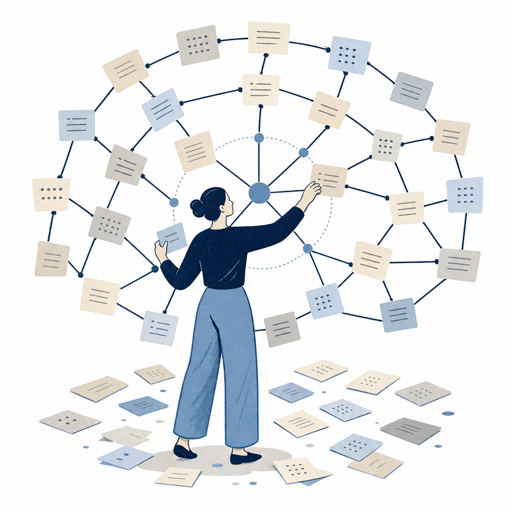

## 為什麼讀

從資訊收集箱抓進來（2026-07-07 收）。這篇講的「LLM Wiki」正是 Simon 自建 KW γ 的同一套理念，是繼 2026-04-29、2026-05-31 兩篇 Karpathy 自生長知識庫來源之後的第三篇同主題文章，用來對照自己的系統設計、補強 [[self-growing-knowledge-base]] 與 [[index-based-knowledge-base]] 兩個概念。

## 摘要

文章介紹 Andrej Karpathy 分享的「LLM Wiki」工作流：把收藏的原始素材丟進 Obsidian vault，讓大型語言模型自動讀取、摘要、交叉比對，整理成持續更新的 Markdown 知識庫。它跟傳統 RAG（檢索增強生成，查詢時才去外部撈原文再回答）的差別在於「時機」——RAG 答完就結束；LLM Wiki 是在你「加入新文章當下」就讓 LLM 讀全文、抽概念、更新既有主題頁，甚至標注新舊資料的矛盾，等於把 LLM 從被動檢索工具變成主動的知識編輯。Karpathy 說知識庫累積到約 100 篇、40 萬字時，複雜問答幾乎不必再依賴 RAG。開源工具 obsidian-llm-wiki（v0.8.5）把流程包成擷取、編譯、審核三階段，預設用 Ollama 本機執行、資料不出網路，作者已把重心移往後繼專案 Synto。

## 核心概念

- [[self-growing-knowledge-base]]：這篇的「LLM Wiki」就是自生長知識庫的另一個名字——收進來的資料由 LLM 主動消化、提煉、標矛盾，知識庫越用越厚。差別只在框架命名（Karpathy 叫它 LLM Wiki／自生長飛輪），底層理念同一套：不是被動收藏夾，是有一個持續蒸餾動作的活系統。
- [[index-based-knowledge-base]]：文章給了一個具體門檻——約 100 篇、40 萬字後複雜問答幾乎不必靠 RAG，因為 LLM 已把整理好的索引與摘要維護到夠完整、能直接從中找答案。這替索引式知識庫「用一份目錄索引取代向量相似度搜尋」提供了佐證（原文講「不必再靠 RAG」是同一件事的另一面說法）；也給「知識庫要養到多大、純索引式才會不夠用而該架 RAG」一個粗略的量級參考。

## 對 Simon 的應用（當下想法）

> 以下為 reading 當下想到的應用、隨時間／工具／興趣變化可能已失效；後續落地狀態見下方「落地動作與效益」段（若有）。

**A. 芙莉蓮優化類**（可套到 Claude Code／skill／rules／CLAUDE.md／user-memory）：
- 三層流水線的「模型分級」值得對照 KW γ 收錄流程：文章的 obsidian-llm-wiki 用輕量模型（3B–8B）做擷取、較大模型（7B–14B）做編譯。KW γ 目前收錄全程同一個模型，或可評估「擷取候選 concept 用便宜模型、編譯 reading／concept 用強模型」的分工，呼應既有調度規則「依品質分工」〔AI 推論〕。這是本篇唯一真正對 KW γ 開出新對照點的候選，其餘為既有設計的佐證。
- 原文「收進來當下就標注新舊資料矛盾」這個通則〔原文支撐〕，對照到 KW γ 已落地的差異3（medium 窄矛盾比對）＋ high 盲點段〔AI 推論〕——所以這條對 Simon 是既有設計的外部佐證、非新優化缺口，**不需動作**。

**B. Simon 個人動作類**：
- 若要挖借鏡點，最值得看 obsidian-llm-wiki 審核階段「拒絕的文章帶回饋重生成」這個迴圈——KW γ 目前 Step 5c 是子代理一次性挑錯、沒有「帶著回饋自動重生成」的閉環，可評估要不要補〔AI 推論〕。
- Substack 寫作角度：「我自己造了一個 Karpathy 說的 LLM Wiki」——用自建 KW γ 對照這套開源工具，寫一篇「同一個理念、我怎麼落地」的文章，個人系統經驗是現成素材〔AI 推論〕。

## 原文要點

- **LLM Wiki 的核心**：把收藏原始素材進 Obsidian vault，LLM 自動讀取、摘要、交叉比對，編譯成持續更新的 Markdown 知識庫。
- **跟 RAG 的差別在時機**：RAG 查詢時才撈原文、答完結束；LLM Wiki 在加入新文章當下就讀全文、抽概念、更新既有主題頁、標注新舊矛盾——主動編輯而非被動索引。
- **規模門檻**：累積約 100 篇、40 萬字後，複雜問答幾乎不必依賴 RAG，LLM 已把索引與摘要維護得夠完整。
- **三層流水線**：擷取（3B–8B 輕量模型抽概念摘要）→ 編譯（7B–14B 較大模型生成帶內部連結的 wiki 文章）→ 審核（使用者逐篇確認、拒絕的帶回饋重生成）。
- **部署**：預設 Ollama 本機執行、資料不出網路；也支援 Groq／Together AI／Azure OpenAI；搭 Obsidian Web Clipper 一鍵收進 raw 資料夾。
- **成熟度警語**：工具仍屬早期，obsidian-llm-wiki 作者已把重心轉往後繼專案 Synto，架構還在快速演化，建議先小規模 vault 測試再擴大。
- **Karpathy 的觀察**：他現在大部分 token 消耗花在操作結構化知識管理文件，而非跑一次性終端指令。

## 盲點與保留
**缺口／矛盾**：
- 文章沒算「主動編輯」的算力成本。每收一篇就要 LLM 讀全文＋回頭更新既有主題頁，庫越大更新面越廣、成本越高——Karpathy 自己說「大部分 token 花在操作結構化文件」其實正暗示這套很吃 token，但文章把它當中性觀察、沒當成該權衡的代價講。
- 三層流水線用 3B–8B 小模型做「擷取」，文章沒談小模型抽出的概念品質風險。實務上小模型抽的概念容易粗糙或抓錯重點，全靠第三階段「使用者逐篇審核」兜底；文章把審核輕描淡寫成「逐篇確認」，沒把這塊人力成本算進「不再需要手動整理」的承諾裡。
- 跟 vault 既有來源無矛盾、屬互補：reading 2026-04-29-karpathy-obsidian-claude-wiki 與 2026-05-31-codex-obsidian-self-growing-kb 是同主題前兩篇，本篇補上 obsidian-llm-wiki 這個具體工具與三層流水線版本；本篇的「約 100 篇後不必靠 RAG」也正好給 concept index-based-knowledge-base 的「規模上限約數百篇」一個更精確的數字，兩者一致。

**過度吹捧／該打折**：
- 「你不再需要手動整理筆記，也不必記住每篇文章的細節」把自動化講得過滿。事實內核是「降低整理阻力、AI 出初稿」，但人仍在迴圈——第三階段審核就是人力介入，Simon 自建 KW γ 的實際經驗也是概念要人工把關。「不再需要手動整理」是行銷話術，該打折。
- 用「這套工具對研究者、記者、產品經理特別實用」的口吻推薦一個 v0.8.5、且作者已宣布棄坑轉後繼專案 Synto 的早期工具，語氣過度樂觀。事實內核：概念成熟、工具不成熟，要導入得當實驗而非生產工具。文章結尾自承「先小規模測試再擴大」，算有自我打折，但推薦口吻與成熟度警語之間有落差。

## 原文全文

> [!info]- 原文全文（未公開）
> 原文全文只保留在本機 Obsidian、未同步到這個 garden。[在 Obsidian 開啟這篇 →](obsidian://open?vault=SimonVault&file=2-knowledge%2Freadings%2F2026-07-09-inside-llm-wiki)

## 原始連結
- https://www.inside.com.tw/article/41745-obsidian-vault-pipelin

## 落地動作與效益

**A. 芙莉蓮優化**（2026-07-09 與 Simon 討論）：
- **KW γ 收錄改模型分級（擷取用便宜模型、編譯用強模型）** — ❌ 不做。理由：省的 token 有限，但小模型抽 concept 的品質風險實在（對抗式 reviewer 也點到「小模型擷取品質差、要人力兜底」），跟 KW γ 現行「單一強模型＋出生閘門把關」的品質取向衝突。維持現狀。
- 「收進來當下標注新舊矛盾」對照 KW γ 差異3（medium 窄矛盾比對）＋ high 盲點段 — 屬既有設計的外部佐證，無新動作。

**B. Simon 個人動作**（Simon 後續自行維護狀態）：
- ❌ 不做（2026-07-09 討論）：obsidian-llm-wiki 審核階段「拒絕帶回饋重生成」迴圈不補進 KW γ。理由——(1) 手動請芙莉蓮重寫本來就是同一個「帶回饋重生成」迴圈，只是觸發鍵從按鈕換成開口；(2) KW γ 已有 Step 5c 逐篇對抗式子代理審查覆蓋「每篇把關」，那套自動迴圈是為 obsidian-llm-wiki「無人看管的小模型量產線」設計的補償措施、KW γ 沒這問題；(3) 逐篇逼人審核會破壞 KW γ 降低阻力的核心。殘留縫（5c 非萬無一失、爛 reading 可能過關又沒回看）那套迴圈也補不了、不構成加它的理由。
- ❌ 不做（2026-07-09）：Substack 題「我自己造了一個 Karpathy 說的 LLM Wiki」不寫。理由：Simon 已發過很像的 Substack、題材重複。
- NotebookLM 簡報＋音訊：2026-07-09 Simon 決定跳過（meta 論述、非需反覆聽的學習素材）。
