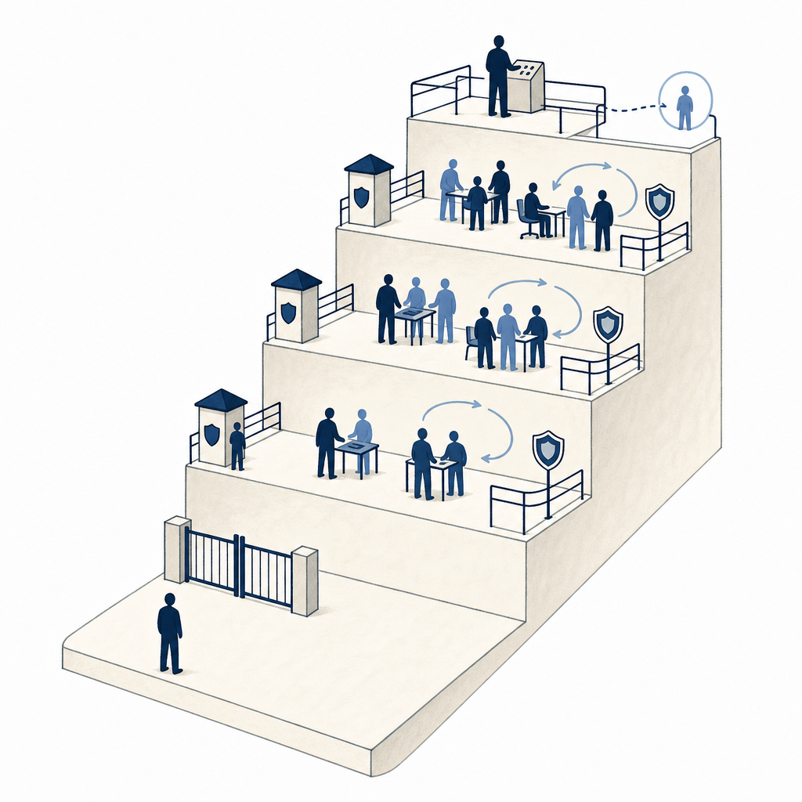
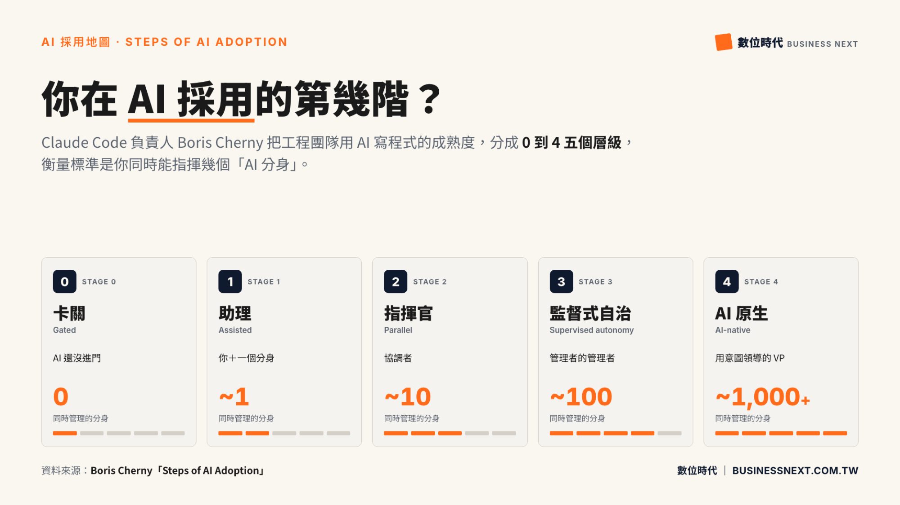

## 為什麼讀

資訊收集箱只留下網址；文章主題直接碰到 Simon 正在建的 Claude／Codex 雙棲代理工作方式，也能拿來區分「個人已熟練使用」與「組織整體仍沒跟上」這兩種成熟度。

## 摘要

《數位時代》整理 Boris Cherny 的 AI 採用五階模型：第 0 階受制度卡住；第 1 階由人逐步盯著單一 AI；第 2 階平行指揮多個代理，只驗收成品；第 3 階由規則、技能與驗證機制支撐大量代理自治；第 4 階則以意圖啟動、自動形成閉合迴圈，人只處理例外。模型的重點不在追求更多代理，而是每升一階都先找出新的瓶頸，再補上相應防護欄；使用量只是活躍度，真正價值還要回到節省的工程工時與新增產出。

## 核心概念

- [[ai-adoption-stage-model]]：把 AI 採用看成「人的角色、可同時管理的代理數、主要瓶頸、防護欄」一起變化的五階模型。它適合拿來找下一步卡點，不是要求所有人直衝最高階。
- [[ai-adoption-gap]]：個人可能已用 AI 把產出拉高，組織卻仍受審批、部署與共用流程卡住；同一家公司內可以同時存在不同採用階段。
- [[trust-threshold]]：從逐步盯著 AI 的第 1 階跨到只驗收成品的第 2 階，前提是代理能自我檢查，且錯誤會被可靠地暴露；否則人的注意力仍是瓶頸。
- [[loop-engineering]]：第 4 階描述的「代理自行啟動、驗證、修正，人只管意圖與例外」，正是迴圈工程的組織成熟版；代理數量本身不代表迴圈可靠。

## 我的立場

> 針對本篇核心主張的表態；空槽待 Simon 事後填、未表態即留白，芙莉蓮不代擬。

1. 工程團隊的 AI 採用可由第 0 階到第 4 階描述；人的角色會從親手執行逐步轉為指揮、監督與處理例外。
   - **我的表態**：（待補：同意／不同意＋為什麼）

2. 升到下一階不能只增加使用量或代理數，還要打破當階瓶頸並建立下一組防護欄。
   - **我的表態**：（待補）

3. 使用量只反映活躍程度；判斷價值時，應補看原本會投入的工程工時與因此新增的工作成果。
   - **我的表態**：（待補）

## 對 Simon 的應用（當下想法）

> 以下為 reading 當下想到的應用、隨時間／工具／興趣變化可能已失效；後續落地狀態見下方「落地動作與效益」段（若有）。

**A. 芙莉蓮優化類**（可套到 Claude Code／skill／rules／CLAUDE.md／user-memory）：

- 可用五階模型檢查自動化是否真的準備好升級：先寫出當前瓶頸、客觀驗證方式與失敗揭露機制，再決定是否增加子代理或自治程度〔AI 推論〕。
- 現有 CORE_RULES 已要求對抗式驗證、失敗大聲揭露與高風險獨立審查；本篇提供的是診斷視角，沒有足以支持新增規則的獨立證據〔AI 推論〕。

**B. Simon 個人動作類**（建 Notion Action 卡／動 vault／改個人工作流／看別的東西）：

- 把「個人雙棲代理」與「公司內 AI 導入」分開評級；避免用個人已到第 2 階的熟練度，推論整個組織也已具備相同信任、部署與驗收條件〔AI 推論〕。
- 可挑一條常跑的高成本流程，寫成四欄小表：所在階段／主要瓶頸／已有防護欄／升階前缺口，用一次實際任務驗證，而非直接追求更多代理〔AI 推論〕。
- Substack 寫作角度：「個人已經 10 倍速，公司為什麼仍在第 0 階？」可從個人技能、組織審批與共用流程三層拆解，但需要 Simon 的真實公司經驗才能成稿〔需 Simon 確認〕。

## 原文要點

<!-- original: https://image-cdn.learnin.tw/bnextmedia/image/album/2026-07/k2wv-1784275086.png -->

> **圖像解讀**
> - **類型**：階段模型資訊圖
> - **內容**：以五張並排卡片呈現第 0 階「卡關」到第 4 階「AI 原生」。各階同時管理的 AI 分身約為 0、1、10、100、1,000+，人的角色則由「AI 還沒進門」逐步移到「管理者的管理者」與「用意圖領導的高階主管」。
> - **原文出處**：圖上標示資料來源 Boris Cherny〈Steps of AI Adoption〉，由《數位時代》重製。
> - **可檢索關鍵字**：AI 採用階段、代理數、監督式自治、AI 原生、Boris Cherny

- **第 0 階「卡關」**：AI 被舊模型限制、審批與部署制度擋在門外；瓶頸是制度與技術決策權。
- **第 1 階「助理」**：一人搭配一個 AI，但人仍逐步盯著產出；注意力與低信任是瓶頸。
- **第 2 階「指揮官」**：一人平行管理約 5–10 個代理；代理先跑測試、檢查與資安掃描，人只看最終成果，驗收量開始成為新瓶頸。
- **第 3 階「監督式自治」**：人管理代理的管理者，大量維護在背景持續執行；規則檔、Skills、信任與團隊決策速度決定能否穩定運作。
- **第 4 階「AI 原生」**：人只提供意圖、監看例外，多數代理由系統自行啟動，形成閉合迴圈。
- **升階規則**：每一步都要同時打破下一個瓶頸、補上下一組防護欄；提高用量不能取代這兩件事。
- **價值指標**：使用量只能顯示活躍度；可先用「若沒 AI，原本是否會投工程人力、要花多少工時」作代理指標，但它仍不是完整投資報酬率。

## 盲點與保留
**缺口／矛盾**：
- 五階模型把「同時管理的代理數」當醒目刻度，容易把規模誤認為成熟度；若缺少可靠驗證、隔離與停止條件，100 個代理可能比 1 個代理更不成熟。這點與 [[loop-engineering]] 的四條件門檻相符，但圖本身沒有給出可量測的升階驗收表。
  - **Simon 回應**：（待補：同意／不同意這個保留＋為什麼）
- 模型原本針對工程團隊用 AI 寫程式；文章把角色轉變類比到其他知識工作，卻沒有提供跨領域案例或驗證資料，不能直接當成通用組織成熟度模型。
  - **Simon 回應**：（待補）
- 報導是 AI 初稿再由編輯整理，屬於二手轉述；雖附 Boris 的 X 貼文與互動圖表，五階細節仍應以第一手版本為準。
  - **Simon 回應**：（待補）
**過度吹捧／該打折**：
- 「產出 10 倍」「同時約 100／1,000+ 個代理」「一季遷移變成按下開始」都是強烈意象，文章沒有交代任務難度、錯誤率、驗收成本與整合成本；適合當方向圖，不宜當成可直接承諾的效益數字。
  - **Simon 回應**：（待補）
- 以「原本會投入多少工程工時」估值，比單看 token 使用量更接近價值，但仍會漏掉品質、風險、重工與那些原本根本不會做的新工作；它是代理指標，不是完整投資報酬率。
  - **Simon 回應**：（待補）

## 第四問

> 這篇沒寫、但站在我的位置可以補上的，是什麼？（先人後機：補章由 Simon 親筆填、芙莉蓮不代擬；填完可喊「驗證我的補章」做文獻對照。）

- **我的補章**：（待補：從位置差／經驗差／時代差挑一個切入、手寫半頁、求真不求完整）

## 原文全文

> [!info]- 原文全文（未公開）
> 原文全文只保留在本機 Obsidian、未同步到這個 garden。[在 Obsidian 開啟這篇 →](obsidian://open?vault=SimonVault&file=2-knowledge%2Freadings%2F2026-07-21-ai-adoption-five-stage-map)

## 原始連結

- https://www.bnext.com.tw/article/91541/claude-code-ai-adoption-5-stages
- Notion inbox 短網址：https://share.google/wZ0vgUOUh0uaze3lo
- 來源性質：二手 — 《數位時代》以 AI 初稿整理 Boris Cherny 的貼文與互動圖表，再由編輯改寫；第一手版本：[Boris Cherny 的 X 貼文串](https://x.com/bcherny/status/2077929379661844559)、[Steps of AI Adoption 互動圖表](https://claude.ai/code/artifact/bfdfaef9-bc62-4dfe-ba9e-c58a26c9accf)

## 落地動作與效益

**A 類芙莉蓮優化**：
- ❌ 本次不改 CORE_RULES 或 skill：現有規則已包含子代理授權、對抗式驗證、客觀關卡與失敗大聲揭露；五階模型先作診斷鏡頭，沒有足夠第一手證據支持再加一層常駐規則〔AI 推論〕。

**B 類 Simon 個人動作**（狀態 Simon 自己維護）：
- ⏸ 分開盤點「個人雙棲代理」與「公司內 AI 導入」所在階段；先以一條真實流程填所在階段／瓶頸／防護欄／缺口四欄，再決定是否升級〔AI 推論〕。
- ⏸ Substack 題目「個人已經 10 倍速，公司為什麼仍在第 0 階？」：待 Simon 補入真實公司經驗後再判斷是否成稿〔需 Simon 確認〕。
