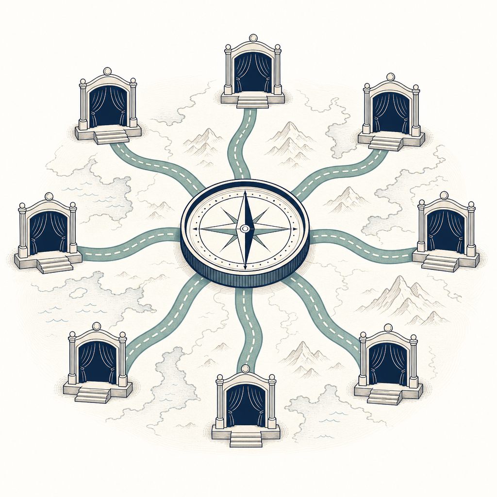

## 為什麼讀

這不是單篇論述，而是一張完整的峰會內容地圖。先收成 reading，可讓後續選讀個別議程時有穩定入口，也避免把 70 場內容一次塞進同一篇筆記。

## 摘要

這個頁面彙整 2026 年 8 月 1、2 日 Agentic AI Summit 的繁體中文內容。第一天四個舞臺共 42 場，提供約 33 萬字全文與 37 篇導讀；第二天三個舞臺共 28 場，提供約 21 萬字全文與 23 篇導讀。每個舞臺都拆成「主題式導讀」與「繁體中文全文」兩種入口，適合先用導讀挑議程，再回全文查脈絡。

## 核心概念

- **導航頁而非單一論述**：頁面本身只整理議程數、字數與入口，不宜從中萃取對 Agentic AI 的實質結論。
- **導讀與全文雙層入口**：主題式導讀適合快速選讀，全文適合回查講者脈絡；兩者用途不同。
- **依舞臺切分內容**：第一天有 Plenary、Atlas、Nexus、Compass 四個舞臺，第二天有 Plenary、Atlas、Compass 三個舞臺。

## 對 Simon 的應用（當下想法）

> 以下為 reading 當下想到的應用、隨時間／工具／興趣變化可能已失效；後續落地狀態見下方「落地動作與效益」段（若有）。

**A. 芙莉蓮優化類**（可套到 Claude Code／skill／rules／CLAUDE.md／user-memory）：

- 後續若要消化峰會內容，應把本頁當來源地圖，逐場建立 reading；不要把索引頁的統計數字誤當成峰會結論。〔AI 推論〕

**B. Simon 個人動作類**（建 Notion Action 卡／動 vault／改個人工作流／看別的東西）：

- 若 Simon 之後要選讀，可先從各舞臺的主題式導讀找題目，再決定是否打開全文；目前只保留入口，不代替 Simon 排閱讀清單。〔需 Simon 確認〕

## 原文要點

- Day 1：四個舞臺、42 場議程、約 33 萬字全文、37 篇導讀。
- Day 2：三個舞臺、28 場議程、約 21 萬字全文、23 篇導讀。
- 兩天合計 70 場議程、約 54 萬字全文與 60 篇導讀。
- 各舞臺都提供「主題式導讀」與「繁體中文全文」兩種連結。
- 部分議程沒有錄影：Day 1 兩場、Day 2 四場。

## 原文全文

> [!info]- 原文全文（未公開）
> 原文全文只保留在本機 Obsidian、未同步到這個 garden。[在 Obsidian 開啟這篇 →](obsidian://open?vault=SimonVault&file=2-knowledge%2Freadings%2F2026-08-04-agentic-ai-summit-2026-guide)

## 原始連結

- https://lushinshang.github.io/AgenticAISummit2026/
