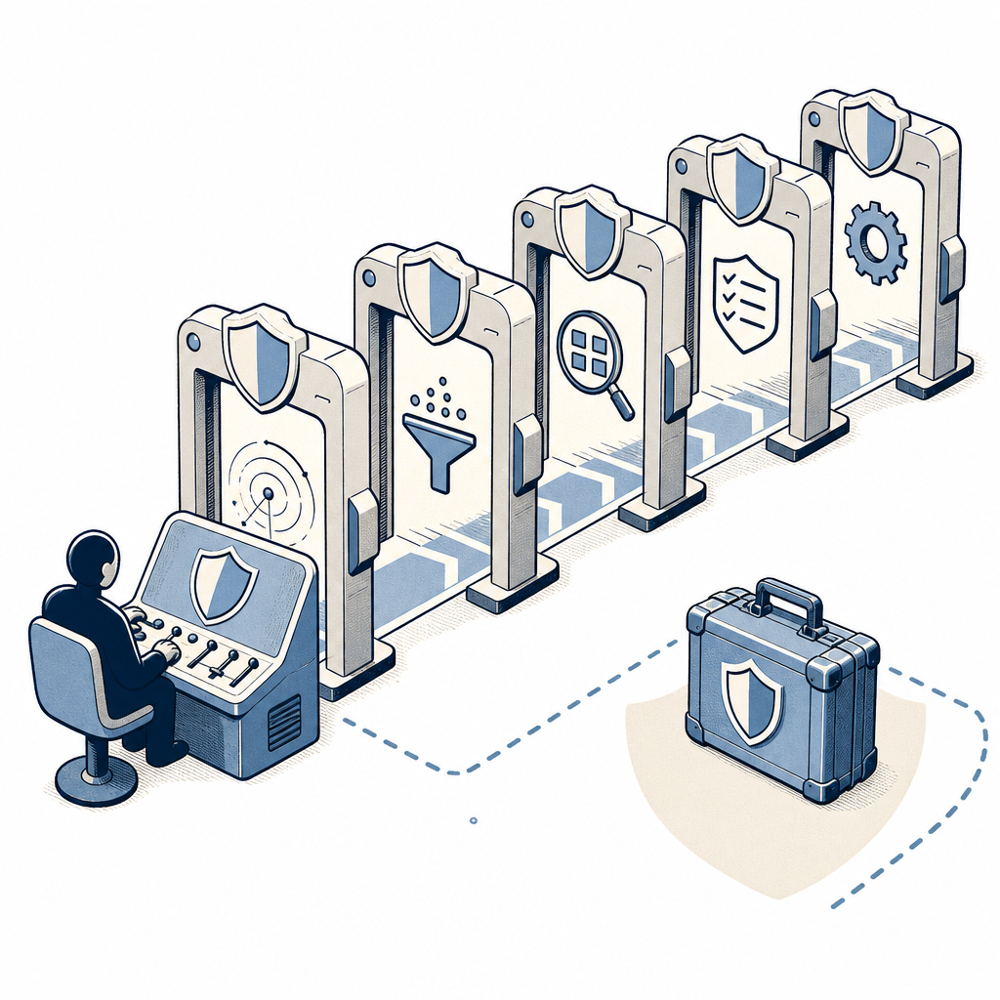

## 為什麼讀

Simon 目前沒有要安裝 Codex Security，但文章揭露的計費、取消、失敗碼與敏感報告落點，不只適用於單一產品，也適合拿來檢查其他付費 AI 自動化。這篇因此不當成安裝教學收藏，而是保留成操作防線的來源。

## 摘要

依 2026-07-29 原文，Codex Security 開源的是 CLI、SDK、報告與 CI 整合，實際分析仍在 OpenAI 服務執行。可跨工具保留五道防線：確認計費身分、成本上限能否硬停、介面能否取消、不完整覆蓋必須失敗、敏感報告隔離於 repo 外。這些邊界構成 [[paid-ai-operation-guardrails]]，也呼應 [[loud-failure]]。



## 核心概念

- [[paid-ai-operation-guardrails]]：啟動付費 AI 工作前，不只要設定金額，還要顯式確認計費身分、成本上限是否真能硬停、介面能否取消、半成品是否會被誤判成功，以及敏感輸出是否與工作目錄隔離。
- [[loud-failure]]：Codex Security 把覆蓋不完整歸到 exit code 2，即使仍保留部分結果，也不讓 CI 把「只掃到一部分」當成通過；比較兩次掃描時，後次範圍不足也不會把消失的發現算成已解決。

## 對 Simon 的應用（當下想法）

> 以下為 reading 當下想到的應用、隨時間／工具／興趣變化可能已失效；後續落地狀態見下方「落地動作與效益」段（若有）。

**A. 芙莉蓮優化類**（可套到 Claude Code／skill／rules／CLAUDE.md／user-memory）：

- 未來任何會計費且可能無法即時取消的 Agent 工作，可在執行前依序確認「計費身分 → hard／soft cap → 取消語意 → 不完整結果是否 fail-closed → 敏感產物落點」。這是候選 review checklist，本次只收知識，不直接改規則或 skill。〔AI 推論〕
- 非互動環境不要依賴隱含的憑證優先序，應顯式指定認證來源。〔原文支撐〕
- 若工具允許，在執行紀錄中留下可稽核的計費身分，可降低訂閱額度與 API 帳單混淆。〔AI 推論〕

**B. Simon 個人動作類**（建 Notion Action 卡／動 vault／改個人工作流／看別的東西）：

- 本次不安裝、不執行掃描。若未來另行授權試用，最小試跑可選非機密的小型 repo，先跑 dry-run，再限定 `--path` 或 `--diff`、顯式選 `--auth`，並把輸出放在 repo／worktree 外。〔原文支撐〕
- 是否實跑 Codex Security，仍需 Simon 另行確認。〔需 Simon 確認〕
- 資安掃描報告本身應視為敏感資料，因為可能包含原始碼片段、漏洞細節與重現步驟；不可跟一般 build artifact 一樣隨手留在專案內。〔原文支撐〕

## 原文要點

- 開源的是掃描編排、結果管理與 CI 整合層；實際分析服務仍在 OpenAI 伺服器，必須具備 Codex Security 存取權。
- 依 2026-07-29 原文，工具當時仍在研究預覽，SDK 1.0 前 minor 版本可能破壞相容性；若接生產環境應鎖版。
- `--dry-run` 不啟動 Codex、不碰網路、不載入憑證，可先檢查 repo、範圍、輸出位置與模型設定。
- `--max-cost` 只會停止新的工作，已在途請求仍可完成；掃描顯示的成本估算亦不含手續費與附加費。
- 環境變數中的 API key 預設優先於 ChatGPT 登入；CI、JSON 輸出等非互動情境不會詢問，應顯式指定 `--auth`。
- 輸出目錄必須在被掃描 repo 與任何包住它的 Git worktree 外，避免漏洞報告被誤 commit。
- MCP 只暴露唯讀 metadata，原因是 MCP 傳輸層無法取消進行中的付費掃描；正式掃描必須走 CLI。
- exit code 2 表示輸入無效、覆蓋不完整或 runtime／匯出錯誤，避免半套掃描被當成通過。
- 支援 SARIF、CSV、JSON 匯出；匯出既有結果不啟動 Codex，也不需重新付費掃描。
- 後次掃描若範圍不足，消失的發現不會被算成已解決，避免因覆蓋縮小產生假修復。

## 原文整理稿（非逐字）

> [!note]- 原文整理稿（點擊展開，非逐字）
> # OpenAI 開源 Codex Security 掃描工具怎麼用？10 分鐘上手
>
> 作者：Limo Lin｜2026-07-29
>
> 這篇帶你在自己電腦上跑完 Codex Security 第一次掃描，從安裝、空跑驗證到匯出 SARIF 報告接進 CI。附上五個會讓你燒錢的地雷。
>
> 這篇帶你在自己電腦上把 OpenAI 剛開源的 Codex Security 跑起來，從安裝、第一次掃描，一路到匯出報告接進 CI（Continuous Integration，持續整合）。順便講清楚一件很多人會誤會的事，下載原始碼不代表你就能用。
>
> 適合手上有 ChatGPT Pro、Business、Edu 或 Enterprise 帳號，想把 AI 資安掃描接進開發流程的工程師。沒有這些方案也可以先看第一節，弄清楚 OpenAI 這次開源了什麼，再決定要不要用。
>
> ## 開源的是「外殼」
>
> 上 GitHub 的 `openai/codex-security` 採 Apache-2.0 授權，內容是「跑掃描、管結果、接 CI」的工具層。真正讀程式碼、在隔離環境重現漏洞、生出修補檔的分析服務，仍然跑在 OpenAI 的伺服器上。
>
> 因此 clone 下來能改、能重新發布，掃描仍要登入 OpenAI 帳號，而且要有 Codex Security 存取權。依 2026-07-29 原文，當時處於研究預覽階段，開放給 ChatGPT Pro、Business、Edu 與 Enterprise，企業帳號可能還要管理員先開權限。
>
> npm 的 `@openai/codex-security` 首版 0.1.0 與 0.1.1 在同一天相隔約六小時發布。SDK 說明亦標明，1.0.0 之前公開 API 可能在 minor 版本之間變動；接進生產環境時宜鎖定版本。
>
> ### 它是開源，但不收外部 PR
>
> `CONTRIBUTING.md` 說明此 repo 是從 OpenAI 內部 canonical repository 單向映像出來，外部 pull request 無法匯入原始碼。使用者可以開 issue、回報 bug 或提功能需求，由維護者評估後搬入內部倉庫；授權允許修改與散布，不代表採用開放協作模式。
>
> ## 流程：安裝、第一次掃描
>
> 環境需求為 Node.js 22 以上、Python 3.10 以上，以及 Codex Security 存取權；支援 macOS、Linux 與 Windows。安裝與第一次掃描指令：
>
> ```bash
> npm install @openai/codex-security
> npx codex-security login
> npx codex-security scan .
> ```
>
> 遠端主機或無瀏覽器環境可用裝置認證：
>
> ```bash
> npx codex-security login --device-auth
> ```
>
> CI 可設 `OPENAI_API_KEY`；`npx codex-security login status` 可顯示目前憑證來源而不印出金鑰。
>
> ### 先空跑一次不花錢
>
> ```bash
> npx codex-security scan . --dry-run
> ```
>
> 此指令不啟動 Codex、不碰網路，也不載入憑證；只驗證 repo、掃描目標、輸出位置與模型設定，並顯示預計使用的模型與推理強度。
>
> ### 預設模型
>
> 文章稱預設模型為 `gpt-5.6-sol`、推理強度 extra-high，也可用 `--model` 與 `--codex KEY=VALUE` 覆蓋。推理強度會影響 token 用量與帳單，第一次測試可降低強度。
>
> ## 五個會讓你燒錢或白做工的地雷點
>
> ### 1. max-cost 不是硬性停止成本
>
> `--max-cost` 超過上限時會停止掃描與派出的 worker，但已經進行中的 request 可以在超過上限後完成。因此設定 5 美元，最終帳單仍可能高於 5 美元，已完成的部分結果則會保留。
>
> 第一次執行可選小型 repo，或用 `--path` 縮小範圍：
>
> ```bash
> npx codex-security scan . --path src --max-cost 5
> ```
>
> 每次掃描顯示的估算成本依 OpenAI 標準 API token 價格計算，包含快取輸入與快取寫入，但不含手續費與附加費，因此只應視為下限。
>
> ### 2. 輸出目錄放錯位置會被擋下來
>
> 輸出目錄必須在被掃描目錄之外，並位於任何包住它的 Git worktree 外；放在 repo 內會被拒絕。掃描結果可能包含原始碼片段、漏洞細節與重現步驟，相當於攻擊路線圖，不應有被 commit 的機會。
>
> macOS 與 Linux 上，既有輸出目錄還必須是 `chmod 700`。若已有舊結果，可用 `--archive-existing` 封存；搭配 `--dry-run` 能先看預計搬移的位置而不實際動檔。
>
> ### 3. 環境變數的金鑰會蓋掉 ChatGPT 登入
>
> 預設規則是環境變數裡的 API key 優先於已儲存的 ChatGPT 登入。互動式掃描會詢問要用哪個憑證，但 JSON 輸出、空跑、CI 等非互動情境不會詢問，會直接沿用金鑰優先。要指定計費來源可加：
>
> ```bash
> npx codex-security scan . --auth chatgpt
> npx codex-security scan . --auth api-key
> ```
>
> `--auth chatgpt` 會忽略 `OPENAI_API_KEY` 與 `CODEX_API_KEY`。
>
> ### 4. Python 3.10 要自己補裝 tomli
>
> Python 3.10 需另裝 `tomli`；3.11 之後標準庫內建 `tomllib`。也可透過 `--python`、SDK 的 `pythonPath` 或 `PYTHON` 環境變數指定直譯器。
>
> ### 5. MCP 只給唯讀資訊，別拿來跑掃描
>
> `npx codex-security mcp add` 可註冊 MCP server，但只暴露唯讀 metadata。掃描、批次掃描、認證、匯出、驗證與修補都只能走 CLI。官方理由是 MCP 傳輸層無法取消進行中的掃描；一個跑到一半停不下來又持續計費的掃描，風險高於不能從 MCP 啟動。
>
> ## 接進 CI 與每次 commit 前的自動檢查
>
> `npx codex-security install-hook` 會安裝 commit 前檢查，掃描暫存與未暫存變更；它會尊重 `core.hooksPath`，不覆蓋既有 hook，預設擋 high 以上的發現，門檻可由 `--fail-on-severity` 調整。
>
> CI 可建立暫存目錄，只掃相對於主分支的 diff，將結構化結果與進度訊息分流：
>
> ```bash
> SCAN_ROOT="$(mktemp -d)"
> npx codex-security scan . \
>   --diff origin/main \
>   --output-dir "$SCAN_ROOT/results" \
>   --json \
>   --fail-on-severity high > "$SCAN_ROOT/findings.json"
> ```
>
> `--diff origin/main` 只掃本次變更，`--working-tree` 則掃暫存與未暫存內容。
>
> Exit code 設計如下：0 代表 report-only 完成或政策通過；1 代表掃描完成但違反政策；2 代表輸入無效、覆蓋不完整或 runtime／匯出錯誤；130 代表被中斷；143 代表被終止。把覆蓋不完整歸到 2，是為了防止掃到一半被誤判通過。部分結果仍會輸出到 stdout，覆蓋警告寫到 stderr。
>
> ## 匯出報告
>
> ```bash
> npx codex-security export ~/security-scans/myrepo \
>   --export-format sarif \
>   --output ~/security-scans/results.sarif
> ```
>
> 支援 SARIF、CSV、JSON；匯出不啟動 Codex，也不載入憑證，因此重匯既有結果不需重新付費掃描。
>
> ## 掃描歷史、誤報標記與批次掃描
>
> 掃描紀錄存在本機 SQLite：`$CODEX_HOME/state/plugins/codex-security/workbench.sqlite3`；不能寫入時可用 `CODEX_SECURITY_STATE_DIR` 指定其他位置。`scans list`、`scans show`、`scans rerun` 可列出、查看與重跑掃描。
>
> `scans match` 會把相同根因的發現串起來，`scans compare` 再分成新增、持續存在、重新出現、已解決與未知。後一次掃描若不完整或沒有覆蓋原範圍，消失的發現不會被算成已解決，避免因掃描範圍縮小產生假修復。
>
> 誤報可用 `findings false-positive OCCURRENCE_ID --reason "..."` 標記；後續掃描只有在同一理由仍成立時才忽略，程式碼變更使理由失效後會重新出現。
>
> `bulk-scan` 可抓取 90 天內推送過的 GitHub repo，排除封存與 fork，讓使用者選取後執行。CSV 必要欄位為 `id`、`repository`、`revision`，並可用 `scope`、`mode`、`--workers` 與 `--max-attempts` 控制範圍、併發與重試。repo 亦附 Dockerfile 與 compose 設定，採非 root 使用者、`cap_drop: ALL`、`no-new-privileges` 與自訂 seccomp profile。
>
> ## 延伸資源與 SDK
>
> 文章列出 GitHub、CLI、SDK、npm 與 Incur 等資源。TypeScript SDK 支援整庫、指定路徑、已提交 diff 與工作樹四種目標；`preflight()` 對應 CLI dry-run，`onWorkerStatus` 與 `onReconnect` 可觀察長時間進度，也能用 `AbortSignal` 取消。
>
> ## 常見問題摘要
>
> 沒有符合方案與 Codex Security 存取權，下載原始碼仍不能使用分析服務。掃描沒有固定價格，依 token 用量估算，且 `--max-cost` 不保證最終帳單絕不超出。API key 與 ChatGPT 登入的計費來源不同，非互動環境應顯式指定。輸出不能放在 repo 內，是因報告含敏感弱點資訊。外部 PR 不會直接合併到單向映像 repo。結果可匯出 SARIF、CSV、JSON，Windows 也在支援範圍內。

## 原文全文

> [!info]- 原文全文（未公開）
> 原文全文只保留在本機 Obsidian、未同步到這個 garden。[在 Obsidian 開啟這篇 →](obsidian://open?vault=SimonVault&file=2-knowledge%2Freadings%2F2026-08-04-codex-security-cli-operational-guardrails)

## 原始連結

- https://share.google/UdOtvjxPU6PG7X0cR
- 轉址後文章：https://www.blocktempo.com/openai-codex-security-cli-sdk-scan-tutorial-setup-cost-pitfalls/
- 來源性質：二手 — BlockTempo 整理官方 README／CLI／SDK 文件
- 第一手版本：https://github.com/openai/codex-security
- 官方 CLI 文件：https://developers.openai.com/codex/security/cli
- 官方 SDK 文件：https://developers.openai.com/codex/security/sdk
