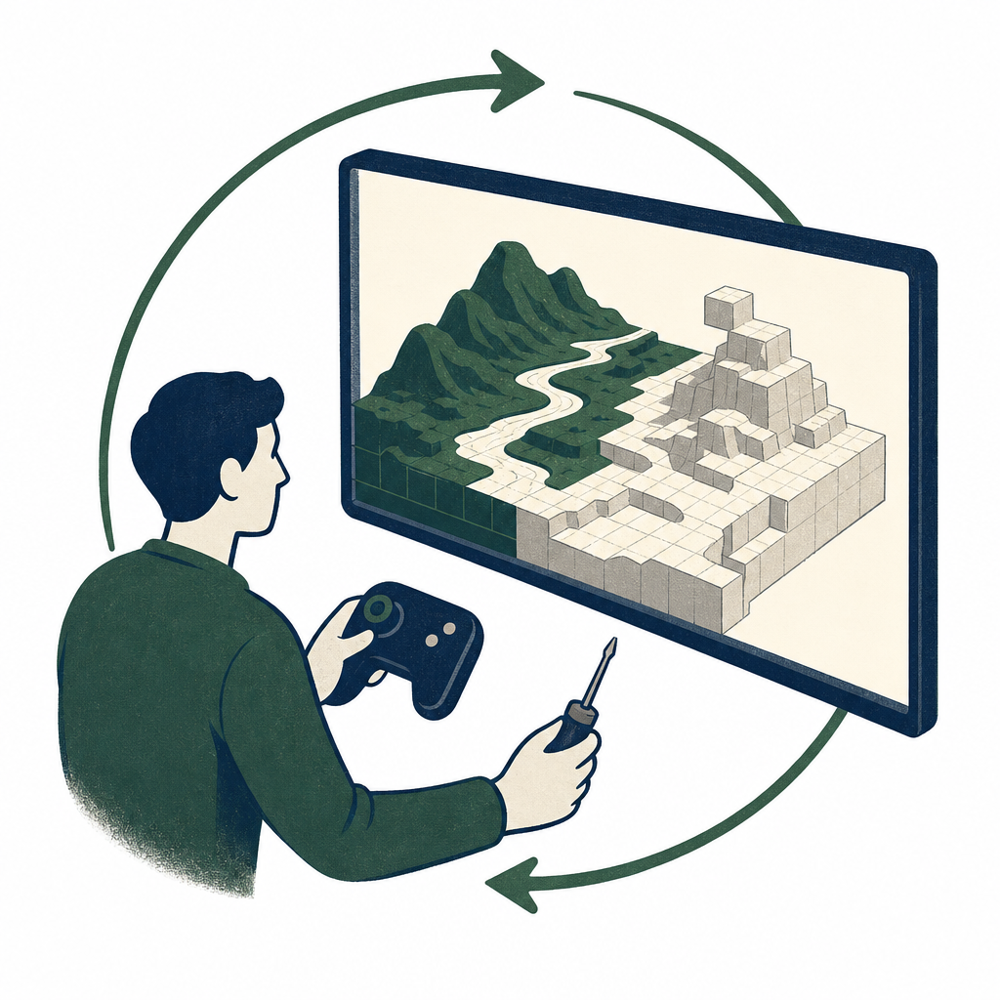

## 為什麼讀

這篇來自資訊收集箱，價值不只在《魔戒》展示，也在它同時呈現長時程 Agent 的能力與成品自審瓶頸。

## 摘要

數位時代轉述 Andrej Karpathy 的實驗：他讓 Claude Opus 5 以約 100 萬 token、10 美元成本，在兩小時內寫出約 5,500 行 three.js 程式，將《魔戒》開場轉成可遊走的 3D 場景。案例對空間配置與動畫已有具體成果；程式結構一致性則是這類長時程任務應納入的評測維度。成品仍粗糙，主要瓶頸不是程式生成，而是模型難以原生觀看影片、操作遊戲並形成快速的感知回饋迴圈。

## 核心概念

- [[agent-perceptual-feedback-loop]]：Agent 要能有效改進成品，必須用接近使用者的方式看見或操作最終輸出；只讀原始碼或零散截圖，回饋速度與品質都會受限。
- [[ai-evaluation-rubric]]：長時程生成的量表不能只算程式碼量、時間或成本，還要檢查模型能否維持結構、看見成品並根據回饋修正。

## 對 Simon 的應用（當下想法）

> 以下為 reading 當下想到的應用、隨時間／工具／興趣變化可能已失效；後續落地狀態見下方「落地動作與效益」段（若有）。

**A. 芙莉蓮優化類**（可套到 Claude Code／skill／rules／CLAUDE.md／user-memory）：

- 若芙莉蓮日後協助產出互動網站、儀表板或視覺成品，驗證步驟應包含實際渲染、截圖與互動測試，不能只看原始碼或測試是否通過。〔AI 推論〕

**B. Simon 個人動作類**（建 Notion Action 卡／動 vault／改個人工作流／看別的東西）：

- Simon 評估長時程 Agent 能力時，可用「能否持續維持程式結構、實際看見成品、根據回饋修正」三項來判斷，避免把程式碼量直接當成完成度。〔AI 推論〕
- 若要延伸成 Substack 題材，可從「AI 會寫 5,500 行程式，不等於它看得懂成品」切入，再對照 Simon 使用 AI 做網站或自動化時的驗證經驗；是否成文需先確認有沒有足夠的個人案例。〔需 Simon 確認〕

## 原文要點

- Karpathy 給 Claude Opus 5 一段《魔戒》開頭文字與約 100 萬 token 的預算；模型花約兩小時寫出約 5,500 行 three.js 程式，生成可在瀏覽器中遊走的 3D 場景。
- 任務要求模型以程式化生成配置地形、房屋、植被與動畫，呈現出長時程程式生成與空間推理能力。
- 成品仍粗糙，主要原因是模型不能原生觀看影片或親自操作遊戲，只能靠不同時間點的截圖慢慢反推問題。
- 這類任務的評測重心已從一次性的 SVG 生成，移向持續執行、維持程式結構與根據回饋反覆修正。
- Karpathy 進一步推測，低成本且有耐力的生成模型可能催生超客製化、短暫存在的娛樂內容；這仍是由單一實驗延伸出的產業想像。

## 原文全文

> [!info]- 原文全文（未公開）
> 原文全文只保留在本機 Obsidian、未同步到這個 garden。[在 Obsidian 開啟這篇 →](obsidian://open?vault=SimonVault&file=2-knowledge%2Freadings%2F2026-08-04-karpathy-claude-lotr-world)

## 原始連結

- https://share.google/NzIBUwU9doU4Nry2m
- 轉址後文章：https://www.bnext.com.tw/article/91711/karpathy-claude-opus-lord-of-the-rings
- 來源性質：二手 — 數位時代整理 Karpathy 的 X 貼文與相關資料，且頁面標明初稿由 AI 編撰；第一手版本：Karpathy X 貼文與實驗頁已由二手文章列出
