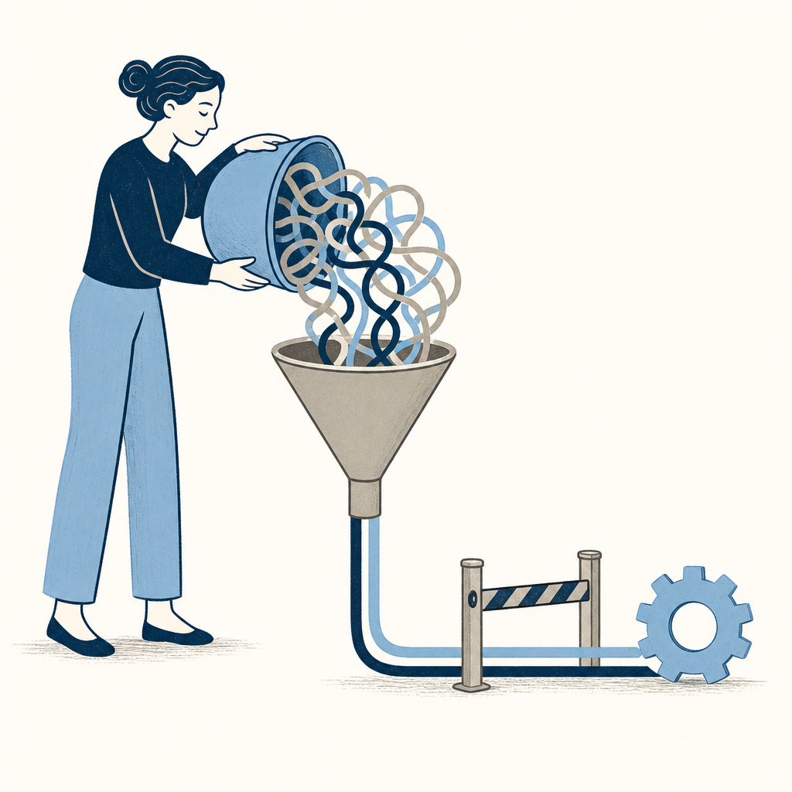

## 為什麼讀

這篇提出可直接套在 Claude Code 與一般 AI 對話的低摩擦輸入法，對長脈絡任務的需求釐清有實作價值。

## 摘要

文章轉述 Andrej Karpathy 的工作習慣：不先雕琢完美提示詞，而是用語音把背景、限制、猶豫與未定想法一次倒給 AI，再要求模型先回述、列出疑點，確認理解後才動工。這種做法降低輸入摩擦，也讓模型拿到更多脈絡；但轉錄可能出錯，模型可能自行補全，錄音也可能把敏感內容送上雲端。對精確數字、事實引用及對外輸出，仍需逐項核對；也不宜把整理思緒的能力完全外包。

## 核心概念

- [[voice-dump-prompting]]：先用語音連續倒出背景、限制、顧慮與未定想法，再讓 AI 整理。它把力氣從「先寫出完美提示詞」移到「先提供足夠脈絡」，適合思緒尚未成形的任務。
- [[ai-backbrief]]：AI 收到原始輸入後先用自己的話回述目標、列出不確定處並提問，使用者確認一致才准許動工。這道閘門能在寫檔、寫程式或擬企劃前抓出理解偏差。
- **風險邊界**：語音輸入仍要防範轉錄錯誤、模型補入未說內容、錄音上傳雲端與思考能力外包；精確數字、敏感資訊及對外內容都需要更嚴格的人工檢查。

## 我的立場

> 針對本篇核心主張的表態；空槽待 Simon 事後填、未表態即留白，芙莉蓮不代擬。

1. 複雜任務的提示品質，常由脈絡是否完整決定，不只由句子是否精煉決定。
   - **我的表態**：

2. AI 收到大量未整理輸入後，應先回述目標、限制與未知處；理解未對齊前不應直接動工。
   - **我的表態**：

3. 語音降低輸入摩擦，不會消除事實查核、隱私判斷與保留自身思考能力的責任。
   - **我的表態**：

## 對 Simon 的應用（當下想法）

> 以下為 reading 當下想到的應用、隨時間／工具／興趣變化可能已失效；後續落地狀態見下方「落地動作與效益」段（若有）。

**A. 芙莉蓮優化類**（可套到 Claude Code／skill／rules／CLAUDE.md／user-memory）：

- 處理語音逐字稿時，可先標出專有名詞、數字、日期與疑似轉錄錯誤，再進入規劃；這能把精確值的查證責任放在動工前。〔AI 推論〕

**B. Simon 個人動作類**（建 Notion Action 卡／動 vault／改個人工作流／看別的東西）：

- 下次卡在長提示詞或複雜需求時，可用支援中文的聽寫工具連續口述背景、目的、限制與猶豫，接著要求 AI 先回述並一次提出 2 到 3 個問題，確認後才動工。〔原文支撐〕
- 涉及公司機密或個資時，先確認錄音是否會上傳雲端、資料是否允許出站；精確數字則在送出前核對轉錄文字，AI 產出後再逐項查證。〔原文支撐〕
- AI 整理完後，自己再把理解重寫成幾條重點，避免長期把組織思路的能力完全外包。〔原文支撐〕

## 原文要點

- Karpathy 的做法是用約 10 分鐘語音意識流輸入大量脈絡，讓 AI 先整理，而非先花力氣撰寫精簡提示詞。
- 方法有效的假設是：模型拿到更多背景、限制與顧慮後，比只收到短提示詞更容易推測真正意圖。
- 實作時可先告知這是可能有錯字的語音轉錄，接著自由口述，最後要求 AI 回述目標、列出不確定處並一次反問 2 到 3 題。
- Claude Code、ChatGPT、系統聽寫與第三方工具的語言、帳號、環境與費用條件不同；中文使用者需另選支援中文的聽寫方式。
- 轉錄錯誤、模型補入未說內容、雲端隱私與思考能力鈍化都是使用界線；精確與對外內容仍需人工核對。

## 盲點與保留

**缺口／矛盾**：文章的效果證據主要是 Karpathy 的個人使用觀察，沒有比較任務類型、使用者差異、總耗時或返工率；「更多脈絡會減少修正」目前適合視為待驗證假說，而不是已證實通則。文章也把 Karpathy 的短貼文、編輯整理的三個技巧與各家工具文件混在同一篇，讀者需分清哪些是原作者主張、哪些是媒體延伸。
- **Simon 回應**：

**過度吹捧／該打折**：數位時代原頁標題的「對 AI 意識流輸出，比想清楚更有效」講得過滿。方法不是取消思考，而是把整理思緒的時點移到口述後，並用 AI 回述做校準；「十分鐘」也只是案例描述，不是普遍最佳長度。
- **Simon 回應**：

## 第四問

**我的補章**：

## 原文全文

> [!info]- 原文全文（未公開）
> 原文全文只保留在本機 Obsidian、未同步到這個 garden。[在 Obsidian 開啟這篇 →](obsidian://open?vault=SimonVault&file=2-knowledge%2Freadings%2F2026-08-04-karpathy-voice-dump-prompting)

## 原始連結

- https://share.google/fYgek4nM3X0Th54Xu
- 來源性質：二手 — 編輯轉述 Karpathy 的 X 貼文，並混合工具文件與媒體資料整理；第一手版本：https://x.com/karpathy/status/2079610838143623371
