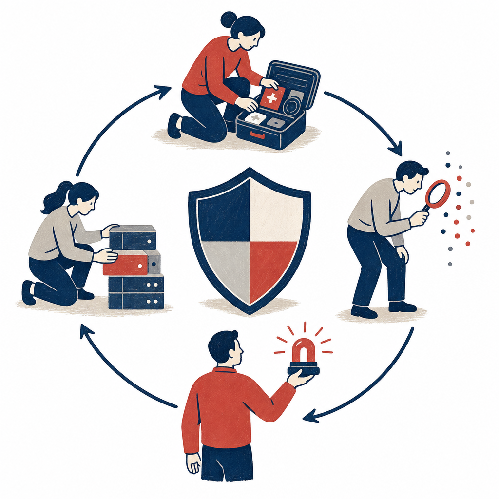

## 為什麼讀

這篇濃縮資安署新公布指引的架構，可用來掌握中小企業資安事件應變的基本範圍與治理要求。

## 摘要

數位發展部資通安全署針對中小企業發布資安事件應變指引，把處理流程拆成準備、偵測與應變、通報與外部溝通、復原與持續改善四個階段，並涵蓋設備感染、帳號遭竊、網路釣魚、商業支付詐欺、勒索軟體與阻斷服務六類常見情境。指引另提供檢核清單、建議時限與聲明稿範本，並要求管理階層參與審查與核可，將事件應變從資訊部門工作提升為跨部門治理責任。

## 核心概念

- [[incident-response-lifecycle]]：資安事件應變不能只處理告警與隔離，還要從事前準備一路涵蓋偵測、通報、對外溝通、復原與事後改善，才能形成完整循環。
- [[playbook]]：把常見威脅拆成情境式行動手冊，並搭配檢核清單、時限與聲明稿，可降低人員在高壓事件現場臨時判斷的負擔。
- [[executive-cybersecurity-accountability]]：事件應變計畫需要管理階層審查與核可，才能在事件發生時取得跨部門調度、對外溝通與風險承擔所需的決策權。

## 對 Simon 的應用（當下想法）

> 以下為 reading 當下想到的應用、隨時間／工具／興趣變化可能已失效；後續落地狀態見下方「落地動作與效益」段（若有）。

**A. 芙莉蓮優化類**（可套到 Claude Code／skill／rules／CLAUDE.md／user-memory）：

- 可用「四階段＋六情境」檢查現有資安事件應變引導是否漏掉管理階層核可、外部溝通與持續改善，先列差距再由 Simon 決定是否調整 skill。〔AI 推論〕

**B. Simon 個人動作類**（建 Notion Action 卡／動 vault／改個人工作流／看別的東西）：

- 可對照公司既有事件應變計畫，確認是否已有六類威脅的檢核清單、處理時限與聲明稿範本；這是盤點候選，不代表 Simon 已決定執行。〔需 Simon 確認〕

## 原文要點

- 資安署把事件應變分成準備、偵測與應變處理、通報與外部溝通、復原與持續改善四個階段。
- 指引涵蓋設備感染、帳號遭竊、網路釣魚、商業支付詐欺、勒索軟體與 DDoS 六類常見威脅。
- 配套包含應變處理檢核清單、里程碑建議時限與聲明稿範本，目的是讓非技術人員在壓力下仍有可操作依據。
- 管理階層應親自審查與核可應變計畫，以確保事件發生時能跨部門調度資源。
- 重大事件除技術處置外，也必須依法通報並與客戶、合作夥伴等利害關係人溝通。

## 原文全文

> [!info]- 原文全文（未公開）
> 原文全文只保留在本機 Obsidian、未同步到這個 garden。[在 Obsidian 開啟這篇 →](obsidian://open?vault=SimonVault&file=2-knowledge%2Freadings%2F2026-08-04-moda-security-incident-response-guide)

## 原始連結

- https://share.google/FyUzbs1lJ0XYKv1fx
- 轉址後文章：https://finance.technews.tw/2026/07/31/moda-security-enterprise/
- 官方新聞稿：https://moda.gov.tw/ACS/press/news/press/20288
- 來源性質：二手 — TechNews 轉述資安署發布的指引與新聞稿，主來源不是官方指引原文；官方新聞稿已找到，指引全文／附件未找到
