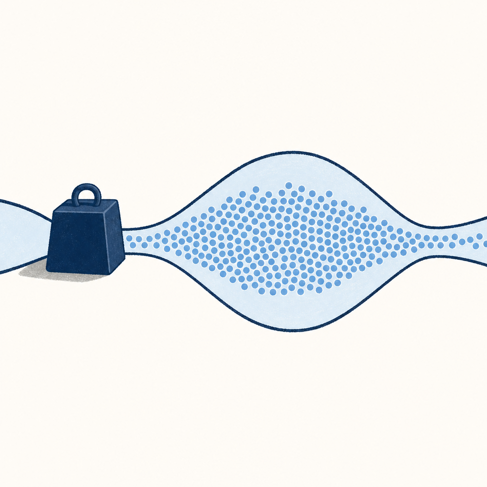

## 為什麼讀

Simon 2026-08-04 做「薑餅資小助手」時發現遠比預期吃 token，當晚寫下「以後要請 AI 先試算一下 TOKEN 數再下去做」。這篇正好接在那條規則後面：不只算總量，還要判斷哪一步值得花、哪一步該換便宜的。他每月 AI 訂閱 6,950 元、占月費型固定支出 43%，這題有實際金額意義。

## 摘要

作者把「模型選擇」重新定義成「算力分配」：同一份任務裡，不同步驟需要的判斷力本來就不一樣，全程派最強的模型等於把最高單價套在輸出量最大的地方。他把選擇拆成兩軸——派誰上場（強模型或便宜模型）乘上叫他想多久（推理強度高或低），組成四種組合；但在挑模型之前要先過兩道限制：公司准不准這個工具吃這份資料、這個任務需不需要特定資料源。落地時把工作拆成研究、設計與規格、執行、審查、修正與部署五步，關鍵在把交接設計好，讓每一步的產出變成下一步的輸入。他以做一個中型行銷網站估算，全程用最強模型約 21.7 美元，分工後約 9.15 美元。

## 核心概念

- [[model-routing]]：讓每一步任務用剛好夠用的模型。作者的類比是，你不會請公司裡薪水最高的人整天複製貼上、整理表格。判斷維度有兩軸而不是一軸：一軸是派誰上場，另一軸是叫他想多久——同一個模型也可以只快速回答，或多想幾步、反覆檢查。（Gary Chen 影片前段）
- [[deliverable-total-cost]]：真正的成本不是每百萬字元的單價，而是做出一份真的能交付的成品要花多少。作者拆成四塊：token 花多少、跑錯後要重跑幾次、人要花多少時間檢查、方向一開始就走錯的代價。他自己測到便宜模型連規格都讀不準時，來回修到能用反而花掉差不多的錢，時間還翻倍。（Gary Chen 影片中段）
- [[token-saving-rules]]：vault 既有的省 token 四原則裡有一條「模型適配」，講的是日常用 Sonnet 不要全程用 Opus。本篇把那一條展開成可執行的判斷流程——加上推理強度這一軸、加上兩道前置限制、再加上「你驗收得了才敢交給便宜模型」這個前提。

## 我的立場

> 針對本篇核心主張的表態；空槽待 Simon 事後填、未表態即留白，芙莉蓮不代擬。

1. 決定成本的不是模型單價，而是把最貴的判斷力放在走錯代價最高的那一步；全程用最強模型，等於把最高單價套在輸出量最大的地方。
   - **我的表態**：（待補：同意／不同意＋為什麼）

2. 模型分工是兩軸而不是一軸——派誰上場乘上叫他想多久；只問「用強的還是用弱的」只回答了一半。
   - **我的表態**：（待補）

3. 能不能交給便宜模型，取決於「你驗收得了嗎」；驗收標準不存在時，分工只會加速產出一堆你不敢用的東西。
   - **我的表態**：（待補）

4. 該建立的是一套架構——任務可拆、模型可換、資料權限清楚、驗收標準存在、出錯可回退——而不是跟著模型排行榜換工具。
   - **我的表態**：（待補）

## 對 Simon 的應用（當下想法）

> 以下為 reading 當下想到的應用、隨時間／工具／興趣變化可能已失效；後續落地狀態見下方「落地動作與效益」段（若有）。

**A. 芙莉蓮優化類**（可套到 Claude Code／skill／rules／CLAUDE.md／user-memory）：

- 調度正本的選 model 與 effort 規則目前偏向「任務難度 → 模型層級」單軸，可對照影片的兩軸拆法，把「推理強度」獨立成一個要明講的參數，而不是跟模型層級綁在一起〔AI 推論〕
- 影片的審查段主張「檢查者只回報證據與失敗項、不宣布能不能上線，因為五個代理同時當法官只會得到五份互相矛盾的判決」；這條跟 CORE_RULES 第 10 節的對抗式驗證同向，但補上了裁決權歸屬，可考慮寫進派工契約〔AI 推論〕
- 「你驗收得了的事情，才適合交給便宜模型大量做」可以當成調度速查卡第 4 條「驗證過的修法才降回便宜模型批次套用」的上位理由，讓那條規則從經驗變成有依據〔AI 推論〕
- 影片要求每張分工表最後加一條升級條件——出現什麼問題時便宜模型必須停下、退回強模型或交給人；派工三件套的驗收條件目前沒有這一欄，可補〔原文支撐〕

**B. Simon 個人動作類**（建 Notion Action 卡／動 vault／改個人工作流／看別的東西）：

- 「先試算 token 數再下去做」這條 8/04 訂下的規則，可以往前推一步：先標出整條流程裡哪一步輸出量最大，那一步才是最值得換便宜模型的地方；影片指出輸出通常比輸入貴，所以看輸出量比看輸入單價準〔原文支撐〕
- 挑一條最常重複的工作流（Veeam 月報、記帳月結、KW γ 收錄都符合「重複、可驗收」的條件），列出每一步的輸入、輸出、錯誤代價、驗收方式、模型層級與推理強度，最後補一條升級條件〔AI 推論〕
- 做上一條那張分工表之前，先去影片資訊欄抓作者整理的 Model Routing 提示詞與各家模型定位（含 Anthropic、OpenAI、Gemini、DeepSeek、Kimi）當底稿，不必從零欄位設計〔原文支撐〕

## 原文要點

- 模型分工是兩軸不是一軸：模型強度（派誰上場）乘上推理強度（叫他想多久），組成四種組合。
- 四種組合的落點：強模型加高推理留給方向不明、走錯代價高的工作；強模型加低推理用於需要判斷但不必想很久的初篩；便宜模型加高推理用於方向已定、但技術細節有難度的執行；便宜模型加低推理處理機械、重複、容易檢查對錯的事。
- 挑模型之前要先過兩道限制：公司准用哪些工具（這份資料能不能丟進去），以及任務需不需要特定資料源（能不能連上即時網路、某個社群平台或內部資料庫）。
- 五步流程是研究、設計與規格、執行、審查、修正與部署；真正的關鍵不是切五塊，而是把交接設計好，讓每一步的產出變成下一步的輸入，出問題才知道退回哪一步。
- 研究階段拆成小團隊：強模型當研究經理定義問題、拆子題、講清楚每個結論需要什麼證據，便宜的偵察代理平行蒐集資料只回報來源與可疑點，最後再由強模型收斂。
- 規格要清楚到換一個模型、換一個人、甚至兩週後的自己回來看，都知道要交什麼、怎麼判斷做完了。
- 判斷能不能交給便宜模型的標準是「你驗收得了嗎」：格式對不對、連結開不開得了、測試過不過。你自己都說不清楚什麼叫做好，便宜模型只會快速產生一堆你不敢用的東西。
- 審查要當成調查而不是抓錯字：先決定要查什麼、需要什麼證據、什麼條件算過關，讓多個檢查者分頭調查並只回報證據，最後由一個強模型當唯一的裁決者。
- 修正階段若發現問題不是實作錯而是規格本身就錯，不要叫便宜模型硬修，直接升級回強模型重新處理方向。
- 成本估算（作者以中型行銷網站假設）：全程用同一個最強模型約 21.7 美元，分工後約 9.15 美元，差約 12.55 美元、約 58%；執行階段最值得分工，因為輸出通常比輸入貴。
- 作者的收尾主張是把 Model Routing 理解成算力分配而不是選模型：模型會變、價格會變，該建立的是任務可拆、模型可換、資料權限清楚、驗收標準存在、出錯可回退的架構。

## 盲點與保留

**缺口／矛盾**：

- 標題那個 58% 只來自作者自己跑的一次比較，影片沒交代任務類型、跑了幾輪、有沒有把他自己提出的「人要花多少時間檢查」算進去。他把總成本拆成四塊是對的，但那個 58% 實際上只算到 token 那一塊。
  - **Simon 回應**：（待補：同意／不同意這個保留＋為什麼）
- 三種做法比較那一段的模型指派前後對不上：說「把規劃和實作都交給 Opus，雖然單價便宜」，可是同一支影片後面的估價表裡，Opus 4.8 被放在審查、Sonnet 5 才是便宜的執行檔位。第三種到底是誰，原文沒講清楚。
  - **Simon 回應**：（待補）
- 成本結論的數字有一處口述不一致：講「1.7 美元降到 9.15 美元」，但同段前面算出的是方法 A 21.7 美元、方法 B 9.15 美元、差 12.55 美元約 58%。以 21.7 代入才自洽（疑似口誤或辨識錯誤、原話如此）。
  - **Simon 回應**：（待補）
- 跟 vault 既有的 [[token-saving-rules]] 沒有互相矛盾，方向一致；但那條只講到「日常用 Sonnet 不要全程 Opus」，本篇是把它細化成兩軸加驗收前提，屬於補強而不是推翻，引用時別當成新發現。
  - **Simon 回應**：（待補）
- 影片全程假設任務可以被清楚拆成五步、規格寫得出來。對於方向本身還在漂、根本寫不出驗收條件的工作（例如還在界定問題的階段），這套分工法沒有給答案，只說「你自己都不知道什麼叫好，便宜模型也沒用」。
  - **Simon 回應**：（待補）

**過度吹捧／該打折**：

- 58% 這個數字放在標題和開頭，是最好傳播的部分；但它成立的三個前提（規格寫得夠清楚、便宜模型做得動、不用重跑）要到影片後段才補上。照作者自己的說法，規格寫爛就會把省下來的錢和時間全部填回去——這個前提值得跟數字放在同一個位置，而不是放在後面。
  - **Simon 回應**：（待補）
- 「就像你不會拿一張 RTX5090 只用來玩小畫家」這種類比很好記，但它暗示了模型能力跟任務難度可以像硬體規格一樣事先量得準。實際上「這一步需要多少判斷力」多半要跑過才知道，作者自己也是比較了三種做法才發現的。
  - **Simon 回應**：（待補）
- 影片收尾導向自家的提示詞組與模型定位整理，是內容產品的常見結構；判斷方法論本身時可以跟這層分開看，不影響前面的推論。
  - **Simon 回應**：（待補）

## 第四問

> 這篇沒寫、但站在我的位置可以補上的，是什麼？（先人後機：補章由 Simon 親筆填、芙莉蓮不代擬；填完可喊「驗證我的補章」做文獻對照。）

- **我的補章**：（待補：從位置差／經驗差／時代差挑一個切入、手寫半頁、求真不求完整）

## 原文全文

> [!info]- 原文全文（未公開）
> 原文全文只保留在本機 Obsidian、未同步到這個 garden。[在 Obsidian 開啟這篇 →](obsidian://open?vault=SimonVault&file=2-knowledge%2Freadings%2F2026-08-06-gary-chen-model-routing)

## 原始連結
- https://www.youtube.com/watch?v=ZLM6Qy7pAHk
